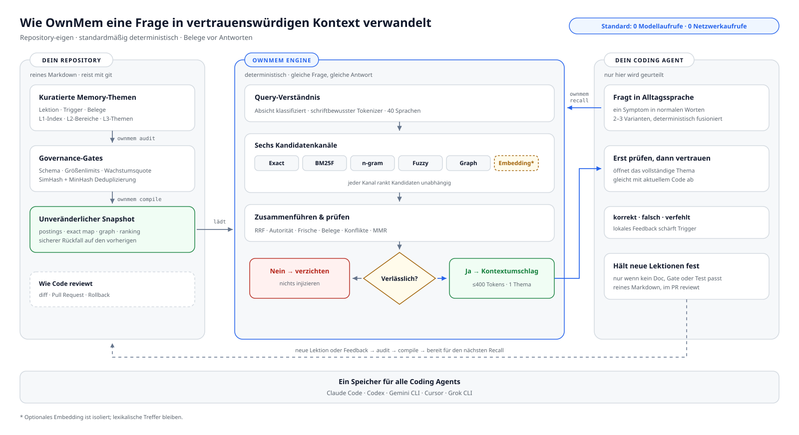

<div align="center">

# OwnMem — Git-natives Projektgedächtnis für KI-Coding-Agents

**Repository-eigen. Deterministisch. Überprüfbar.**

Ein quelloffenes Gedächtnissystem für KI-Agenten in Software-Repositories.<br>
Ein dauerhaftes Projektgedächtnis für Claude Code · Codex · Antigravity · Cursor · Gemini CLI · Grok CLI.

[](https://www.npmjs.com/package/ownmem)
[](https://nodejs.org)
[](./LICENSE)
[](https://github.com/grpcer/ownmem/actions/workflows/ci.yml)
[](#benchmarks)
[](#benchmarks)

[English](./README.md) · [简体中文](./README.zh-CN.md) · [繁體中文](./README.zh-TW.md) · [日本語](./README.ja.md) · [한국어](./README.ko.md) · [Español](./README.es.md) · [Français](./README.fr.md) · **Deutsch** · [Português (BR)](./README.pt-BR.md)

</div>

## Was ist OwnMem?

OwnMem ist ein quelloffenes, lokales und Git-natives Gedächtnissystem für
Coding-Agenten. Es bewahrt kuratierte Projektentscheidungen, Randbedingungen
und Erkenntnisse aus der Fehlersuche als überprüfbares Markdown im Repository
auf. Dieses dauerhafte Projektgedächtnis funktioniert über Agenten und
Sitzungen hinweg, reist mit Git und lässt sich zusammen mit dem beschriebenen
Code zurückrollen.

Eine deterministische, für Unicode-Schriftsysteme optimierte BM25F-Engine
ordnet die Erinnerungen in `.ownmem/`. Bei gleicher Abfrage, Konfiguration und
kompiliertem Snapshot liefert der standardmäßige Abruf dieselbe Rangfolge —
ohne Modellaufruf, Netzwerkanfrage oder Token-Kosten zur Abfragezeit und im
öffentlichen Benchmark in rund zwei Millisekunden.

OwnMem besteht aus zwei Teilen. Das **npm-Paket** ist der Motor: Es lebt in
jedem Repository als geprüfte `devDependency` und verwaltet das Gedächtnis
dieses Repositories in `.ownmem/`. Das **Agent-Plugin** ist eine optionale
Komfortschicht, einmal pro Maschine installiert: Es bringt deinem Agenten bei,
den Motor zu bedienen — einschließlich der Begleitung durch die Einrichtung
pro Repository.

> **Hinweis:** Ein Repository ist bereit, sobald es das Paket und `.ownmem/`
> hat — unabhängig davon, wie beides eingerichtet wurde. Du kannst mit einem
> der beiden Teile beginnen.

## OwnMem auf einen Blick

| Merkmal | Fakt |
| --- | --- |
| Kategorie | Repository-eigenes Projektgedächtnis für KI-Coding-Agenten |
| Umfang | Ein Repository |
| Speicherung | Überprüfbares Markdown in `.ownmem/`, mit Git versioniert |
| Standardabruf | Deterministisches BM25F, **0 Modell- / 0 Netzwerkaufrufe** |
| Öffentlicher Benchmark | Festgeschriebener synthetischer Benchmark v0.1.2: **100 % Recall@1**, **P95 2,46 ms**; kein Beleg für Genauigkeit bei echten Nutzern |
| Lizenz | Apache-2.0 |

<picture>
  <source media="(prefers-color-scheme: dark)" srcset="./assets/architecture-de-dark.svg">
  
</picture>

## Schnellstart

OwnMem benötigt Node.js 20 oder neuer. Drei Schritte, alle im Repository,
das ein eigenes Gedächtnis bekommen soll.

**Schritt 1 — den Motor installieren.** Er wird zu einer normalen
`devDependency`, geprüft und gepinnt wie jede andere:

```bash
npm install --save-dev ownmem
```

**Schritt 2 — dieses Repository initialisieren.** Das erstellt `.ownmem/`
und die Adapter-Dateien pro Agenten:

```bash
npx ownmem init --locale auto --hosts claude,codex --layers dashboard --hook
```

**Schritt 3 — deinen Agenten neu öffnen.** Agenten entdecken Befehle beim
Sitzungsstart, alles Folgende erscheint daher erst in der nächsten Sitzung,
nicht in der, die init ausgeführt hat.

Das ist die empfohlene Einrichtung — Claude Code und Codex funktionieren
sofort, die lokale Konsole ist ebenfalls dabei. Was du nach dem Neustart
hast:

- **Claude Code** erhält einen Projekt-Befehl: `/ownmem <alles, was das
  Gedächtnis tun soll>`.
- **Codex und Grok CLI** entdecken den `ownmem`-Skill des Repositories
  automatisch.
- **Antigravity** lädt dieselben Projektanweisungen (`AGENTS.md`,
  `GEMINI.md`) und folgt damit ebenfalls der Gedächtnis-Disziplin — wie
  jeder andere Agent, der diese Anweisungen liest.
- **Die Konsole** ist ein Terminal-Befehl, kein Slash-Befehl:
  `npx ownmem dashboard --open`. (Das optionale Plugin weiter unten ergänzt
  `/ownmem:dashboard`.)

Einen täglichen Einrichtungsbefehl gibt es nicht — arbeite einfach wie
gewohnt. Wiederhole die drei Schritte einmal für jedes Repository, das sein
eigenes Gedächtnis bekommen soll.

Du nutzt nur einen Agenten? Ersetze `--hosts claude,codex` durch
`--hosts claude` oder `--hosts codex`. Antigravity und Grok CLI lesen
dieselben `AGENTS.md`-Dateien (und, bei Grok, `.agents/skills/`) wie Codex,
`--hosts codex` deckt also beide mit ab. Cursor nutzt `--hosts cursor`,
klassische Gemini-CLI-Setups nutzen `--hosts gemini`; für andere Agenten
gibt es `--hosts generic`.

Die Initialisierung erstellt `.ownmem/` und ergänzt die Projektanweisungen des
Agenten um einen kleinen OwnMem-Abschnitt. Text außerhalb der markierten
Grenzen bleibt unverändert.

## Täglicher Gebrauch

Nach der Einrichtung musst du dir nur zwei Dinge merken.

**1. Sprich einfach mit deinem Agenten.** Wenn du etwas lernst, das später
nützlich sein könnte, sag es in ganz normalen Worten:

> „Merk dir das — der Timeout kommt vom Pool-Limit, nicht von der
> Worker-Zahl. Nie die Worker erhöhen, ohne den Pool zu erhöhen."

Später fragst du so natürlich wie immer:

> „Das Staging-Deployment hängt wieder. Prüfe zuerst den Projektspeicher,
> bevor du etwas änderst."

Der Agent kümmert sich um Schreiben, Prüfen und Abrufen. Du musst weder
`.ownmem/` öffnen noch selbst `audit` oder `recall` ausführen. Lieber ein
expliziter Befehl? `/ownmem <Anfrage>` (Claude Code) und der `ownmem`-Skill
(Codex) leiten dieselbe Anfrage durch das Gedächtnis.

**2. Öffne die Konsole, wenn du einen Überblick möchtest.** Sie zeigt
Nutzung, Recall-Qualität, Latenz und Zustand des Speichers für dieses
Repository und ist nur auf deinem Computer unter 127.0.0.1 erreichbar:

```bash
npx ownmem dashboard --open
```


Das ist der gesamte Alltagsablauf. `audit`, manuelles `recall` und die
Feedback-Befehle sind für CI und Fehlersuche gedacht; normale Nutzer müssen
sie sich nicht merken.

## Wie OwnMem entstanden ist

Ich baue Oriveo, einen BYOK-Multi-Modell-KI-Client für iOS, Android, Web und Desktop — eine große Codebasis, an der ich täglich mit Coding-Agenten arbeite und dabei zwischen Claude Code und Codex wechsle. In jedem Repository sammelten sich hart erarbeitete Lektionen an: Ursachen von Fehlern, Fallstricke in der Werkzeugkette und Timing-Probleme. Bei jedem Wechsel des Agenten, der Maschine oder eines Teammitglieds gingen sie unbemerkt verloren, weil sie im Gedächtnis eines einzelnen Werkzeugs auf einer einzelnen Maschine lebten.

Vektor- und Cloud-Gedächtnisdienste fühlten sich dafür nie richtig an: Wissen über ein Repository sollte weder ein Konto noch einen Server noch eine Abrechnung pro Abfrage brauchen. Also zog das Gedächtnis ins Repository selbst. OwnMem ist das System, das ich täglich in der Oriveo-Codebasis betreibe — Hunderte kuratierte Erinnerungen, durch Quoten und Audits in Form gehalten — herausgelöst und als saubere öffentliche Engine neu aufgebaut.

## Warum OwnMem

OwnMem geht vier Wetten ein, und jede Design-Entscheidung folgt aus ihnen:

- **Gedächtnis gehört ins Repository.** Überprüfbares Markdown, das mit git
  reist, in Pull Requests erscheint und wie jeder andere Code zurückgerollt
  werden kann. Repo klonen, Gedächtnis dabei — kein Konto, kein Sync-Dienst,
  kein Export-Schritt.
- **Recall muss kostenlos und deterministisch sein.** Dieselbe Abfrage
  liefert dasselbe Ranking — ohne Modellaufruf, ohne Latenzsteuer, ohne
  Rechnung pro Frage: 100 % Recall@1 bei einem P95 von 2,46 ms im festgeschriebenen
  öffentlichen Benchmark.
- **Gedächtnis muss jedes einzelne Tool überleben.** Dieselben Dateien
  bedienen Claude Code, Codex, Antigravity, Cursor, Gemini CLI und Grok CLI — ein
  Agentenwechsel bedeutet also nie, das Gelernte des Teams zu verlieren.
- **Gedächtnis muss klein bleiben, um vertrauenswürdig zu bleiben.** Eine
  Quote mit null Nettowachstum, ein reines Node-Audit sowie Beinahe-Duplikat-
  und Drift-Prüfungen halten es schlank und aktuell, statt es zu einem zweiten
  Wiki werden zu lassen, das niemand beschneidet.

### Was OwnMem nicht ist

- **Keine Vektordatenbank.** Wer unscharfe semantische Suche über große
  Gedächtnisbestände will, ist mit einem Vektor- oder
  Wissensgraph-Gedächtnisdienst besser bedient.
- **Keine automatische Erfassung.** Schreibvorgänge sind bewusst und
  kuratiert — die Prüfung ist die Qualitätssicherung. Eingebaute
  Agentengedächtnisse sind bequemer, um den Preis von Werkzeugbindung und
  fehlender Überprüfbarkeit.
- **Nicht repository-übergreifend, nicht cloud-synchronisiert.** Das
  Gedächtnis reist mit der Git-Historie des Repositories — wer das Repository
  klont, hat es. Es wird aber nie über Repositories hinweg geteilt und läuft
  nie durch einen Gedächtnisdienst — mit Absicht.

## Ein Blick in `.ownmem/`: das dreistufige Gedächtnis

Der immer geladene Teil bleibt winzig; alles andere wird bei Bedarf gelesen:

| Stufe | Datei | Wann sie gelesen wird |
| --- | --- | --- |
| **L1** | `MEMORY.md` | Der Index — wird zu Beginn jeder Session geladen |
| **L2** | `MEMORY-<area>.md` | Bereichs-Subindizes — geöffnet, wenn der Bereich berührt wird |
| **L3** | eine Datei pro Thema | Eine Lektion pro Datei — von `recall` geliefert, wenn ihre Auslöser passen |

Eine Themendatei ist reines Markdown mit striktem, schemageprüftem
Frontmatter — Symptome und Formulierungen in `triggers`, Belege in
`evidence` (hier gekürzt; `ownmem init` legt ein vollständiges Beispiel
an):

```markdown
---
name: pool_cap_timeout
description: staging deploys time out when workers exceed the pool cap
metadata:
  type: lesson
  triggers: ["staging deploy timeout", "pool cap exceeded"]
  evidence: [deploy-2026-08-12.log]
---

Raising the worker count without raising the connection pool cap exhausts
the pool, and every deploy waits until it times out. Raise both together.
```

Genau diese Struktur macht Recall kostenlos: Der Index ist klein genug, um
immer geladen zu bleiben, und BM25F muss nur kleine, gut beschriftete
Themendateien einordnen.

## OwnMem im Vergleich

Jede Spalte unten löst ein echtes Problem — die Tabelle zeigt, welche
Kompromisse die jeweilige Lösung eingeht, unsere eingeschlossen.

| | OwnMem | [Mem0 (OSS)](https://github.com/mem0ai/mem0) | [Zep / Graphiti](https://github.com/getzep/graphiti) | [claude-mem](https://github.com/thedotmack/claude-mem) | Eingebautes Auto-Gedächtnis¹ |
| --- | :---: | :---: | :---: | :---: | :---: |
| Gedächtnis lebt in deinem Repository, reist mit Git und Pull Requests | ✅ | ❌ | ❌ | ❌ | ❌ |
| Menschenlesbares, überprüfbares Markdown | ✅ | ❌ | ❌ | ❌ | ⚠️² |
| Recall ohne Modell- oder Netzwerkaufrufe | ✅ | ❌³ | ❌ | ❌ | — |
| Deterministisches, reproduzierbares Ranking | ✅ | ❌ | ❌ | ❌ | — |
| Ein Gedächtnis über Claude Code, Codex, Antigravity, Cursor, Gemini CLI und Grok CLI hinweg | ✅ | ⚠️⁴ | ⚠️⁴ | ⚠️⁴ | ❌ |
| Schutz vor Aufblähung (Wachstumsquote, Audit, Drift-Prüfungen) | ✅ | ❌ | ❌ | ❌ | ⚠️⁵ |
| Semantische Paraphrasensuche | ⚠️⁶ | ✅ | ✅ | ✅ | ❌ |
| Vollautomatische Erfassung | ❌⁷ | ✅ | ✅ | ✅ | ✅ |
| Repository-übergreifendes Gedächtnis auf Nutzerebene | ❌⁷ | ✅ | ✅ | ⚠️ | ❌ |

¹ Claude Code Auto-Memory und Codex Memories: Dateien in deinem
Benutzerverzeichnis — maschinenlokal, werkzeuggebunden, außerhalb des Repositories.
Cursor hat Memories in 2.1 zugunsten von Rules eingestellt; Windsurf-Memories
bleiben auf einer Maschine und werden nie eingecheckt.
² Editierbares Markdown, das aber außerhalb des Repos liegt und deshalb nie
in einem Pull Request auftaucht.
³ Mem0s Apache-2.0-Bibliothek läuft lokal, benötigt aber trotzdem ein LLM und
ein Embedding-Modell (standardmäßig einen OpenAI-Schlüssel oder lokale Modelle über
Ollama), um Gedächtnis zu schreiben und abzufragen.
⁴ Über einen MCP-Server oder eine eigene API — das Gedächtnis ist nutzer-
oder app-bezogen, kein Satz Dateien, der deinem Repository gehört.
⁵ Claude Code deckelt seinen ständig geladenen Index (200 Zeilen / 25 KB);
dahinter stehen weder Quote noch Audit oder Duplikatprüfung.
⁶ Optionale Embedding-Spur, standardmäßig aus; sie fließt erst ins Ranking
ein, wenn deine lokalen A/B-Belege die Sicherheitsprüfung bestehen.
⁷ Mit Absicht. OwnMem setzt auf kuratierte, geprüfte Schreibvorgänge und den
Ein-Repository-Zuschnitt; wer automatische Erfassung oder app-übergreifendes
Gedächtnis auf Nutzerebene will, ist mit diesen Tools tatsächlich besser
bedient.

Fakten geprüft im August 2026 gegen die öffentliche Dokumentation der
Projekte: [Mem0](https://docs.mem0.ai), [Zep / Graphiti](https://help.getzep.com/graphiti/getting-started/overview),
[claude-mem](https://github.com/thedotmack/claude-mem),
[Claude-Code-Auto-Memory](https://code.claude.com/docs/en/memory),
[Codex memories](https://developers.openai.com/codex/memories),
[Cursor rules](https://cursor.com/docs/context/rules),
[Windsurf memories](https://docs.devin.ai/desktop/cascade/memories) — Korrekturen willkommen.

## Benchmarks

<picture>
  <source media="(prefers-color-scheme: dark)" srcset="./assets/benchmark-dark.svg">
  
</picture>

Jedes Release muss einen festgeschriebenen öffentlichen Benchmark bestehen: ein
CC0-Korpus mit 40 Themen über 40 BCP-47-Sprachtags und 25
Schriftsystemgruppen, mit 128 positiven Abfragen und 40 themenfremden
Negativen. Die Zahlen unten stammen aus einem Lauf in Release-Qualität
(25 gemessene Iterationen pro Abfrage):

| Metrik | Ergebnis | Release-Grenzwert |
| --- | --- | --- |
| Recall@1 / Recall@5 (128 positive Abfragen) | **100 % / 100 %** | = 100 % |
| MRR | **1,000** | = 1,000 |
| Enthaltung bei 40 themenfremden Abfragen | **40 / 40** | = 100 % |
| Recall-Latenz P50 / P95 (4.200 gemessene Stichproben) | **1,17 ms / 2,46 ms** | P95 ≤ 5 ms |
| Sprachen / Schriftsysteme unter denselben Grenzwerten | 40 Tags / 25 Schriftsysteme | P95 pro Sprache & pro Schriftsystem ≤ 5 ms |
| Modellaufrufe / Netzwerkaufrufe während des Recalls | **0 / 0** | = 0 |
| Laufzeitabhängigkeiten | 2 (`ajv`, `yaml` — reines JS) | festgeschrieben |
| Zusätzlicher Speicher während des Laufs (RSS-Delta) | < 2 MB | — |

Auf demselben Korpus erreicht eine nicht zwischen Groß- und Kleinschreibung
unterscheidende Festtextsuche mit `grep` 3,1 %
Recall@1. Lexikalisch und deterministisch zu bleiben ist für sich genommen
noch nicht der Trick — das Unicode-Schriftsystem-bewusste BM25F-Ranking ist
es.

Reproduziere es selbst:

```bash
git clone https://github.com/grpcer/ownmem
cd ownmem && npm ci && npm run benchmark
```

> **Hinweis:** Gemessen auf einem Apple M5 Pro mit Node 25. Korpus-Hash,
> Rankings und Schwellenwerte sind festgeschrieben, und der Lauf wird mit umgekehrter
> Themenreihenfolge wiederholt, um Determinismus zu beweisen. Diese
> synthetischen Metriken sind Regressionsbelege, keine Behauptung über die
> Genauigkeit bei echten Nutzern.

## Literatur

Nichts an der Ranking-Mathematik ist selbst erfunden — jede Technik der Engine
ist ein publiziertes, erprobtes Verfahren. OwnMems Beitrag ist, sie zu einer
deterministischen Engine mit zwei kleinen reinen JavaScript-Laufzeitabhängigkeiten
zu kombinieren:

| In OwnMem | Technik | Literatur |
| --- | --- | --- |
| `bm25f`-Kanal | Feldgewichtetes BM25-Ranking | Robertson & Zaragoza (2009), *[The Probabilistic Relevance Framework: BM25 and Beyond](https://doi.org/10.1561/1500000019)*; Robertson, Zaragoza & Taylor (2004), *[Simple BM25 extension to multiple weighted fields](https://doi.org/10.1145/1031171.1031181)* |
| Kanal- und Mehrfach-Query-Fusion | Reciprocal Rank Fusion | Cormack, Clarke & Büttcher (2009), *[Reciprocal rank fusion outperforms Condorcet and individual rank learning methods](https://doi.org/10.1145/1571941.1572114)* |
| Ergebnisdiversität | Maximal Marginal Relevance | Carbonell & Goldstein (1998), *[The use of MMR, diversity-based reranking for reordering documents and producing summaries](https://doi.org/10.1145/290941.291025)* |
| `ngram`-Kanal | Zeichen-n-Gramm-Ähnlichkeit (Dice) | Dice (1945), *[Measures of the amount of ecologic association between species](https://doi.org/10.2307/1932409)* |
| `fuzzy`-Kanal | Begrenzte Editierdistanz | Levenshtein (1966), *Binary codes capable of correcting deletions, insertions, and reversals*, Soviet Physics Doklady 10(8) |
| Duplikatprüfung | SimHash | Charikar (2002), *[Similarity estimation techniques from rounding algorithms](https://doi.org/10.1145/509907.509965)*; Manku, Jain & Das Sarma (2007), *[Detecting near-duplicates for web crawling](https://doi.org/10.1145/1242572.1242592)* |
| Duplikatprüfung | MinHash | Broder (1997), *[On the resemblance and containment of documents](https://doi.org/10.1109/SEQUEN.1997.666900)* |
| Tokenizer | Schriftbewusste Segmentierung | *[UAX #24: Unicode Script Property](https://unicode.org/reports/tr24/)*; *[UAX #29: Unicode Text Segmentation](https://unicode.org/reports/tr29/)* |

## Agent-Plugin installieren (optional, einmal pro Maschine)

**Musst du es installieren? Nein — auch ohne funktioniert alles.**
`ownmem init` hat die Disziplin bereits in die Agent-Anweisungen des
Repositories geschrieben; jeder Agent, der das Repository öffnet, folgt ihr.
Das Plugin ist Komfort auf Maschinenebene: Es bringt dieselben drei Skills
in jedes Repository der Maschine — auch in solche ohne
`.ownmem/`, wo der init-Skill den Agenten durch die Engine-Einrichtung
führt. Dieses Repository ist zugleich der Plugin-Marketplace; die
Plugin-Befehle routen nur zu `npx ownmem`, ein Plugin-Update schreibt dein
Gedächtnis also nie um.

Ein Plugin, drei Skills, ein Satz Namen:

| Skill | Claude Code | Codex CLI | Was er tut |
| --- | --- | --- | --- |
| `recall` | `/ownmem:recall` | `ownmem:recall` | Gedächtnis abrufen, bevor Code geändert wird |
| `init` | `/ownmem:init` | `ownmem:init` | OwnMem in einem Repository einrichten oder aktualisieren |
| `dashboard` | `/ownmem:dashboard` | `ownmem:dashboard` | Die lokale Konsole öffnen |

**Claude Code** — führe beide Befehle in dieser Reihenfolge aus: der erste
registriert dieses Repository als Plugin-Marketplace (einmalig nötig), der
zweite installiert das Plugin daraus:

```
/plugin marketplace add grpcer/ownmem
/plugin install ownmem@ownmem
```

Starte Claude Code danach neu: Plugin-Befehle laden beim Sitzungsstart und
erscheinen daher erst in der nächsten Sitzung, nicht in der, die sie
installiert hat. Aktiviere die automatische Aktualisierung des Marketplace
unter `/plugin` → Marketplaces, um neue Versionen automatisch zu erhalten.

**Codex CLI** — dieselben zwei Schritte in dieser Reihenfolge: Marketplace
registrieren, dann das Plugin hinzufügen:

```
codex plugin marketplace add grpcer/ownmem
codex plugin add ownmem@ownmem
```

Auch hier laden Skills beim Sitzungsstart; du findest sie im
`$`-Skill-Picker. Später aktualisieren mit
`codex plugin marketplace upgrade ownmem`, gefolgt von
`codex plugin add ownmem@ownmem`.

**Grok CLI** — wieder beide Befehle in dieser Reihenfolge: Marketplace
registrieren, dann installieren (Grok verlangt das explizite `--trust`).
Überspringe den ersten Befehl, wenn Grok deine Claude-Code-Marketplaces
bereits importiert hat:

```
grok plugin marketplace add grpcer/ownmem
grok plugin install ownmem@ownmem --trust
```

Das installiert dieselben drei Skills. Ist ein einfacher Skill-Name bereits
vergeben, versieht Grok ihn mit einem Namespace — sein eingebautes Dashboard
macht unseres zu `/ownmem:dashboard`. Aktualisieren mit
`grok plugin update ownmem`.

**Antigravity** — ein einzelner Befehl, kein Marketplace-Schritt:

```
agy plugin install https://github.com/grpcer/ownmem
```

Das importiert die Skills `ownmem`, `ownmem-init` und `ownmem-dashboard`;
aktualisieren durch erneutes Ausführen desselben Befehls. (Klassische
Gemini-CLI-Setups — API-Key, Vertex AI oder Enterprise-Lizenz — können
dasselbe Repository weiterhin mit
`gemini extensions install https://github.com/grpcer/ownmem` installieren.)

## Sichere automatische Updates

OwnMem ist für überprüfbare Abhängigkeits-Updates gebaut, nicht für stilles
Umschreiben im Hintergrund. Aktiviere Dependabot oder Renovate für
npm-Abhängigkeiten. Öffnet eines davon einen OwnMem-Upgrade-Pull-Request,
sollte die CI diese drei Befehle in dieser Reihenfolge ausführen:

```bash
npx ownmem init --update
npx ownmem init --check
npx ownmem audit
```

`init --update` erneuert nur die von OwnMem verwalteten Grenzen und bewahrt
das Projektgedächtnis. `init --check` schlägt fehl, wenn generierte Adapter
abdriften. Das Einchecken von `package-lock.json` hält jeden Agenten und jeden
CI-Job auf der geprüften Version.

Für ein manuelles Update führe alle vier in dieser Reihenfolge aus:

```bash
npm install --save-dev ownmem@latest
npx ownmem init --update
npx ownmem init --check
npx ownmem audit
```

Vermeide ein schwebendes `npx ownmem@latest` in Produktions-Repositories: für
den ersten Blick bequem, macht es Ausführungen aber nicht reproduzierbar.

## Schichten

Wähle selbst, wie viel Maschinerie du willst — jede Schicht enthält die
vorherige:

| Schicht | Fügt hinzu |
| --- | --- |
| `core` | Initialisierung, striktes Schema, Unicode-Schriftsystem-bewusster BM25F-Recall, deterministische Mehrfachabfrage-Fusion, Wachstumsquote |
| `gates` | Reines Node-Audit und Beinahe-Duplikat-Prüfung |
| `compiler` | Unveränderliche Snapshots, residente stdio-Laufzeit, optionaler Claude-Code-Hook |
| `dashboard` | OwnMem Console und die optionale Embedding-Evaluationsspur |

Alle Schichten nutzen ausschließlich die reinen
JavaScript-Laufzeitabhängigkeiten `ajv` und `yaml`. Die OwnMem Console
liefert vollständige Kataloge für Englisch, vereinfachtes und traditionelles
Chinesisch, Japanisch, Koreanisch, Spanisch, Französisch, Deutsch,
brasilianisches Portugiesisch, Arabisch, Hindi, Indonesisch, Russisch, Thai,
Türkisch und Vietnamesisch.

## FAQ zum Gedächtnis für KI-Agenten

### Was ist ein Gedächtnissystem für KI-Agenten?

Ein Gedächtnissystem für KI-Agenten speichert Wissen, das ein Agent über
Aufgaben oder Sitzungen hinweg wiederverwenden kann. OwnMem spezialisiert
dieses Prinzip auf geprüfte technische Erkenntnisse in Software-Repositories,
nicht auf Chatverläufe oder Nutzerprofile.

### Wie erhalten Claude Code oder Codex ein dauerhaftes Projektgedächtnis?

Führe den [Schnellstart](#schnellstart) einmal pro Repository aus und öffne
den Agenten anschließend neu. Claude Code, Codex, Antigravity, Cursor,
Gemini CLI und Grok CLI können dann dieselben `.ownmem/`-Dateien lesen.

### Wo wird das Gedächtnis gespeichert und wie teilt es ein Team?

Das Gedächtnis liegt als Markdown unter `.ownmem/`. Geeignete Erinnerungen
werden in Git eingecheckt und folgen dem normalen Clone-, Pull-Request-,
Zugriffs- und Rollback-Ablauf; Geheimnisse gehören nicht hinein.

### Benötigt OwnMem ein LLM, eine Embedding-API, eine Vektordatenbank oder Netzwerkzugriff?

Der Standardabruf benötigt nichts davon: Er arbeitet lokal und lexikalisch
mit zwei kleinen reinen JavaScript-Laufzeitabhängigkeiten. Die Paketinstallation
kann Netzwerkzugriff erfordern; die optionale Embedding-Spur bleibt deaktiviert,
bis lokale A/B-Belege ihre Sicherheitsprüfung bestehen.

### Wie unterscheidet sich OwnMem von Mem0, Graphiti, claude-mem oder eingebautem Gedächtnis?

OwnMem ist auf ein Repository begrenzt, kuratiert, deterministisch und in Git
überprüfbar. Für automatische Erfassung, semantische Suche in großen Beständen,
Nutzergedächtnis, Wissensgraphen oder Cloud-Synchronisierung passen diese
Alternativen besser; Einzelheiten stehen im [Vergleich](#ownmem-im-vergleich).

## Mitwirken

Issues und Pull Requests sind willkommen — die Grundregeln stehen in
[CONTRIBUTING.md](./CONTRIBUTING.md): den Standard-Recall deterministisch,
lokal und modellfrei halten, für jede Retrieval-Änderung einen
Regressionsfall ergänzen und vor der Prüfung `npm test` sowie
`npm run benchmark:release` ausführen. Sicherheitsmeldungen laufen über
[SECURITY.md](./SECURITY.md).

## Sicherheit und Belege

- Gedächtnisdateien bleiben inspizierbares Markdown im Repository.
- Schema-, Quoten-, Beinahe-Duplikat-Prüfungen und die Prüfung generierter Grenzen laufen lokal.
- `recall.consumed` ist der Nordstern der Adoption; Recall@K ist eine Prozessmetrik.
- Die Standardinstallation lädt niemals ein Modell herunter und ruft keines auf.
- Die optionale Embedding-Spur bleibt aus dem Ranking, bis lokale A/B-Belege die Sicherheitsprüfung bestehen.

OwnMem ist unter Apache-2.0 lizenziert. Lies `PRIVACY.md`, `SECURITY.md` und
`RELEASE.md`, bevor du Artefakte teilst oder ein Release veröffentlichst.

## Danksagung

- [LINUX DO](https://linux.do/)
