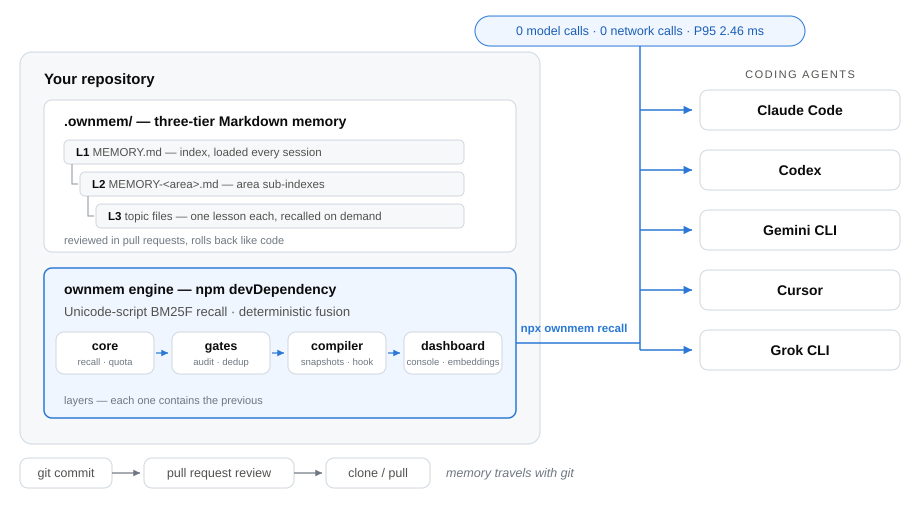

<div align="center">

# OwnMem

**Tu proyecto. Su propia memoria.**

Memoria local, determinista y nativa de git para coding agents.<br>
Un mismo conjunto de archivos sirve a Claude Code · Codex · Gemini CLI · Cursor · Grok CLI.

[](https://www.npmjs.com/package/ownmem)
[](https://nodejs.org)
[](./LICENSE)


[English](./README.md) · [简体中文](./README.zh-CN.md) · [日本語](./README.ja.md) · [한국어](./README.ko.md) · **Español** · [Français](./README.fr.md) · [Deutsch](./README.de.md) · [Português (BR)](./README.pt-BR.md)

</div>

OwnMem da a Claude Code, Codex y otros coding agents una memoria que vive
dentro del repositorio: Markdown plano en `.ownmem/`, clasificado por un motor
BM25F determinista y consciente de los sistemas de escritura Unicode. El
recall nunca llama a un modelo, nunca toca la red y nunca gasta un token en
tiempo de consulta — la misma pregunta devuelve la misma respuesta, en unos
dos milisegundos.

OwnMem tiene dos piezas. El **paquete npm** es el motor: vive en cada
repositorio como una `devDependency` revisada y gestiona la memoria de ese
repositorio en `.ownmem/`. El **plugin de agente** es una capa de conveniencia
opcional que se instala una vez por máquina: enseña a tu agente a usar el
motor, incluida la guía por la configuración de cada repositorio.

> **Nota:** Un repositorio está listo en cuanto tiene el paquete y `.ownmem/`,
> llegases como llegases. Empieza por cualquiera de las dos piezas.

<picture>
  <source media="(prefers-color-scheme: dark)" srcset="./assets/architecture-dark.svg">
  
</picture>

## Por qué existe

Construyo Oriveo, un cliente de IA multimodelo BYOK que se distribuye en iOS, Android, Web y escritorio: una base de código grande que desarrollo a diario con coding agents, alternando entre Claude Code y Codex. Cada repositorio acumulaba lecciones ganadas a pulso —causas raíz de depuración, trampas del toolchain, condiciones de carrera— y, cada vez que cambiaba el agent, la máquina o un compañero, esas lecciones desaparecían en silencio, porque vivían en la memoria de una sola herramienta, en una sola máquina.

Los servicios de memoria vectorial o en la nube nunca encajaron aquí: el conocimiento sobre un repositorio no debería exigir una cuenta, un servidor ni una factura por consulta. Así que la memoria se mudó al propio repositorio. OwnMem es el sistema que uso a diario en la base de código de Oriveo —cientos de memorias curadas, gobernadas por cuotas y auditorías—, extraído y reconstruido como un motor público y limpio.

## Por qué OwnMem

OwnMem hace cuatro apuestas, y cada decisión de diseño se deriva de ellas:

- **La memoria pertenece al repositorio.** Markdown revisable que viaja con
  git, aparece en los pull requests y se revierte como cualquier otro código.
  Clona el repo y te llevas la memoria — sin cuenta, sin servicio de
  sincronización, sin paso de exportación.
- **El recall debe ser gratuito y determinista.** La misma consulta devuelve
  el mismo ranking, sin llamadas a modelos, sin impuesto de latencia y sin
  factura por pregunta: 100% de Recall@1 con un P95 de 2.46 ms en el
  benchmark público bloqueado.
- **La memoria debe sobrevivir a cualquier herramienta concreta.** Los mismos
  archivos sirven a Claude Code, Codex, Gemini CLI, Cursor y Grok CLI, así que
  cambiar de agente nunca significa perder lo que el equipo aprendió.
- **La memoria debe mantenerse pequeña para seguir siendo fiable.** Una cuota
  de crecimiento neto cero, una auditoría en Node puro y puertas de casi
  duplicados y de deriva la mantienen ligera y actual, en lugar de dejar que
  se convierta en una segunda wiki que nadie poda.

### Qué no es OwnMem

- **No es una base de datos vectorial.** Si quieres búsqueda semántica difusa
  sobre grandes conjuntos de memorias, encaja mejor un servicio de memoria
  vectorial o de grafo de conocimiento.
- **No es captura automática.** Las escrituras son deliberadas y curadas — la
  revisión es la puerta de calidad. Las memorias integradas de cada agente
  son más cómodas, al precio de quedar atadas a una herramienta y de no ser
  revisables.
- **No es memoria entre repositorios ni sincronizada en la nube.** Un
  repositorio, una memoria, totalmente local, por diseño.

## Dentro de `.ownmem/`: la memoria de tres niveles

La parte siempre cargada se mantiene mínima; todo lo demás se lee bajo
demanda:

| Nivel | Archivo | Cuándo se lee |
| --- | --- | --- |
| **L1** | `MEMORY.md` | El índice — se carga al inicio de cada sesión |
| **L2** | `MEMORY-<area>.md` | Subíndices por área — se abren al tocar esa área |
| **L3** | un archivo por topic | Una lección por archivo — `recall` lo devuelve cuando sus triggers coinciden |

Un archivo de topic es Markdown plano con un frontmatter estricto validado
por schema — síntomas y formulaciones en `triggers`, pruebas en `evidence`
(abreviado aquí; `ownmem init` genera un ejemplo completo):

```markdown
---
name: pool_cap_timeout
description: staging deploys time out when workers exceed the pool cap
metadata:
  type: lesson
  triggers: ["staging deploy timeout", "pool cap exceeded"]
  evidence: [deploy-2026-08-12.log]
---

Raising the worker count without raising the connection pool cap exhausts
the pool, and every deploy waits until it times out. Raise both together.
```

Esta estructura es lo que hace gratis el recall: el índice es tan pequeño que
puede quedar siempre cargado, y BM25F solo tiene que ordenar archivos de
topic pequeños y bien etiquetados.

## Cómo se compara OwnMem

Cada columna de abajo resuelve un problema real — la tabla muestra qué
compromisos asume cada una, incluidos los nuestros.

| | OwnMem | [Mem0 (OSS)](https://github.com/mem0ai/mem0) | [Zep / Graphiti](https://github.com/getzep/graphiti) | [claude-mem](https://github.com/thedotmack/claude-mem) | Memoria automática integrada¹ |
| --- | :---: | :---: | :---: | :---: | :---: |
| La memoria vive en tu repo, viaja con git y los PRs | ✅ | ❌ | ❌ | ❌ | ❌ |
| Markdown legible y revisable por humanos | ✅ | ❌ | ❌ | ❌ | ⚠️² |
| Recall sin llamadas a modelos ni a la red | ✅ | ❌³ | ❌ | ❌ | — |
| Ranking determinista y reproducible | ✅ | ❌ | ❌ | ❌ | — |
| Una sola memoria para Claude Code, Codex, Gemini CLI, Cursor y Grok CLI | ✅ | ⚠️⁴ | ⚠️⁴ | ⚠️⁴ | ❌ |
| Gobernanza anti-inflado (cuota de crecimiento, auditoría, puertas de deriva) | ✅ | ❌ | ❌ | ❌ | ⚠️⁵ |
| Búsqueda semántica por paráfrasis | ⚠️⁶ | ✅ | ✅ | ✅ | ❌ |
| Captura totalmente automática | ❌⁷ | ✅ | ✅ | ✅ | ✅ |
| Memoria entre repositorios, a nivel de usuario | ❌⁷ | ✅ | ✅ | ⚠️ | ❌ |

¹ La memoria automática de Claude Code y las Memories de Codex: archivos bajo
tu directorio home — locales a la máquina, atados a la herramienta y fuera del
repositorio. Cursor retiró Memories en la 2.1 en favor de Rules; las memorias
de Windsurf se quedan en una sola máquina y nunca se confirman en git.
² Markdown editable, pero vive fuera del repo, así que nunca aparece en un
pull request.
³ La librería Apache-2.0 de Mem0 corre en local, pero sigue necesitando un LLM
y un modelo de embeddings (una key de OpenAI por defecto, o modelos locales
vía Ollama) para escribir y consultar la memoria.
⁴ A través de un servidor MCP o de su propia API — la memoria tiene alcance de
usuario o de aplicación, no es un conjunto de archivos que tu repositorio
posea.
⁵ Claude Code limita su índice siempre cargado (200 líneas / 25 KB); detrás no
hay cuota, auditoría ni puerta de duplicados.
⁶ Carril de embeddings opcional, desactivado por defecto; solo entra en el
ranking cuando tu evidencia A/B local pasa la puerta de seguridad.
⁷ Por diseño. OwnMem apuesta por escrituras curadas y revisadas y por el
alcance de un solo repositorio; si quieres captura automática o memoria a
nivel de usuario entre aplicaciones, esas herramientas encajan genuinamente
mejor.

Datos verificados en agosto de 2026 contra la documentación pública de cada
proyecto — las correcciones son bienvenidas.

## Benchmarks

<picture>
  <source media="(prefers-color-scheme: dark)" srcset="./assets/benchmark-dark.svg">
  
</picture>

Cada release debe pasar un benchmark público bloqueado: un corpus CC0 de 40
temas que abarca 40 etiquetas de idioma BCP 47 y 25 grupos de escritura, con
128 consultas positivas y 40 negativas sin relación. Las cifras de abajo
provienen de una ejecución con calidad de release (25 iteraciones
cronometradas por consulta):

| Métrica | Resultado | Puerta de release |
| --- | --- | --- |
| Recall@1 / Recall@5 (128 consultas positivas) | **100% / 100%** | = 100% |
| MRR | **1.000** | = 1.000 |
| Abstención en 40 consultas sin relación | **40 / 40** | = 100% |
| Latencia de recall P50 / P95 (4,200 muestras cronometradas) | **1.17 ms / 2.46 ms** | P95 ≤ 5 ms |
| Idiomas / escrituras bajo las mismas puertas | 40 etiquetas / 25 escrituras | P95 por idioma y por escritura ≤ 5 ms |
| Llamadas a modelos / a la red durante el recall | **0 / 0** | = 0 |
| Dependencias de runtime | 2 (`ajv`, `yaml` — JS puro) | bloqueado |
| Memoria extra durante la ejecución (delta de RSS) | < 2 MB | — |

Sobre el mismo corpus, un grep de cadena fija sin distinguir mayúsculas
obtiene un 3.1% de Recall@1. Mantenerse léxico y determinista no es el truco
por sí solo — lo es el ranking BM25F consciente de los sistemas de escritura
Unicode.

Reprodúcelo tú mismo:

```bash
git clone https://github.com/grpcer/ownmem
cd ownmem && npm ci && npm run benchmark
```

> **Nota:** Medido en un Apple M5 Pro con Node 25. El hash del corpus, los
> rankings y los umbrales están bloqueados, y la ejecución se repite con el
> orden de temas invertido para demostrar el determinismo. Estas métricas
> sintéticas son evidencia de regresión, no una afirmación de precisión con
> usuarios reales.

## Inicio rápido

OwnMem requiere Node.js 20 o superior. Instala el motor en el repositorio que
deba recordar su propio contexto de ingeniería:

```bash
npm install --save-dev ownmem
```

Para Claude Code:

```bash
npx ownmem init --locale auto --hosts claude --layers compiler --hook --command "npx ownmem"
```

Para Codex:

```bash
npx ownmem init --locale auto --hosts codex --layers compiler --command "npx ownmem"
```

Para ambas herramientas, con la consola web local:

```bash
npx ownmem init --locale auto --hosts claude,codex --layers dashboard --hook --command "npx ownmem"
```

La inicialización crea `.ownmem/` y bloques OwnMem delimitados dentro de las
instrucciones de proyecto del host. Todo el texto fuera de los límites
`ownmem-generated` se conserva intacto. Claude Code recibe además `/ownmem` y,
con `--hook` activado, un guardián `PreToolUse`. Codex recibe la misma
disciplina a través de `AGENTS.md`, más un skill a nivel de repositorio en
`.agents/skills/ownmem/`, que Cursor y Grok CLI descubren desde la misma ruta.
Gemini CLI y las reglas de Cursor también están soportados
(`--hosts gemini,cursor`), y `--hosts generic` escribe un
`MEMORY_INSTRUCTIONS.md` plano para cualquier otro agente.

Si trabajas desde un checkout del código fuente antes de la publicación, usa
la entrada local equivalente: `node memory.mjs init --locale auto`.

> **Nota:** Los comandos de barra vienen de dos lugares. `init` escribe los
> del propio repositorio que acabas de configurar (el `/ownmem` de Claude
> Code, más la skill `.agents/skills/ownmem/` que comparten Codex, Cursor y
> Grok CLI). El plugin opcional de la siguiente sección añade `/ownmem:recall`
> y `/ownmem:init` a nivel de máquina — útiles incluso en repositorios que
> aún no tienen `.ownmem/`.

## Instalar el plugin de agente (opcional, una vez por máquina)

**¿Hace falta instalarlo? No — si lo omites, todo sigue funcionando.**
`ownmem init` ya escribió la disciplina en las instrucciones de agente del
repositorio, así que cualquier agente que abra el repositorio la sigue. El
plugin aporta comodidad a nivel de máquina: añade `/ownmem:recall` y
`/ownmem:init` a todos los repositorios de la máquina — incluidos los que
aún no tienen `.ownmem/`, donde la skill de init guía al agente por la
instalación del motor. Este repositorio funciona además como marketplace del
plugin; sus comandos solo enrutan a `npx ownmem`, así que una actualización
del plugin nunca reescribe tu memoria.

Claude Code:

```
/plugin marketplace add grpcer/ownmem
/plugin install ownmem@ownmem
```

Esto añade los comandos `/ownmem:recall` y `/ownmem:init` junto con sus skills
de invocación por modelo. Activa la actualización automática del marketplace
en `/plugin` → Marketplaces para recibir nuevas versiones automáticamente.

Codex CLI:

```
codex plugin marketplace add grpcer/ownmem
codex plugin add ownmem@ownmem
```

Esto instala los skills `$ownmem` y `$ownmem-init`. Actualiza después con
`codex plugin marketplace upgrade ownmem`.

Gemini CLI:

```
gemini extensions install https://github.com/grpcer/ownmem
```

Esto añade el comando `/ownmem` y los mismos dos skills. Actualiza con
`gemini extensions update ownmem`.

## Actualizaciones automáticas seguras

OwnMem está diseñado para actualizaciones de dependencias revisables, no para
reescrituras silenciosas en segundo plano. Activa Dependabot o Renovate para
las dependencias npm. Cuando abra un pull request de actualización de OwnMem,
el CI debería ejecutar:

```bash
npx ownmem init --update
npx ownmem init --check
npx ownmem audit
```

`init --update` refresca solo los límites gestionados por OwnMem y conserva la
memoria del proyecto. `init --check` falla cuando los adaptadores generados
derivan. Confirmar `package-lock.json` mantiene a cada agente y trabajo de CI
en la versión revisada.

Para una actualización manual:

```bash
npm install --save-dev ownmem@latest
npx ownmem init --update
npx ownmem init --check
npx ownmem audit
```

Evita un `npx ownmem@latest` flotante en repositorios de producción: es cómodo
para un primer vistazo, pero hace las ejecuciones no reproducibles.

## Uso diario

**Enséñale una lección.** Acabas de quemar una hora descubriendo que los
deploys de staging expiran porque el pool de conexiones tiene un tope de
cinco. Dile a tu agente:

> «Recuerda esto: el timeout viene del tope del pool, no del número de
> workers. Nunca subas los workers sin subir el pool.»

El agente escribe un pequeño archivo de topic bajo `.ownmem/` — síntomas
en `triggers`, pruebas en `evidence` — y las puertas lo mantienen honesto:

```bash
npx ownmem audit
```

**Recupéralo cuando importa.** La semana siguiente, otra máquina, otro
agente, el mismo síntoma:

```bash
npx ownmem recall -- "staging deploy timeout"
```

La lección vuelve en unos dos milisegundos, con la evidencia adjunta — sin
llamada a modelo, sin red, sin gastar un token.

**Califica lo que volvió.** El feedback explícito se queda en una bandeja
local ignorada por git — nunca se sube ni se promueve automáticamente a un
benchmark:

```bash
npx ownmem recall --feedback correct -- "staging deploy timeout"
npx ownmem recall --feedback miss --expected pool_cap_timeout -- "why do deploys hang"
```

**Observa el sistema completo.** OwnMem Console muestra adopción, calidad
de recall, latencia y gobernanza de este repositorio — servido solo en
127.0.0.1 (`--status` y `--stop` lo gestionan):

```bash
npx ownmem dashboard --open
```


## Capas

Elige cuánta maquinaria quieres — cada capa contiene a la anterior:

| Capa | Añade |
| --- | --- |
| `core` | Inicialización, schema estricto, recall BM25F consciente de los sistemas de escritura Unicode, fusión determinista de múltiples consultas, cuota de crecimiento |
| `gates` | Auditoría en Node puro y puerta de casi duplicados |
| `compiler` | Snapshots inmutables, runtime residente por stdio, hook opcional de Claude Code |
| `dashboard` | OwnMem Console y el carril opcional de evaluación de embeddings |

Todas las capas usan solo las dependencias de runtime en JavaScript puro `ajv`
y `yaml`. OwnMem Console incluye catálogos completos para inglés, chino
simplificado y tradicional, japonés, coreano, español, francés, alemán,
portugués de Brasil, árabe, hindi, indonesio, ruso, tailandés, turco y
vietnamita.

## Seguridad y evidencia

- Los archivos de memoria siguen siendo Markdown inspeccionable dentro del repositorio.
- Las comprobaciones de schema, cuota, límites generados y casi duplicados se ejecutan en local.
- `recall.consumed` es la estrella polar de adopción; Recall@K es una métrica de proceso.
- La instalación por defecto nunca descarga ni invoca un modelo.
- El carril opcional de embeddings queda fuera del ranking hasta que la evidencia A/B local pase su puerta de seguridad.

OwnMem se licencia bajo Apache-2.0. Consulta `PRIVACY.md`, `SECURITY.md` y
`RELEASE.md` antes de compartir artefactos o publicar una release.
