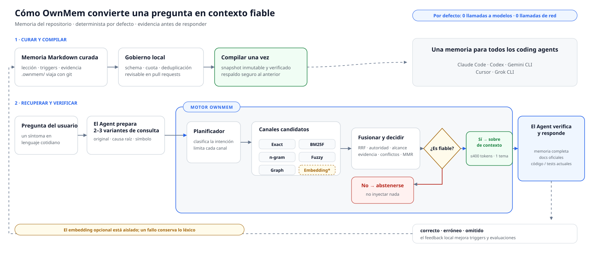

<div align="center">

# OwnMem — Memoria de proyecto nativa de Git para agentes de programación con IA

**Del repositorio. Determinista. Revisable.**

Un sistema de memoria de código abierto para agentes de IA en repositorios de software.<br>
Una memoria de proyecto persistente para Claude Code · Codex · Antigravity · Cursor · Gemini CLI · Grok CLI.

[](https://www.npmjs.com/package/ownmem)
[](https://nodejs.org)
[](./LICENSE)
[](https://github.com/grpcer/ownmem/actions/workflows/ci.yml)
[](#benchmarks)
[](#benchmarks)

[English](./README.md) · [简体中文](./README.zh-CN.md) · [繁體中文](./README.zh-TW.md) · [日本語](./README.ja.md) · [한국어](./README.ko.md) · **Español** · [Français](./README.fr.md) · [Deutsch](./README.de.md) · [Português (BR)](./README.pt-BR.md)

</div>

## ¿Qué es OwnMem?

OwnMem es un sistema de memoria de código abierto, local y nativo de Git para
agentes de programación con IA. Conserva decisiones, restricciones y aprendizajes de
depuración del proyecto como Markdown revisable dentro del repositorio. Esta
memoria de proyecto persistente funciona entre agentes y sesiones, viaja con
Git y se puede revertir junto con el código que describe.

Su motor BM25F determinista, adaptado a los sistemas de escritura Unicode,
ordena la memoria en `.ownmem/`. Con la misma consulta, configuración e
instantánea compilada, la recuperación predeterminada devuelve la misma
clasificación sin llamar a ningún modelo, realizar solicitudes de red ni
consumir tokens en tiempo de consulta: unos dos milisegundos en el benchmark
público.

OwnMem tiene dos piezas. El **paquete npm** es el motor: vive en cada
repositorio como una `devDependency` revisada y gestiona la memoria de ese
repositorio en `.ownmem/`. El **plugin de agente** es una capa de conveniencia
opcional que se instala una vez por máquina: enseña a tu agente a usar el
motor, incluida la guía por la configuración de cada repositorio.

> **Nota:** Un repositorio está listo en cuanto tiene el paquete y `.ownmem/`,
> independientemente de cómo se hayan instalado. Puedes empezar por cualquiera
> de los dos componentes.

## OwnMem de un vistazo

| Atributo | Dato |
| --- | --- |
| Categoría | Memoria de proyecto perteneciente al repositorio para agentes de programación con IA |
| Alcance | Un repositorio |
| Almacenamiento | Markdown revisable en `.ownmem/`, versionado con Git |
| Recuperación predeterminada | BM25F determinista, **0 llamadas a modelos / 0 llamadas de red** |
| Benchmark público | Benchmark sintético fijado de v0.1.2: **100 % de Recall@1**, **P95 de 2,46 ms**; no mide la precisión con usuarios reales |
| Licencia | Apache-2.0 |

<picture>
  <source media="(prefers-color-scheme: dark)" srcset="./assets/architecture-es-dark.svg">
  
</picture>

## Inicio rápido

OwnMem requiere Node.js 20 o superior. Tres pasos, todos dentro del
repositorio al que quieras dar memoria.

**Paso 1 — instala el motor.** Se convierte en una `devDependency` normal,
revisada y fijada como cualquier otra:

```bash
npm install --save-dev ownmem
```

**Paso 2 — inicializa este repositorio.** Esto crea `.ownmem/` y los archivos
adaptadores por agente:

```bash
npx ownmem init --locale auto --hosts claude,codex --layers dashboard --hook
```

**Paso 3 — vuelve a abrir tu agente.** Los agentes descubren los comandos al
inicio de la sesión, así que todo lo de abajo aparece en la siguiente sesión,
no en la que ejecutó la inicialización.

Esta es la configuración recomendada: Claude Code y Codex quedan listos, y
también se incluye la consola local. Lo que tienes tras reabrir:

- **Claude Code** gana un comando de proyecto: `/ownmem <lo que quieras que
  haga la memoria>`.
- **Codex y Grok CLI** descubren automáticamente la capacidad `ownmem` del
  repositorio.
- **Antigravity** carga las mismas instrucciones del proyecto (`AGENTS.md`,
  `GEMINI.md`), así que también sigue la disciplina de memoria — igual que
  cualquier otro agente que las lea.
- **La consola** es un comando de terminal, no un comando con barra:
  `npx ownmem dashboard --open`. (El plugin opcional de más abajo añade
  `/ownmem:dashboard`.)

No hay ningún comando que debas ejecutar cada día — simplemente trabaja como
siempre. Repite los tres pasos una vez por cada repositorio que deba tener su
propia memoria.

¿Solo usas un agente? Cambia `--hosts claude,codex` por `--hosts claude` o
`--hosts codex`. Antigravity y Grok CLI leen los mismos archivos `AGENTS.md`
(y, en el caso de Grok, `.agents/skills/`) que Codex, así que `--hosts codex`
cubre ambos. Cursor usa `--hosts cursor`, las configuraciones clásicas de
Gemini CLI usan `--hosts gemini`, y `--hosts generic` funciona con otros
agentes.

La inicialización crea `.ownmem/` y añade una pequeña sección de OwnMem a las
instrucciones del proyecto. Nunca modifica el texto que queda fuera de sus
límites marcados.

## Uso diario

Después de configurarlo, solo tienes que recordar dos cosas.

**1. Habla con tu agente.** Cuando aprendas algo que valga la pena conservar,
díselo con tus propias palabras:

> «Recuerda esto: el tiempo de espera viene del límite del conjunto de
> conexiones, no del número de procesos. Nunca aumentes los procesos sin
> aumentar el conjunto de conexiones.»

Más adelante, pregunta con la misma naturalidad de siempre:

> «El despliegue en preproducción vuelve a estar bloqueado. Revisa la memoria del
> proyecto antes de cambiar nada.»

El agente se encarga de escribir, validar y recuperar la memoria. No necesitas
abrir `.ownmem/` ni ejecutar `audit` o `recall` por tu cuenta. ¿Prefieres un
comando explícito? `/ownmem <petición>` (Claude Code) y la capacidad `ownmem`
(Codex) enrutan la misma petición a través de la memoria.

**2. Abre la consola cuando quieras una visión general.** Muestra el uso, la
calidad de recuperación, la latencia y el estado de la memoria de este
repositorio, y solo está disponible en tu equipo mediante 127.0.0.1:

```bash
npx ownmem dashboard --open
```


Ese es todo el flujo diario. `audit`, el `recall` manual y los comandos de
comentarios están pensados para CI y diagnóstico; un usuario normal no necesita
recordarlos.

## Por qué existe

Construyo Oriveo, un cliente de IA multimodelo BYOK para iOS, Android, web y escritorio: una base de código grande que desarrollo a diario con agentes de programación, alternando entre Claude Code y Codex. Cada repositorio acumulaba lecciones ganadas a pulso —causas raíz de errores, trampas de la cadena de herramientas y condiciones de carrera— y, cada vez que cambiaba el agente, la máquina o un compañero, esas lecciones desaparecían en silencio, porque vivían en la memoria de una sola herramienta, en una sola máquina.

Los servicios de memoria vectorial o en la nube nunca encajaron aquí: el conocimiento sobre un repositorio no debería exigir una cuenta, un servidor ni una factura por consulta. Así que la memoria se mudó al propio repositorio. OwnMem es el sistema que uso a diario en la base de código de Oriveo —cientos de memorias curadas, gobernadas por cuotas y auditorías—, extraído y reconstruido como un motor público y limpio.

## Por qué OwnMem

OwnMem hace cuatro apuestas, y cada decisión de diseño se deriva de ellas:

- **La memoria pertenece al repositorio.** Markdown revisable que viaja con
  git, aparece en los pull requests y se revierte como cualquier otro código.
  Clona el repo y te llevas la memoria — sin cuenta, sin servicio de
  sincronización, sin paso de exportación.
- **El recall debe ser gratuito y determinista.** La misma consulta devuelve
  la misma clasificación, sin llamadas a modelos, sin impuesto de latencia y sin
  factura por pregunta: 100 % de Recall@1 con un P95 de 2,46 ms en el
  benchmark público fijado.
- **La memoria debe sobrevivir a cualquier herramienta concreta.** Los mismos
  archivos sirven a Claude Code, Codex, Antigravity, Cursor, Gemini CLI y Grok CLI, así que
  cambiar de agente nunca significa perder lo que el equipo aprendió.
- **La memoria debe mantenerse pequeña para seguir siendo fiable.** Una cuota
  de crecimiento neto cero, una auditoría en Node puro y puertas de casi
  duplicados y de deriva la mantienen ligera y actualizada, en lugar de dejar que
  se convierta en una segunda wiki que nadie poda.

### Qué no es OwnMem

- **No es una base de datos vectorial.** Si quieres búsqueda semántica difusa
  sobre grandes conjuntos de memorias, encaja mejor un servicio de memoria
  vectorial o de grafo de conocimiento.
- **No es captura automática.** Las escrituras son deliberadas y curadas — la
  revisión es el control de calidad. Las memorias integradas de cada agente
  son más cómodas, al precio de quedar atadas a una herramienta y de no ser
  revisables.
- **No es memoria entre repositorios ni sincronizada en la nube.** La memoria
  viaja con el historial git del propio repositorio: clona el repositorio y
  ahí está. Pero nunca se comparte entre repositorios ni pasa por un servicio
  de memoria, por diseño.

## Dentro de `.ownmem/`: la memoria de tres niveles

La parte siempre cargada se mantiene mínima; todo lo demás se lee bajo
demanda:

| Nivel | Archivo | Cuándo se lee |
| --- | --- | --- |
| **L1** | `MEMORY.md` | El índice — se carga al inicio de cada sesión |
| **L2** | `MEMORY-<area>.md` | Subíndices por área — se abren al tocar esa área |
| **L3** | un archivo por tema | Una lección por archivo — `recall` la devuelve cuando coinciden sus activadores |

Un archivo de tema es Markdown plano con metadatos iniciales estrictos validados
por un esquema — síntomas y formulaciones en `triggers`, pruebas en `evidence`
(abreviado aquí; `ownmem init` genera un ejemplo completo):

```markdown
---
name: pool_cap_timeout
description: staging deploys time out when workers exceed the pool cap
metadata:
  type: lesson
  triggers: ["staging deploy timeout", "pool cap exceeded"]
  evidence: [deploy-2026-08-12.log]
---

Raising the worker count without raising the connection pool cap exhausts
the pool, and every deploy waits until it times out. Raise both together.
```

Esta estructura es lo que hace gratis el recall: el índice es tan pequeño que
puede quedar siempre cargado, y BM25F solo tiene que ordenar archivos de
tema pequeños y bien etiquetados.

## Cómo se compara OwnMem

Cada columna de abajo resuelve un problema real — la tabla muestra qué
compromisos asume cada una, incluidos los nuestros.

| | OwnMem | [Mem0 (OSS)](https://github.com/mem0ai/mem0) | [Zep / Graphiti](https://github.com/getzep/graphiti) | [claude-mem](https://github.com/thedotmack/claude-mem) | Memoria automática integrada¹ |
| --- | :---: | :---: | :---: | :---: | :---: |
| La memoria vive en tu repositorio, viaja con Git y las solicitudes de cambio | ✅ | ❌ | ❌ | ❌ | ❌ |
| Markdown legible y revisable por humanos | ✅ | ❌ | ❌ | ❌ | ⚠️² |
| Recall sin llamadas a modelos ni a la red | ✅ | ❌³ | ❌ | ❌ | — |
| Ranking determinista y reproducible | ✅ | ❌ | ❌ | ❌ | — |
| Una sola memoria para Claude Code, Codex, Antigravity, Cursor, Gemini CLI y Grok CLI | ✅ | ⚠️⁴ | ⚠️⁴ | ⚠️⁴ | ❌ |
| Control contra la expansión (cuota de crecimiento, auditoría, controles de deriva) | ✅ | ❌ | ❌ | ❌ | ⚠️⁵ |
| Búsqueda semántica por paráfrasis | ⚠️⁶ | ✅ | ✅ | ✅ | ❌ |
| Captura totalmente automática | ❌⁷ | ✅ | ✅ | ✅ | ✅ |
| Memoria entre repositorios, a nivel de usuario | ❌⁷ | ✅ | ✅ | ⚠️ | ❌ |

¹ La memoria automática de Claude Code y las Memories de Codex: archivos bajo
tu directorio personal — locales a la máquina, atados a la herramienta y fuera del
repositorio. Cursor retiró Memories en la 2.1 en favor de Rules; las memorias
de Windsurf se quedan en una sola máquina y nunca se incluyen en commits.
² Markdown editable, pero vive fuera del repo, así que nunca aparece en un
pull request.
³ La librería Apache-2.0 de Mem0 corre en local, pero sigue necesitando un LLM
y un modelo de embeddings (una clave de OpenAI por defecto, o modelos locales
vía Ollama) para escribir y consultar la memoria.
⁴ A través de un servidor MCP o de su propia API — la memoria tiene alcance de
usuario o de aplicación, no es un conjunto de archivos que tu repositorio
posea.
⁵ Claude Code limita su índice siempre cargado (200 líneas / 25 KB); detrás no
no hay cuota, auditoría ni control de duplicados.
⁶ Vía de embeddings opcional, desactivada por defecto; solo entra en la
clasificación cuando tus pruebas A/B locales superan el control de seguridad.
⁷ Por diseño. OwnMem apuesta por escrituras curadas y revisadas y por el
alcance de un solo repositorio; si quieres captura automática o memoria a
nivel de usuario entre aplicaciones, esas herramientas encajan genuinamente
mejor.

Datos verificados en agosto de 2026 contra la documentación pública de cada
proyecto: [Mem0](https://docs.mem0.ai), [Zep / Graphiti](https://help.getzep.com/graphiti/getting-started/overview),
[claude-mem](https://github.com/thedotmack/claude-mem),
[memoria automática de Claude Code](https://code.claude.com/docs/en/memory),
[Codex memories](https://developers.openai.com/codex/memories),
[Cursor rules](https://cursor.com/docs/context/rules),
[Windsurf memories](https://docs.devin.ai/desktop/cascade/memories) — se agradecen correcciones.

## Benchmarks

<picture>
  <source media="(prefers-color-scheme: dark)" srcset="./assets/benchmark-dark.svg">
  
</picture>

Cada versión debe superar un benchmark público fijado: un corpus CC0 de 40
temas que abarca 40 etiquetas de idioma BCP 47 y 25 grupos de escritura, con
128 consultas positivas y 40 negativas sin relación. Las cifras de abajo
provienen de una ejecución apta para publicación (25 iteraciones
cronometradas por consulta):

| Métrica | Resultado | Criterio de publicación |
| --- | --- | --- |
| Recall@1 / Recall@5 (128 consultas positivas) | **100 % / 100 %** | = 100 % |
| MRR | **1,000** | = 1,000 |
| Abstención en 40 consultas sin relación | **40 / 40** | = 100 % |
| Latencia de recuperación P50 / P95 (4.200 muestras cronometradas) | **1,17 ms / 2,46 ms** | P95 ≤ 5 ms |
| Idiomas / escrituras bajo las mismas puertas | 40 etiquetas / 25 escrituras | P95 por idioma y por escritura ≤ 5 ms |
| Llamadas a modelos / a la red durante la recuperación | **0 / 0** | = 0 |
| Dependencias en tiempo de ejecución | 2 (`ajv`, `yaml` — JS puro) | fijadas |
| Memoria extra durante la ejecución (delta de RSS) | < 2 MB | — |

Sobre el mismo corpus, un `grep` de cadena fija sin distinguir mayúsculas
obtiene un 3,1 % de Recall@1. Mantenerse léxico y determinista no es el truco
por sí solo — lo es la clasificación BM25F adaptada a los sistemas de escritura
Unicode.

Reprodúcelo tú mismo:

```bash
git clone https://github.com/grpcer/ownmem
cd ownmem && npm ci && npm run benchmark
```

> **Nota:** Medido en un Apple M5 Pro con Node 25. El hash del corpus, los
> clasificaciones y los umbrales están fijados, y la ejecución se repite con el
> orden de temas invertido para demostrar el determinismo. Estas métricas
> sintéticas son evidencia de regresión, no una afirmación de precisión con
> usuarios reales.

## Referencias

Nada de la matemática de clasificación es de cosecha propia: cada técnica del motor
es un método publicado y probado. La aportación de OwnMem es componerlas en un
motor determinista con dos pequeñas dependencias de JavaScript puro en tiempo
de ejecución:

| En OwnMem | Técnica | Bibliografía |
| --- | --- | --- |
| Canal `bm25f` | BM25 ponderado por campos | Robertson & Zaragoza (2009), *[The Probabilistic Relevance Framework: BM25 and Beyond](https://doi.org/10.1561/1500000019)*; Robertson, Zaragoza & Taylor (2004), *[Simple BM25 extension to multiple weighted fields](https://doi.org/10.1145/1031171.1031181)* |
| Fusión de canales y consultas | Reciprocal Rank Fusion | Cormack, Clarke & Büttcher (2009), *[Reciprocal rank fusion outperforms Condorcet and individual rank learning methods](https://doi.org/10.1145/1571941.1572114)* |
| Diversidad de resultados | Maximal Marginal Relevance | Carbonell & Goldstein (1998), *[The use of MMR, diversity-based reranking for reordering documents and producing summaries](https://doi.org/10.1145/290941.291025)* |
| Canal `ngram` | Similitud de n-gramas (Dice) | Dice (1945), *[Measures of the amount of ecologic association between species](https://doi.org/10.2307/1932409)* |
| Canal `fuzzy` | Distancia de edición acotada | Levenshtein (1966), *Binary codes capable of correcting deletions, insertions, and reversals*, Soviet Physics Doklady 10(8) |
| Control de duplicados | SimHash | Charikar (2002), *[Similarity estimation techniques from rounding algorithms](https://doi.org/10.1145/509907.509965)*; Manku, Jain & Das Sarma (2007), *[Detecting near-duplicates for web crawling](https://doi.org/10.1145/1242572.1242592)* |
| Control de duplicados | MinHash | Broder (1997), *[On the resemblance and containment of documents](https://doi.org/10.1109/SEQUEN.1997.666900)* |
| Tokenizador | Segmentación por escritura | *[UAX #24: Unicode Script Property](https://unicode.org/reports/tr24/)*; *[UAX #29: Unicode Text Segmentation](https://unicode.org/reports/tr29/)* |

## Instalar el plugin de agente (opcional, una vez por máquina)

**¿Hace falta instalarlo? No — si lo omites, todo sigue funcionando.**
`ownmem init` ya escribió la disciplina en las instrucciones de agente del
repositorio, así que cualquier agente que abra el repositorio la sigue. El
plugin aporta comodidad a nivel de máquina: añade las mismas tres funciones a
todos los repositorios de la máquina — incluidos los que
aún no tienen `.ownmem/`, donde la función de inicialización guía al agente por la
instalación del motor. Este repositorio funciona además como marketplace del
plugin; sus comandos solo enrutan a `npx ownmem`, así que una actualización
del plugin nunca reescribe tu memoria.

Un plugin, tres funciones, un solo conjunto de nombres:

| Función | Claude Code | Codex CLI | Qué hace |
| --- | --- | --- | --- |
| `recall` | `/ownmem:recall` | `ownmem:recall` | Recuperar la memoria antes de cambiar código |
| `init` | `/ownmem:init` | `ownmem:init` | Instalar o actualizar OwnMem en un repositorio |
| `dashboard` | `/ownmem:dashboard` | `ownmem:dashboard` | Abrir la consola local |

**Claude Code** — ejecuta ambos comandos, en orden: el primero registra este
repositorio como marketplace de plugins (solo hace falta una vez), el segundo
instala el plugin desde él:

```
/plugin marketplace add grpcer/ownmem
/plugin install ownmem@ownmem
```

Después reinicia Claude Code: los comandos del plugin se cargan al inicio de
la sesión, así que aparecen en la siguiente sesión, no en la que los instaló.
Activa la actualización automática del marketplace en `/plugin` → Marketplaces
para recibir nuevas versiones automáticamente.

**Codex CLI** — los mismos dos pasos en orden: registra el marketplace y
luego añade el plugin:

```
codex plugin marketplace add grpcer/ownmem
codex plugin add ownmem@ownmem
```

Aquí las funciones también se cargan al inicio de la sesión; las encontrarás en
el selector `$`. Actualiza después con
`codex plugin marketplace upgrade ownmem` seguido de
`codex plugin add ownmem@ownmem`.

**Grok CLI** — de nuevo ambos comandos en orden: registra el marketplace y
luego instala (Grok exige el `--trust` explícito). Omite el primer comando si
Grok ya importó tus marketplaces de Claude Code:

```
grok plugin marketplace add grpcer/ownmem
grok plugin install ownmem@ownmem --trust
```

Esto instala las mismas tres funciones. Cuando un nombre sencillo ya está
ocupado, Grok le añade un espacio de nombres: su panel integrado convierte el
nuestro en `/ownmem:dashboard`. Actualiza con `grok plugin update ownmem`.

**Antigravity** — un solo comando, sin paso de marketplace:

```
agy plugin install https://github.com/grpcer/ownmem
```

Esto importa las funciones `ownmem`, `ownmem-init` y `ownmem-dashboard`;
actualiza volviendo a ejecutar el mismo comando. (Las configuraciones
clásicas de Gemini CLI — clave de API, Vertex AI o una licencia empresarial — aún
pueden instalar el mismo repositorio con
`gemini extensions install https://github.com/grpcer/ownmem`.)

## Actualizaciones automáticas seguras

OwnMem está diseñado para actualizaciones de dependencias revisables, no para
reescrituras silenciosas en segundo plano. Activa Dependabot o Renovate para
las dependencias npm. Cuando abra una solicitud de cambios para actualizar OwnMem,
el CI debería ejecutar estos tres comandos en orden:

```bash
npx ownmem init --update
npx ownmem init --check
npx ownmem audit
```

`init --update` refresca solo los límites gestionados por OwnMem y conserva la
memoria del proyecto. `init --check` falla cuando los adaptadores generados
se desvían. Incluir `package-lock.json` en los commits mantiene a cada agente y trabajo de CI
en la versión revisada.

Para una actualización manual, ejecuta los cuatro en orden:

```bash
npm install --save-dev ownmem@latest
npx ownmem init --update
npx ownmem init --check
npx ownmem audit
```

Evita un `npx ownmem@latest` flotante en repositorios de producción: es cómodo
para un primer vistazo, pero hace las ejecuciones no reproducibles.

## Capas

Elige cuánta maquinaria quieres — cada capa contiene a la anterior:

| Capa | Añade |
| --- | --- |
| `core` | Inicialización, esquema estricto, recuperación BM25F adaptada a los sistemas de escritura Unicode, fusión determinista de múltiples consultas, cuota de crecimiento |
| `gates` | Auditoría en Node puro y control de casi duplicados |
| `compiler` | Instantáneas inmutables, entorno de ejecución residente mediante stdio, enlace opcional de Claude Code |
| `dashboard` | OwnMem Console y la vía opcional de evaluación de embeddings |

Todas las capas usan solo las dependencias en tiempo de ejecución de JavaScript puro `ajv`
y `yaml`. OwnMem Console incluye catálogos completos para inglés, chino
simplificado y tradicional, japonés, coreano, español, francés, alemán,
portugués de Brasil, árabe, hindi, indonesio, ruso, tailandés, turco y
vietnamita.

## Preguntas frecuentes sobre la memoria para agentes de IA

### ¿Qué es un sistema de memoria para agentes de IA?

Es un sistema que guarda conocimientos que un agente puede reutilizar entre
tareas o sesiones. OwnMem aplica esa idea a los repositorios de software y
conserva aprendizajes técnicos revisados, no historiales de chat ni perfiles.

### ¿Cómo doy memoria de proyecto persistente a Claude Code o Codex?

Sigue el [inicio rápido](#inicio-rápido) una vez en cada repositorio y vuelve
a abrir el agente. Claude Code, Codex, Antigravity, Cursor, Gemini CLI y Grok
CLI podrán leer los mismos archivos de `.ownmem/`.

### ¿Dónde se almacena la memoria y cómo la comparte un equipo?

La memoria es Markdown plano dentro de `.ownmem/`. Incluye en Git solo las
memorias adecuadas para que sigan el flujo habitual de clonación, solicitudes
de cambio, control de acceso y reversión; no guardes secretos del repositorio.

### ¿OwnMem necesita un LLM, una API de embeddings, una base vectorial o red?

La recuperación predeterminada no necesita nada de eso: es una búsqueda
léxica local con dos pequeñas dependencias de JavaScript puro. Instalar paquetes
puede requerir red; la vía opcional de embeddings permanece desactivada hasta
que las pruebas A/B locales superan su control de seguridad.

### ¿En qué se diferencia de Mem0, Graphiti, claude-mem o la memoria integrada?

OwnMem está limitado al repositorio, es curado, determinista y revisable en
Git. Esas alternativas encajan mejor si necesitas captura automática, búsqueda
semántica a gran escala, memoria de usuario, grafos de conocimiento o
sincronización en la nube; consulta la [comparación](#cómo-se-compara-ownmem).

## Contribuir

Las incidencias y solicitudes de cambio son bienvenidas — consulta
[CONTRIBUTING.md](./CONTRIBUTING.md) para las reglas básicas: mantener el
recall por defecto determinista, local y sin modelos, añadir un caso de
regresión por cada cambio de recuperación, y ejecutar `npm test` y
`npm run benchmark:release` antes de pedir revisión. Los reportes de
seguridad van por [SECURITY.md](./SECURITY.md).

## Seguridad y evidencia

- Los archivos de memoria siguen siendo Markdown inspeccionable dentro del repositorio.
- Las comprobaciones de esquema, cuota, límites generados y casi duplicados se ejecutan en local.
- `recall.consumed` es la estrella polar de adopción; Recall@K es una métrica de proceso.
- La instalación por defecto nunca descarga ni invoca un modelo.
- La vía opcional de embeddings queda fuera de la clasificación hasta que las pruebas A/B locales superen el control de seguridad.

OwnMem se licencia bajo Apache-2.0. Consulta `PRIVACY.md`, `SECURITY.md` y
`RELEASE.md` antes de compartir artefactos o publicar una versión.

## Agradecimientos

- [LINUX DO](https://linux.do/)
