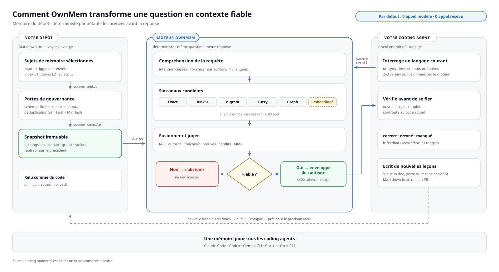
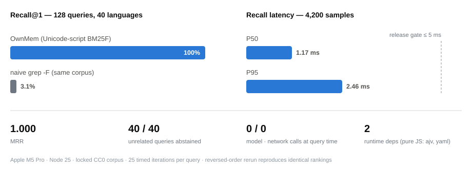
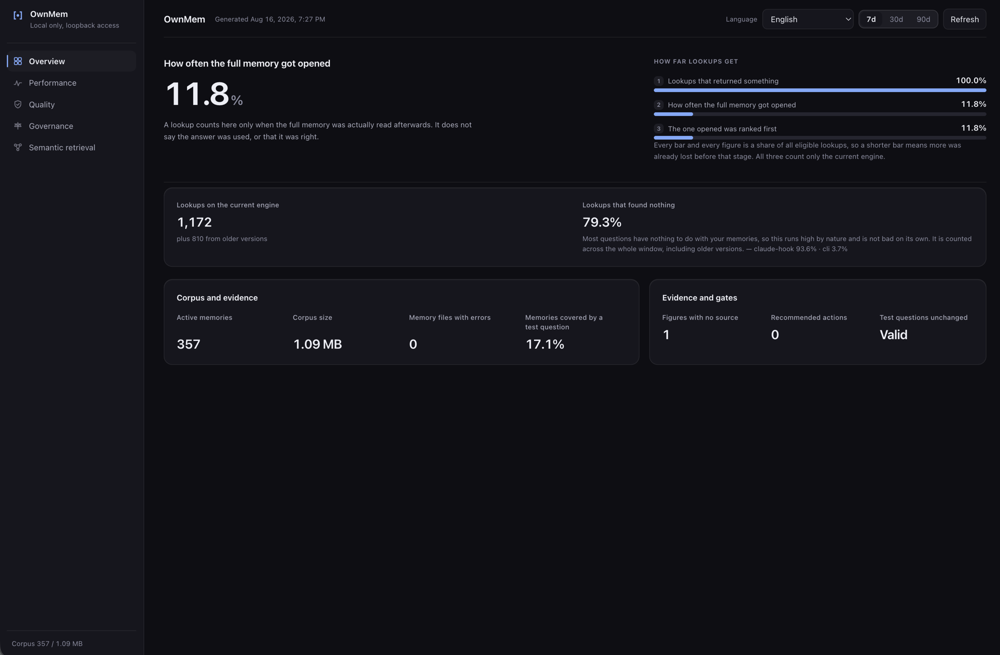

<div align="center">

# OwnMem

**Votre projet. Sa propre mémoire.**

Une mémoire locale, déterministe et native git pour les coding agents.<br>
Un même jeu de fichiers sert Claude Code · Codex · Gemini CLI · Cursor · Grok CLI.

[](https://www.npmjs.com/package/ownmem)
[](https://nodejs.org)
[](./LICENSE)


[English](./README.md) · [简体中文](./README.zh-CN.md) · [日本語](./README.ja.md) · [한국어](./README.ko.md) · [Español](./README.es.md) · **Français** · [Deutsch](./README.de.md) · [Português (BR)](./README.pt-BR.md)

</div>

OwnMem donne à Claude Code, Codex et aux autres coding agents une mémoire qui
vit dans le dépôt : du Markdown brut dans `.ownmem/`, classé par un moteur
BM25F déterministe et sensible aux systèmes d'écriture Unicode. Le recall
n'appelle jamais de modèle, ne touche jamais le réseau et ne dépense jamais un
token au moment de la requête — la même question renvoie la même réponse, en
deux millisecondes environ.

OwnMem se compose de deux pièces. Le **paquet npm** est le moteur : il vit
dans chaque dépôt comme `devDependency` révisée et gère la mémoire de ce dépôt
dans `.ownmem/`. Le **plugin d'agent** est une couche de confort optionnelle,
installée une fois par machine : elle apprend à votre agent à piloter le
moteur, y compris en vous guidant dans la configuration par dépôt.

> **Remarque :** un dépôt est prêt dès qu'il a le paquet et `.ownmem/`, peu
> importe le chemin suivi. Commencez par l'une ou l'autre pièce.

<picture>
  <source media="(prefers-color-scheme: dark)" srcset="./assets/architecture-fr-dark.svg">
  
</picture>

## Pourquoi ce projet existe

Je développe Oriveo, un client IA multi-modèles BYOK livré sur iOS, Android, Web et desktop — une base de code volumineuse sur laquelle je travaille chaque jour avec des coding agents, en alternant entre Claude Code et Codex. Chaque dépôt accumulait des leçons durement acquises : causes racines de débogage, pièges de toolchain, problèmes de timing. Et à chaque changement d'agent, de machine ou de coéquipier, ces leçons disparaissaient en silence, parce qu'elles vivaient dans la mémoire d'un seul outil, sur une seule machine.

Les services de mémoire vectorielle ou cloud ne m'ont jamais semblé adaptés ici : la connaissance d'un dépôt ne devrait exiger ni compte, ni serveur, ni facturation à la requête. La mémoire a donc rejoint le dépôt lui-même. OwnMem est le système que j'utilise chaque jour dans la base de code d'Oriveo — des centaines de mémoires soigneusement sélectionnées, tenues par des quotas et des audits — extrait et reconstruit en un moteur public propre.

## Pourquoi OwnMem

OwnMem fait quatre paris, et chaque décision de conception en découle :

- **La mémoire appartient au dépôt.** Du Markdown révisable qui voyage avec
  git, apparaît dans les pull requests et se rétablit comme n'importe quel
  autre code. Clonez le dépôt, la mémoire vient avec — pas de compte, pas de
  service de synchronisation, pas d'étape d'export.
- **Le recall doit être gratuit et déterministe.** La même requête renvoie le
  même classement, sans appel de modèle, sans taxe de latence, sans facture à
  la question : 100 % de Recall@1 avec un P95 de 2.46 ms sur le benchmark
  public verrouillé.
- **La mémoire doit survivre à chaque outil pris isolément.** Les mêmes
  fichiers servent Claude Code, Codex, Gemini CLI, Cursor et Grok CLI, donc
  changer d'agent ne signifie jamais perdre ce que l'équipe a appris.
- **La mémoire doit rester petite pour rester digne de confiance.** Un quota à
  croissance nette nulle, un audit en Node pur, des portes anti quasi-doublons
  et anti-dérive la gardent svelte et à jour, au lieu d'en faire un second
  wiki que personne n'élague.

### Ce qu'OwnMem n'est pas

- **Pas une base vectorielle.** Si vous voulez une recherche sémantique floue
  sur de grands ensembles de souvenirs, un service de mémoire vectorielle ou
  en graphe de connaissances conviendra mieux.
- **Pas de capture automatique.** Les écritures sont délibérées et curées —
  la revue est la porte de qualité. Les mémoires intégrées des agents sont
  plus commodes, au prix d'un verrouillage sur un outil et d'une absence de
  révisabilité.
- **Ni inter-dépôts, ni synchronisé dans le cloud.** La mémoire voyage avec
  l'historique git du dépôt lui-même : clonez le dépôt et elle est là. Mais
  elle n'est jamais partagée entre dépôts et ne transite jamais par un service
  de mémoire, par conception.

## À l'intérieur de `.ownmem/` : la mémoire à trois niveaux

La partie toujours chargée reste minuscule ; tout le reste est lu à la
demande :

| Niveau | Fichier | Quand il est lu |
| --- | --- | --- |
| **L1** | `MEMORY.md` | L'index — chargé au début de chaque session |
| **L2** | `MEMORY-<area>.md` | Sous-index par domaine — ouverts quand ce domaine est touché |
| **L3** | un fichier par topic | Une leçon par fichier — renvoyé par `recall` quand ses triggers correspondent |

Un fichier de topic est du Markdown pur avec un frontmatter strict validé par
schéma — symptômes et formulations dans `triggers`, preuves dans
`evidence` (extrait ; `ownmem init` génère un exemple complet) :

```markdown
---
name: pool_cap_timeout
description: staging deploys time out when workers exceed the pool cap
metadata:
  type: lesson
  triggers: ["staging deploy timeout", "pool cap exceeded"]
  evidence: [deploy-2026-08-12.log]
---

Raising the worker count without raising the connection pool cap exhausts
the pool, and every deploy waits until it times out. Raise both together.
```

C'est cette structure qui rend le rappel gratuit : l'index est assez petit
pour rester chargé, et BM25F n'a qu'à classer de petits fichiers de topic
bien étiquetés.

## Comment OwnMem se compare

Chaque colonne ci-dessous résout un vrai problème — le tableau montre les
compromis que fait chacune, les nôtres compris.

| | OwnMem | [Mem0 (OSS)](https://github.com/mem0ai/mem0) | [Zep / Graphiti](https://github.com/getzep/graphiti) | [claude-mem](https://github.com/thedotmack/claude-mem) | Mémoire auto intégrée¹ |
| --- | :---: | :---: | :---: | :---: | :---: |
| La mémoire vit dans votre dépôt, voyage avec git et les PR | ✅ | ❌ | ❌ | ❌ | ❌ |
| Markdown lisible et révisable par un humain | ✅ | ❌ | ❌ | ❌ | ⚠️² |
| Recall sans appel de modèle ni réseau | ✅ | ❌³ | ❌ | ❌ | — |
| Classement déterministe et reproductible | ✅ | ❌ | ❌ | ❌ | — |
| Une seule mémoire pour Claude Code, Codex, Gemini CLI, Cursor, Grok CLI | ✅ | ⚠️⁴ | ⚠️⁴ | ⚠️⁴ | ❌ |
| Gouvernance anti-enflure (quota de croissance, audit, portes anti-dérive) | ✅ | ❌ | ❌ | ❌ | ⚠️⁵ |
| Recherche sémantique par paraphrase | ⚠️⁶ | ✅ | ✅ | ✅ | ❌ |
| Capture entièrement automatique | ❌⁷ | ✅ | ✅ | ✅ | ✅ |
| Mémoire inter-dépôts, au niveau utilisateur | ❌⁷ | ✅ | ✅ | ⚠️ | ❌ |

¹ Mémoire automatique de Claude Code et Memories de Codex : des fichiers sous
votre répertoire personnel — locaux à la machine, verrouillés sur l'outil,
hors du dépôt. Cursor a retiré Memories en 2.1 au profit des Rules ; les
mémoires de Windsurf restent locales à une machine et ne sont jamais
committées.
² Du Markdown éditable, mais il vit hors du dépôt et n'apparaît donc jamais
dans une pull request.
³ La bibliothèque Apache-2.0 de Mem0 tourne en local, mais exige toujours un
LLM et un modèle d'embedding (une clé OpenAI par défaut, ou des modèles locaux
via Ollama) pour écrire et interroger la mémoire.
⁴ Via un serveur MCP ou sa propre API — la mémoire a une portée utilisateur
ou application, ce n'est pas un jeu de fichiers appartenant à votre dépôt.
⁵ Claude Code plafonne son index chargé en permanence (200 lignes / 25 KB) ;
derrière, il n'y a ni quota, ni audit, ni porte anti-doublons.
⁶ Voie d'embeddings optionnelle, désactivée par défaut ; elle ne rejoint le
classement qu'une fois vos preuves A/B locales passées par la porte de
sécurité.
⁷ Par conception. OwnMem parie sur des écritures curées et révisées et sur
une portée limitée à un dépôt ; si vous voulez une capture automatique ou une
mémoire au niveau utilisateur partagée entre applications, ces outils
conviennent sincèrement mieux.

Faits vérifiés en août 2026 sur la documentation publique de chaque projet —
corrections bienvenues.

## Benchmarks

<picture>
  <source media="(prefers-color-scheme: dark)" srcset="./assets/benchmark-dark.svg">
  
</picture>

Chaque release doit passer un benchmark public verrouillé : un corpus CC0 de
40 sujets couvrant 40 étiquettes de langue BCP 47 et 25 groupes d'écritures,
avec 128 requêtes positives et 40 négatives sans rapport. Les chiffres
ci-dessous proviennent d'un run de qualité release (25 itérations
chronométrées par requête) :

| Métrique | Résultat | Porte de release |
| --- | --- | --- |
| Recall@1 / Recall@5 (128 requêtes positives) | **100% / 100%** | = 100% |
| MRR | **1.000** | = 1.000 |
| Abstention sur 40 requêtes sans rapport | **40 / 40** | = 100% |
| Latence de recall P50 / P95 (4 200 échantillons chronométrés) | **1.17 ms / 2.46 ms** | P95 ≤ 5 ms |
| Langues / écritures sous les mêmes portes | 40 étiquettes / 25 écritures | P95 par langue et par écriture ≤ 5 ms |
| Appels de modèle / appels réseau pendant le recall | **0 / 0** | = 0 |
| Dépendances runtime | 2 (`ajv`, `yaml` — JS pur) | verrouillé |
| Mémoire supplémentaire pendant le run (delta RSS) | < 2 MB | — |

Sur le même corpus, un grep de chaîne fixe insensible à la casse obtient
3.1 % de Recall@1. Rester lexical et déterministe n'est pas l'astuce en soi —
c'est le classement BM25F sensible aux systèmes d'écriture Unicode qui l'est.

Reproduisez-le vous-même :

```bash
git clone https://github.com/grpcer/ownmem
cd ownmem && npm ci && npm run benchmark
```

> **Remarque :** mesuré sur un Apple M5 Pro avec Node 25. Le hash du corpus,
> les classements et les seuils sont verrouillés, et le run se répète avec
> l'ordre des sujets inversé pour prouver le déterminisme. Ces métriques
> synthétiques sont des preuves de régression, pas une prétention de précision
> en usage réel.

## Démarrage rapide

OwnMem nécessite Node.js 20 ou plus récent. Installez le moteur dans le dépôt
qui doit se souvenir de son propre contexte d'ingénierie :

```bash
npm install --save-dev ownmem
```

Pour Claude Code :

```bash
npx ownmem init --locale auto --hosts claude --layers compiler --hook --command "npx ownmem"
```

Pour Codex :

```bash
npx ownmem init --locale auto --hosts codex --layers compiler --command "npx ownmem"
```

Pour les deux outils, avec la console web locale :

```bash
npx ownmem init --locale auto --hosts claude,codex --layers dashboard --hook --command "npx ownmem"
```

L'initialisation crée `.ownmem/` et des blocs OwnMem délimités dans les
instructions de projet de l'hôte. Tout le texte hors des limites
`ownmem-generated` est préservé. Claude Code reçoit aussi `/ownmem` et, quand
`--hook` est activé, un garde `PreToolUse`. Codex reçoit la même discipline
via `AGENTS.md`, plus un skill au niveau du dépôt dans
`.agents/skills/ownmem/`, que Cursor et Grok CLI découvrent depuis le même
chemin. Gemini CLI et les règles Cursor sont également pris en charge
(`--hosts gemini,cursor`), et `--hosts generic` écrit un
`MEMORY_INSTRUCTIONS.md` brut pour tout autre agent.

Si vous travaillez depuis un checkout des sources avant publication, utilisez
l'entrée locale équivalente : `node memory.mjs init --locale auto`.

> **Remarque :** Les commandes slash viennent de deux endroits. `init`
> écrit celles propres au dépôt que vous venez de configurer (le `/ownmem` de
> Claude Code, plus la skill `.agents/skills/ownmem/` partagée par Codex,
> Cursor et Grok CLI). Le plugin optionnel de la section suivante ajoute
> `/ownmem:recall` et `/ownmem:init` à l'échelle de la machine — utiles
> même dans un dépôt qui n'a pas encore de `.ownmem/`.

## Installer le plugin d'agent (optionnel, une fois par machine)

**Faut-il l'installer ? Non — sans lui, tout fonctionne déjà.**
`ownmem init` a déjà écrit la discipline dans les instructions d'agent du
dépôt : tout agent qui ouvre le dépôt la suit. Le plugin apporte le confort à
l'échelle de la machine : il ajoute `/ownmem:recall` et `/ownmem:init` à
tous les dépôts de la machine — y compris ceux qui n'ont pas encore de
`.ownmem/`, où la skill d'init guide l'agent dans l'installation du moteur.
Ce dépôt fait aussi office de marketplace du plugin ; ses commandes ne font
que router vers `npx ownmem`, donc une mise à jour du plugin ne réécrit
jamais votre mémoire.

Claude Code :

```
/plugin marketplace add grpcer/ownmem
/plugin install ownmem@ownmem
```

Cela ajoute les commandes `/ownmem:recall` et `/ownmem:init` ainsi que leurs
skills invoqués par le modèle. Activez la mise à jour automatique du
marketplace dans `/plugin` → Marketplaces pour recevoir les nouvelles versions
automatiquement.

Codex CLI :

```
codex plugin marketplace add grpcer/ownmem
codex plugin add ownmem@ownmem
```

Cela installe les skills `$ownmem` et `$ownmem-init`. Rafraîchissez ensuite
avec `codex plugin marketplace upgrade ownmem`.

Gemini CLI :

```
gemini extensions install https://github.com/grpcer/ownmem
```

Cela ajoute la commande `/ownmem` et les deux mêmes skills. Mettez à jour avec
`gemini extensions update ownmem`.

## Mises à jour automatiques sûres

OwnMem est conçu pour des mises à jour de dépendances révisables, pas pour des
réécritures silencieuses en arrière-plan. Activez Dependabot ou Renovate pour
les dépendances npm. Quand il ouvre une pull request de montée de version
d'OwnMem, la CI devrait exécuter :

```bash
npx ownmem init --update
npx ownmem init --check
npx ownmem audit
```

`init --update` ne rafraîchit que les limites gérées par OwnMem et préserve la
mémoire du projet. `init --check` échoue quand les adaptateurs générés
dérivent. Committer `package-lock.json` garde chaque agent et chaque job CI
sur la version révisée.

Pour une mise à jour manuelle :

```bash
npm install --save-dev ownmem@latest
npx ownmem init --update
npx ownmem init --check
npx ownmem audit
```

Évitez un `npx ownmem@latest` flottant dans les dépôts de production :
pratique pour un premier essai, mais il rend les exécutions non
reproductibles.

## Usage quotidien

**Apprenez-lui une leçon.** Vous venez de perdre une heure à découvrir que
les déploiements de staging expirent parce que le pool de connexions est
plafonné à cinq. Dites à votre agent :

> « Retiens ça : le timeout vient du plafond du pool, pas du nombre de
> workers. Ne jamais augmenter les workers sans augmenter le pool. »

L'agent écrit un petit fichier de topic sous `.ownmem/` — symptômes dans
`triggers`, preuves dans `evidence` — et les portes le gardent honnête :

```bash
npx ownmem audit
```

**Rappelez-la au bon moment.** La semaine suivante, une autre machine, un
autre agent, le même symptôme :

```bash
npx ownmem recall -- "staging deploy timeout"
```

La leçon revient en deux millisecondes environ, preuves jointes — sans
appel de modèle, sans réseau, sans dépenser un token.

**Notez ce qui est revenu.** Le feedback explicite reste dans une boîte
locale ignorée par git — jamais téléversé, jamais promu automatiquement dans
un benchmark :

```bash
npx ownmem recall --feedback correct -- "staging deploy timeout"
npx ownmem recall --feedback miss --expected pool_cap_timeout -- "why do deploys hang"
```

**Surveillez l'ensemble.** OwnMem Console affiche l'adoption, la qualité
du rappel, la latence et la gouvernance de ce dépôt — servi uniquement sur
127.0.0.1 (`--status` et `--stop` le pilotent) :

```bash
npx ownmem dashboard --open
```



## Couches

Choisissez votre dose de machinerie — chaque couche contient la précédente :

| Couche | Ajoute |
| --- | --- |
| `core` | Initialisation, schema strict, recall BM25F sensible aux systèmes d'écriture Unicode, fusion multi-requêtes déterministe, quota de croissance |
| `gates` | Audit en Node pur et porte anti quasi-doublons |
| `compiler` | Snapshots immuables, runtime résident stdio, hook Claude Code optionnel |
| `dashboard` | OwnMem Console et la voie optionnelle d'évaluation des embeddings |

Toutes les couches n'utilisent que les dépendances runtime en JavaScript pur
`ajv` et `yaml`. OwnMem Console embarque des catalogues complets pour
l'anglais, le chinois simplifié et traditionnel, le japonais, le coréen,
l'espagnol, le français, l'allemand, le portugais du Brésil, l'arabe, l'hindi,
l'indonésien, le russe, le thaï, le turc et le vietnamien.

## Sécurité et preuves

- Les fichiers de mémoire restent du Markdown inspectable dans le dépôt.
- Les contrôles de schema, quota, limites générées et quasi-doublons s'exécutent en local.
- `recall.consumed` est l'étoile polaire de l'adoption ; Recall@K n'est qu'une métrique de processus.
- L'installation par défaut ne télécharge ni n'invoque jamais de modèle.
- La voie optionnelle d'embeddings reste hors du classement tant que les preuves A/B locales n'ont pas passé leur porte de sécurité.

OwnMem est sous licence Apache-2.0. Consultez `PRIVACY.md`, `SECURITY.md` et
`RELEASE.md` avant de partager des artefacts ou de publier une release.
