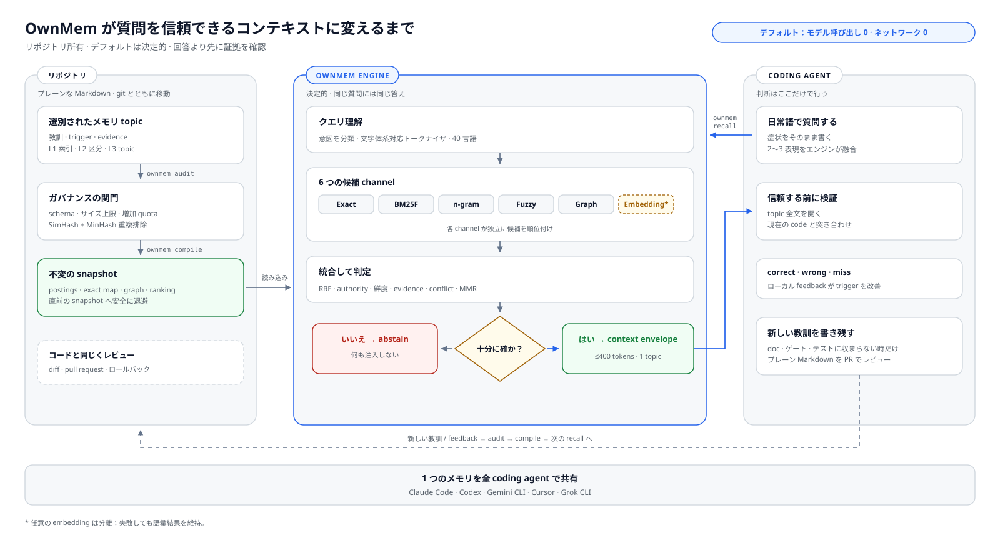

<div align="center">

# OwnMem

**あなたのプロジェクトに、専属のメモリを。**

coding agent のための、ローカルで決定的な git ネイティブメモリ。<br>
ひとつのファイル群が Claude Code · Codex · Gemini CLI · Cursor · Grok CLI のすべてに働きます。

[](https://www.npmjs.com/package/ownmem)
[](https://nodejs.org)
[](./LICENSE)


[English](./README.md) · [简体中文](./README.zh-CN.md) · **日本語** · [한국어](./README.ko.md) · [Español](./README.es.md) · [Français](./README.fr.md) · [Deutsch](./README.de.md) · [Português (BR)](./README.pt-BR.md)

</div>

OwnMem は Claude Code、Codex をはじめとする coding agent に、リポジトリの中に
住むメモリを与えます。実体は `.ownmem/` 配下のプレーンな Markdown で、Unicode の
文字体系を理解する決定的な BM25F エンジンがランキングします。recall はモデルを
一切呼ばず、ネットワークにも触れず、クエリ時の token も消費しません——同じ質問
には同じ答えが、およそ 2 ミリ秒で返ります。

OwnMem は 2 つの部品から成ります。**npm パッケージ**はエンジンです。各リポジトリに
レビュー可能な `devDependency` として常駐し、そのリポジトリの `.ownmem/` にある
メモリを管理します。**agent プラグイン**はマシンごとに 1 回インストールする任意の
便利レイヤーで、agent にエンジンの使い方を教え、リポジトリごとのセットアップも
案内してくれます。

> **注:** パッケージと `.ownmem/` が揃った時点で、そのリポジトリは準備完了です。
> 経路は問いません——どちらの部品から始めても構いません。

<picture>
  <source media="(prefers-color-scheme: dark)" srcset="./assets/architecture-ja-dark.svg">
  
</picture>

## なぜ作ったのか

私は Oriveo という BYOK マルチモデル AI クライアントを開発しています。iOS・Android・Web・デスクトップに展開する大きなコードベースを、毎日 Claude Code と Codex を切り替えながら coding agent とともに育てています。どのリポジトリにも、苦労して得た教訓——デバッグの根本原因、ツールチェーンの罠、タイミングの競合——が積み重なっていきます。しかしそれらは一つのツールの記憶、一台のマシンの中にしかなく、agent やマシン、チームメイトが変わるたびに静かに失われていきました。

ベクトルやクラウドの記憶サービスは、この用途にはどうもしっくりきませんでした。リポジトリに関する知識に、アカウントもサーバーも、クエリごとの課金も要らないはずです。だから記憶をリポジトリそのものに移しました。OwnMem は、私が Oriveo のコードベースで毎日使っているシステム——クォータと監査に律された数百件の厳選された記憶——を、公開用のクリーンなエンジンとして作り直したものです。

## なぜ OwnMem か

OwnMem は 4 つの賭けをしており、すべての設計判断はそこから導かれます:

- **メモリはリポジトリに属する。** git とともに移動し、pull request に現れ、
  他のコードと同じようにロールバックできる、レビュー可能な Markdown。リポジトリを
  clone すればメモリも付いてきます——アカウントも、同期サービスも、エクスポート
  手順も不要です。
- **recall は無料で決定的であるべき。** 同じクエリは同じランキングを返します。
  モデル呼び出しも、レイテンシ税も、質問ごとの課金もありません:ロックされた
  公開ベンチマークで Recall@1 100%、P95 2.46 ms。
- **メモリはどの単一ツールよりも長生きすべき。** 同じファイル群が Claude Code、
  Codex、Gemini CLI、Cursor、Grok CLI に働くため、agent を乗り換えてもチームの
  学びは失われません。
- **メモリは小さく保たれてこそ信頼される。** 正味ゼロ成長のクォータ、純 Node の
  audit、近接重複ゲートとドリフトゲートが、誰も剪定しない第二の wiki 化を防ぎ、
  リーンで最新の状態を保ちます。

### OwnMem がやらないこと

- **ベクトルデータベースではありません。** 大きなメモリプールに対するあいまいな
  セマンティック検索が欲しいなら、ベクトルや知識グラフ型のメモリサービスの方が
  適しています。
- **自動キャプチャではありません。** 書き込みは意図的で、キュレーションされます
  ——レビューこそが品質ゲートです。ツール内蔵の agent メモリの方が手軽ですが、
  ツールにロックインされ、レビュー不能になる代償を払います。
- **リポジトリ横断でもクラウド同期でもありません。** メモリはリポジトリ自身の
  git 履歴とともに移動します——clone すればそこにあります。ただしリポジトリを
  またいで共有されることはなく、クラウドのメモリサービスを経由することも
  ありません。それが設計です。

## `.ownmem/` の中身:三層メモリ

常時ロードされる部分は極小に保たれ、それ以外はすべてオンデマンドで読まれ
ます:

| 層 | ファイル | 読まれるタイミング |
| --- | --- | --- |
| **L1** | `MEMORY.md` | 総索引——毎セッション開始時にロード |
| **L2** | `MEMORY-<area>.md` | 領域別サブ索引——その領域に触れたときに開く |
| **L3** | topic ごとに 1 ファイル | 1 ファイル 1 教訓——triggers が一致したとき `recall` が返す |

topic ファイルは、schema 検証付きの厳格な frontmatter を持つプレーンな
Markdown です——症状と言い回しは `triggers` に、証拠は `evidence` に
(ここでは抜粋。完全な例は `ownmem init` が生成します):

```markdown
---
name: pool_cap_timeout
description: staging deploys time out when workers exceed the pool cap
metadata:
  type: lesson
  triggers: ["staging deploy timeout", "pool cap exceeded"]
  evidence: [deploy-2026-08-12.log]
---

Raising the worker count without raising the connection pool cap exhausts
the pool, and every deploy waits until it times out. Raise both together.
```

recall が無料でいられる理由はこの構造にあります。索引は常駐できるほど
小さく、BM25F は小さくラベル付けの良い topic ファイルをランキングするだけ
で済みます。

## 他ツールとの比較

下表のどの列も、それぞれ実在する課題を解いています——この表が示すのは各ツールが
選んだトレードオフであり、OwnMem 自身のものも含みます。

| | OwnMem | [Mem0 (OSS)](https://github.com/mem0ai/mem0) | [Zep / Graphiti](https://github.com/getzep/graphiti) | [claude-mem](https://github.com/thedotmack/claude-mem) | ツール内蔵の自動メモリ¹ |
| --- | :---: | :---: | :---: | :---: | :---: |
| メモリがリポジトリに住み、git と PR とともに移動する | ✅ | ❌ | ❌ | ❌ | ❌ |
| 人間が読め、レビューできる Markdown | ✅ | ❌ | ❌ | ❌ | ⚠️² |
| モデル・ネットワーク呼び出しなしの recall | ✅ | ❌³ | ❌ | ❌ | — |
| 決定的で再現可能なランキング | ✅ | ❌ | ❌ | ❌ | — |
| Claude Code・Codex・Gemini CLI・Cursor・Grok CLI で共有するひとつのメモリ | ✅ | ⚠️⁴ | ⚠️⁴ | ⚠️⁴ | ❌ |
| 肥大化を防ぐガバナンス(成長クォータ・audit・ドリフトゲート) | ✅ | ❌ | ❌ | ❌ | ⚠️⁵ |
| セマンティックな言い換え検索 | ⚠️⁶ | ✅ | ✅ | ✅ | ❌ |
| 完全自動キャプチャ | ❌⁷ | ✅ | ✅ | ✅ | ✅ |
| リポジトリ横断のユーザーレベルメモリ | ❌⁷ | ✅ | ✅ | ⚠️ | ❌ |

¹ Claude Code の auto memory と Codex の Memories:ホームディレクトリ配下の
ファイルで、マシンローカルかつツールロックイン、リポジトリの外にあります。
Cursor は 2.1 で Memories を廃止して Rules に移行。Windsurf の memories は
1 台のマシンに留まり、コミットされることはありません。
² 編集可能な Markdown ですが、リポジトリの外にあるため pull request には
決して現れません。
³ Mem0 の Apache-2.0 ライブラリはローカルで動きますが、メモリの書き込みと
問い合わせには依然として LLM と embedding モデル(デフォルトでは OpenAI キー、
または Ollama 経由のローカルモデル)が必要です。
⁴ MCP サーバーまたは独自 API を経由します——メモリのスコープはユーザーまたは
アプリ単位で、リポジトリが所有するファイル群ではありません。
⁵ Claude Code は常時ロードされるインデックスに上限(200 行 / 25 KB)を設けて
いますが、その背後にクォータ・audit・重複ゲートはありません。
⁶ 任意の embedding レーン。デフォルトは無効で、ローカルの A/B 証拠が安全ゲート
を通過して初めてランキングに参加します。
⁷ 設計上の選択です。OwnMem はキュレーションされレビューされた書き込みと
1 リポジトリのスコープに賭けています。自動キャプチャやアプリ横断のユーザー
レベルメモリが必要なら、そうしたツールの方が本当に適しています。

事実関係は 2026 年 8 月時点で各プロジェクトの公開ドキュメントに照らして確認
しました——訂正を歓迎します。

## ベンチマーク

<picture>
  <source media="(prefers-color-scheme: dark)" srcset="./assets/benchmark-dark.svg">
  
</picture>

すべてのリリースは、ロックされた公開ベンチマークを通過しなければなりません:
40 の BCP 47 言語タグと 25 の文字体系グループにまたがる 40 トピックの CC0
コーパスで、128 の正例クエリと 40 の無関係な負例を含みます。以下の数値は
リリースグレードの実行(クエリごとに 25 回の計測イテレーション)によるものです:

| 指標 | 結果 | リリースゲート |
| --- | --- | --- |
| Recall@1 / Recall@5(正例 128 クエリ) | **100% / 100%** | = 100% |
| MRR | **1.000** | = 1.000 |
| 無関係な 40 クエリでの棄権 | **40 / 40** | = 100% |
| recall レイテンシ P50 / P95(計測 4,200 サンプル) | **1.17 ms / 2.46 ms** | P95 ≤ 5 ms |
| 同一ゲート下の言語 / 文字体系 | 40 タグ / 25 文字体系 | 言語別・文字体系別の P95 ≤ 5 ms |
| recall 中のモデル呼び出し / ネットワーク呼び出し | **0 / 0** | = 0 |
| ランタイム依存 | 2(`ajv`、`yaml`——純 JS) | ロック済み |
| 実行中の追加メモリ(RSS 差分) | < 2 MB | — |

同じコーパスで、大文字小文字を無視した固定文字列 grep の Recall@1 は 3.1% です。
字句ベースで決定的というだけでは足りません——効いているのは、Unicode の文字体系
を理解する BM25F ランキングです。

自分の手で再現するには:

```bash
git clone https://github.com/grpcer/ownmem
cd ownmem && npm ci && npm run benchmark
```

> **注:** 計測環境は Apple M5 Pro と Node 25。コーパスのハッシュ、ランキング、
> しきい値はロックされており、トピック順を反転させた再実行で決定性を証明します。
> これらの合成指標は回帰の証拠であり、実ユーザーでの精度を主張するものでは
> ありません。

## クイックスタート

OwnMem には Node.js 20 以降が必要です。自身のエンジニアリング文脈を記憶させたい
リポジトリで、エンジンをインストールします:

```bash
npm install --save-dev ownmem
```

Claude Code の場合:

```bash
npx ownmem init --locale auto --hosts claude --layers compiler --hook --command "npx ownmem"
```

Codex の場合:

```bash
npx ownmem init --locale auto --hosts codex --layers compiler --command "npx ownmem"
```

両ツールを有効にし、ローカル Web コンソールも使う場合:

```bash
npx ownmem init --locale auto --hosts claude,codex --layers dashboard --hook --command "npx ownmem"
```

初期化は `.ownmem/` を作成し、ホストのプロジェクト指示ファイルに境界付きの
OwnMem ブロックを書き込みます。`ownmem-generated` 境界の外側のテキストはすべて
そのまま保持されます。Claude Code には `/ownmem` が追加され、`--hook` 有効時には
`PreToolUse` ガードも入ります。Codex は `AGENTS.md` に加えてリポジトリレベルの
skill `.agents/skills/ownmem/` を通じて同じ規律を受け取り、Cursor と Grok CLI も
同じパスから自動発見します。Gemini CLI と Cursor ルールもサポートされており
(`--hosts gemini,cursor`)、`--hosts generic` はその他の agent 向けにプレーンな
`MEMORY_INSTRUCTIONS.md` を書き出します。

公開前のソースチェックアウトで作業する場合は、等価なローカルエントリ
`node memory.mjs init --locale auto` を使ってください。

> **注:** スラッシュコマンドの由来は 2 つあります。`init` が書き込むのは
> いま設定したリポジトリ単位のもの(Claude Code の `/ownmem` と、Codex・
> Cursor・Grok CLI が共有する `.agents/skills/ownmem/` skill)です。次の
> セクションの任意プラグインは、マシン全体で使える `/ownmem:recall` と
> `/ownmem:init` を追加します——まだ `.ownmem/` の無いリポジトリでも
> 役立ちます。

## agent プラグインのインストール(任意、マシンごとに 1 回)

**インストールは必須？——いいえ。入れなくてもすべて動きます。**
`ownmem init` がリポジトリの agent 指示ファイルに規律を書き込み済みなので、
このリポジトリを開いた agent はそれに従います。プラグインが担うのはマシン
全体の利便性です。マシン上のすべてのリポジトリに `/ownmem:recall` と
`/ownmem:init` を追加します——まだ `.ownmem/` の無いリポジトリでも、
init skill が agent をエンジンのセットアップへ案内します。このリポジトリは
プラグイン marketplace を兼ねており、プラグインのコマンドは `npx ownmem`
へルーティングするだけなので、プラグインの更新があなたのメモリを書き換える
ことはありません。

Claude Code:

```
/plugin marketplace add grpcer/ownmem
/plugin install ownmem@ownmem
```

これで `/ownmem:recall` と `/ownmem:init` のコマンドが、モデルが自動起動する
skill とともに追加されます。`/plugin` → Marketplaces でこの marketplace の
自動更新を有効にすると、新バージョンを自動的に受け取れます。

Codex CLI:

```
codex plugin marketplace add grpcer/ownmem
codex plugin add ownmem@ownmem
```

これで `$ownmem` と `$ownmem-init` の skill がインストールされます。以後は
`codex plugin marketplace upgrade ownmem` で更新できます。

Gemini CLI:

```
gemini extensions install https://github.com/grpcer/ownmem
```

これで `/ownmem` コマンドと同じ 2 つの skill が追加されます。更新は
`gemini extensions update ownmem` です。

## 安全な自動更新

OwnMem はサイレントなバックグラウンド書き換えではなく、レビュー可能な依存更新を
前提に設計されています。npm 依存に Dependabot か Renovate を有効化してください。
OwnMem のアップグレード PR が開かれたら、CI で次を実行します:

```bash
npx ownmem init --update
npx ownmem init --check
npx ownmem audit
```

`init --update` は OwnMem 管理の境界ブロックだけを更新し、プロジェクトのメモリは
保持します。`init --check` は生成済みアダプタのドリフトを検出すると失敗します。
`package-lock.json` をコミットしておけば、すべての agent と CI ジョブがレビュー
済みバージョンに留まります。

手動更新の場合:

```bash
npm install --save-dev ownmem@latest
npx ownmem init --update
npx ownmem init --check
npx ownmem audit
```

本番リポジトリでのフローティングな `npx ownmem@latest` は避けてください。最初の
お試しには便利ですが、実行が再現不能になります。

## 日常の使い方

**教訓を教え込む。** staging のデプロイがタイムアウトする原因が、
コネクションプールの上限 5 だったと突き止めるのに 1 時間溶かしたところ
です。agent にこう伝えます:

> 「覚えておいて——タイムアウトの原因はプール上限で、worker 数では
> ない。プールを増やさずに worker を増やしてはいけない」

agent は `.ownmem/` に小さな topic ファイルを 1 つ書きます——症状は
`triggers` に、証拠は `evidence` に——そしてゲートがその誠実さを保ち
ます:

```bash
npx ownmem audit
```

**必要な瞬間に recall する。** 翌週、別のマシン、別の agent、同じ症状:

```bash
npx ownmem recall -- "staging deploy timeout"
```

教訓は約 2 ミリ秒で証拠付きで戻ってきます——モデル呼び出しなし、
ネットワークなし、token 消費ゼロ。

**返ってきた答えを採点する。** 明示的なフィードバックは git に無視される
ローカルの受信箱に残ります——アップロードされることも、ベンチマークへ
自動昇格することもありません:

```bash
npx ownmem recall --feedback correct -- "staging deploy timeout"
npx ownmem recall --feedback miss --expected pool_cap_timeout -- "why do deploys hang"
```

**全体を見渡す。** OwnMem Console はこのリポジトリの採用率・recall
品質・レイテンシ・ガバナンスを表示します——提供は 127.0.0.1 のみ
(`--status` と `--stop` で管理):

```bash
npx ownmem dashboard --open
```


## レイヤー

どこまでの仕組みを使うかは選べます——各レイヤーは前のレイヤーを含みます:

| レイヤー | 追加されるもの |
| --- | --- |
| `core` | 初期化、厳格 schema、Unicode 文字体系対応の BM25F recall、決定的なマルチクエリ融合、成長クォータ |
| `gates` | 純 Node の audit と近接重複ゲート |
| `compiler` | 不変スナップショット、stdio 常駐ランタイム、任意の Claude Code hook |
| `dashboard` | OwnMem Console と任意の embedding 評価レーン |

すべてのレイヤーのランタイム依存は、純 JavaScript の `ajv` と `yaml` の 2 つ
だけです。OwnMem Console は英語・簡体字中国語・繁体字中国語・日本語・韓国語・
スペイン語・フランス語・ドイツ語・ブラジルポルトガル語・アラビア語・ヒンディー語・
インドネシア語・ロシア語・タイ語・トルコ語・ベトナム語の完全なカタログを同梱します。

## 安全性と証拠

- メモリファイルは常にリポジトリ内の検査可能な Markdown のままです。
- Schema・クォータ・生成境界・近接重複のチェックはすべてローカルで実行されます。
- `recall.consumed` が採用率のノーススター。Recall@K はプロセス指標に過ぎません。
- デフォルトのインストールがモデルをダウンロード・呼び出しすることはありません。
- 任意の embedding レーンは、ローカル A/B の証拠が安全ゲートを通過するまでランキングに関与しません。

OwnMem は Apache-2.0 でライセンスされています。成果物の共有やリリースの公開の
前に `PRIVACY.md`、`SECURITY.md`、`RELEASE.md` をお読みください。
