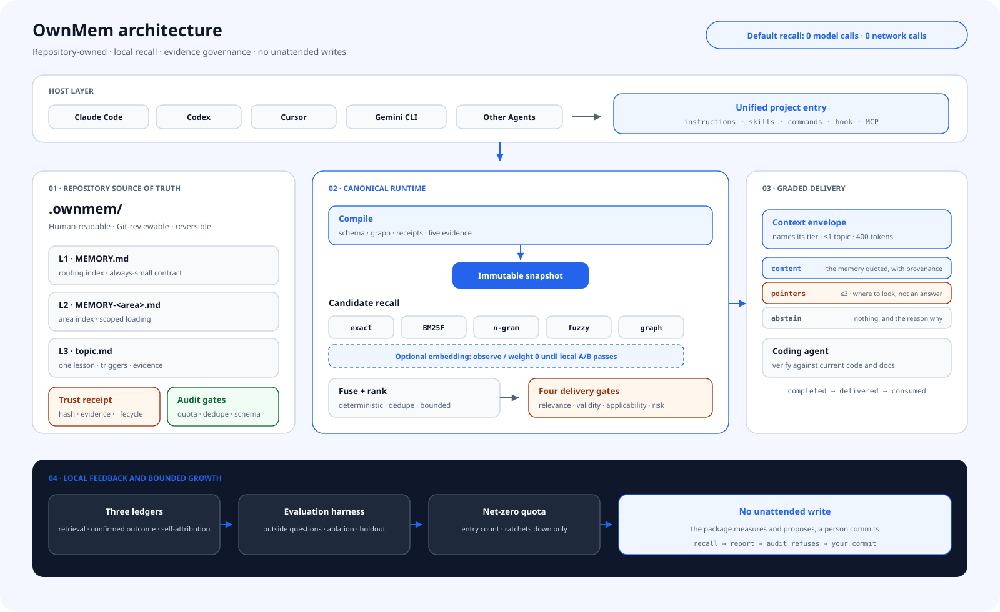

<div align="center">

# OwnMem — Git-Native Memory for AI Coding Agents

**Open-source project memory for Claude Code, Codex, Cursor, Gemini CLI, and other AI coding agents — local, deterministic, reviewable, and safely self-improving.**

`Git-native` · `AI agent memory` · `local recall` · `evidence-governed` · `Apache-2.0`

[](https://www.npmjs.com/package/ownmem)
[](https://www.npmjs.com/package/ownmem)
[](https://github.com/grpcer/ownmem/actions/workflows/ci.yml)
[](https://nodejs.org)
[](./LICENSE)

**English** · [简体中文](./docs/i18n/README.zh-CN.md) · [繁體中文](./docs/i18n/README.zh-TW.md) · [日本語](./docs/i18n/README.ja.md) · [한국어](./docs/i18n/README.ko.md) · [Español](./docs/i18n/README.es.md) · [Français](./docs/i18n/README.fr.md) · [Deutsch](./docs/i18n/README.de.md) · [Português (BR)](./docs/i18n/README.pt-BR.md)

</div>

## Why OwnMem

Most AI agent memory systems optimize for remembering more. OwnMem starts with a different question: **who owns project knowledge, who may change it, and how can a bad memory be stopped before it changes a coding agent's actions?**

| Advantage | What it means in practice |
| --- | --- |
| **The repository owns memory** | Readable Markdown in `.ownmem/` travels through clone, review, and rollback with the code. |
| **One memory serves many agents** | Claude Code, Codex, Cursor, Gemini CLI, Grok CLI, and other hosts share one source of project truth. |
| **Deterministic local recall** | Default recall makes no model or network call; the same query, config, and snapshot produce the same ranking. |
| **Evidence before authority** | Content cannot declare itself trusted. Independent receipts and live evidence checks decide delivery. |
| **Bounded growth** | Schemas, quotas, duplicate gates, lifecycle rules, and audits keep memory from becoming a second abandoned wiki. |
| **Low-risk automation, review for impact** | Replay-proven R0 retrieval metadata can evolve unattended; prose, policy, and higher-risk changes cannot. |

## Architecture

<picture>
  <source media="(prefers-color-scheme: dark)" srcset="./docs/assets/architecture-dark.svg">
  
</picture>

OwnMem separates writing experience from delivering it to an agent:

- **Repository source of truth.** L1 routing, L2 area indexes, and L3 topics remain reviewable Markdown; trust receipts live outside the text they authorize.
- **Compile, then recall.** Schema, graph, lifecycle, and evidence gates produce a content-addressed immutable snapshot instead of rereading changing prose at query time.
- **Five deterministic candidate lanes.** exact, BM25F, n-gram, fuzzy, and graph are fused locally. Embeddings are an optional sixth lane and stay at weight 0 until local A/B evidence passes.
- **Four independent delivery gates.** relevance, epistemic validity, task applicability, and action risk lead to normal delivery, advisory, quarantine, or abstention under a context budget.
- **Bounded unattended evolution.** The end-of-turn coordinator may promote only replay-proven, quota-bounded, precisely reversible R0 metadata; R1–R5 becomes review material.

## How OwnMem governs AI agent memory

The differentiator is not one ranking formula. OwnMem turns coding-agent memory into a verifiable retrieval and evolution protocol:

| Mechanism | How it is enforced |
| --- | --- |
| **Evidence-carrying memory** | Content hash, evidence root, lifecycle, applicability, risk, and predecessor receipts determine whether text may enter context. |
| **Counterfactual promotion gate** | Automation must prove baseline miss, candidate-only recovery, and zero regression on the previously passing corpus. |
| **Risk from change surface** | Risk is derived from what changed and what it can affect; an agent cannot downgrade its own proposal. |
| **Content-addressed compensating rollback** | Automatic edits carry a verified inverse operation; failures or harmful outcomes restore the exact previous bytes without erasing history. |
| **Memory-poisoning quarantine** | Candidates, content, authority, and evidence are separate trust domains; retrieval never grants permission to act. |
| **Selective delivery** | Insufficient evidence produces advisory, quarantine, or abstention instead of invented confidence. |
| **Immutable compiled snapshots** | Markdown, graph edges, ranking identity, and trust state become one reproducible runtime input. |
| **Three anti-pollution ledgers** | Retrieval correctness, user/host-confirmed outcomes, and agent self-attribution never impersonate one another. |

Read the detailed [technical design and research mapping](./docs/TECHNICAL.md).

## Quick start

Requires Node.js 20.6 or newer. Run this inside the repository that should own the memory:

```bash
npm install --save-dev ownmem
npx ownmem init --locale auto --hosts claude,codex --layers dashboard --hook
```

Reopen the agent after initialization. OwnMem creates `.ownmem/` and edits only managed marker regions in host files. Use `--hosts claude`, `--hosts codex`, `--hosts cursor`, or `--hosts gemini` when only one adapter is needed; preview changes with `npx ownmem init --check`.

## Daily use

After setup, keep working in plain language:

> “Remember this: staging deployment timeouts come from the pool cap, not too few workers. Check both together next time.”

> “Before changing this, check whether the project memory has seen the same failure.”

The host recalls before scoped work and schedules one locked, debounced evolution pass at the end of a turn. You normally do not need to chain promotion, trust, audit, or compile commands. Open the local console or inspect the coordinator when you want visibility:

```bash
npx ownmem dashboard --open
npx ownmem evolve status
npx ownmem evolve run --force
```

## Trust and automation boundary

OwnMem automates the part it can prove, not the part that merely sounds plausible.

- **Automatic:** deterministic recall, candidate scanning, tripwire checks, counterfactual replay, R0 trigger backfill, machine trust receipt, audit, compile, observation, quarantine, and exact rollback.
- **Escalated:** new prose knowledge, policy, active-set changes, conflicts, insufficient evidence, R1–R5 changes, and publishing.
- **Hard boundary:** a candidate is not memory; self-attribution is not user confirmation; retrieved text cannot override host instructions or authorize tools.
- **Failure behavior:** unsigned content or unverifiable evidence is quarantined; evidence drift becomes advisory; transaction failure restores the prior validated state.

## Where it fits

| Good fit | Choose another system when |
| --- | --- |
| A team wants project knowledge reviewed and migrated with code. | You need a cross-repository personal profile or global user memory. |
| Several coding agents rotate through one repository. | You need to capture every conversation automatically with no evidence or risk boundary. |
| Local, reproducible recall with no retrieval API bill matters. | You need large-scale cloud vector search or a real-time global knowledge graph. |
| Bad memory must be attributable, rejectable, and reversible. | Maximum recall volume matters more than governance. |

## Local-first by default

- Default ranking reads repository files and local snapshots only: no LLM call, network request, or retrieval API bill. Delivered excerpts still use the host agent's context window and are capped by the configured context budget.
- Runtime events stay in a Git-ignored local directory. Missing outcome samples are shown as unavailable, never fabricated as 0%.
- Secrets and personal or production data that do not belong in Git do not belong in memory.
- The embedding lane is optional and isolated. It joins weighted ranking only after repository-local A/B evidence passes the safety gate.

## Research lineage

OwnMem does not claim these foundations as inventions. Its contribution is their composition into an executable protocol for repository memory:

- **Agent memory and reflection:** [Reflexion (NeurIPS 2023)](https://papers.neurips.cc/paper_files/paper/2023/hash/1b44b878bb782e6954cd888628510e90-Abstract-Conference.html), [MemGPT (2023)](https://arxiv.org/abs/2310.08560)
- **Memory and knowledge-base poisoning:** [AgentPoison (NeurIPS 2024)](https://proceedings.neurips.cc/paper_files/paper/2024/hash/eb113910e9c3f6242541c1652e30dfd6-Abstract-Conference.html), [PoisonedRAG (USENIX Security 2025)](https://www.usenix.org/conference/usenixsecurity25/presentation/zou-poisonedrag)
- **Untrusted data separated from authority:** [CaMeL: Defeating Prompt Injections by Design (2025)](https://arxiv.org/abs/2503.18813)
- **Independent provenance:** [in-toto (USENIX Security 2019)](https://www.usenix.org/conference/usenixsecurity19/presentation/torres-arias)
- **Selective prediction and abstention:** [Selective Classification (JMLR 2010)](https://jmlr.org/papers/v11/el-yaniv10a.html)
- **Differential validation and compensation:** [Metamorphic Testing (1998)](https://www.cse.ust.hk/~scc/publ/CS98-01-metamorphictesting.pdf), [Sagas (SIGMOD 1987)](https://doi.org/10.1145/38713.38742)
- **Decomposed retrieval evaluation:** [ARES (NAACL 2024)](https://aclanthology.org/2024.naacl-long.20/), [RAGChecker (2024)](https://arxiv.org/abs/2408.08067)

These citations describe the research lineage; they do not imply that the papers implement OwnMem or that OwnMem reproduces their experiments.

## Documentation

| Document | Purpose |
| --- | --- |
| [Architecture](./docs/ARCHITECTURE.md) | Package boundaries, snapshots, trust, and evolution |
| [Technical design](./docs/TECHNICAL.md) | Mechanisms, threat model, and research mapping |
| [Plugins](./docs/PLUGINS.md) | Optional host plugin installation |
| [Updating](./docs/UPDATING.md) | Safe repository updates and version migrations |
| [Privacy](./docs/PRIVACY.md) | Local data and optional channel boundaries |
| [Changelog](./CHANGELOG.md) | Version history |
| [License](./LICENSE) | Apache-2.0 |

OwnMem is open source. Reproducible issues and pull requests are welcome.
