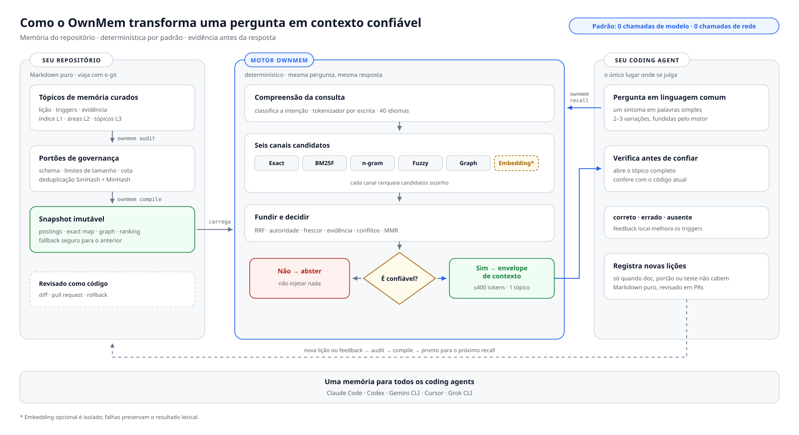

<div align="center">

# OwnMem

**Seu projeto. Com memória própria.**

Memória local, determinística e nativa do git para coding agents.<br>
Um único conjunto de arquivos serve Claude Code · Codex · Gemini CLI · Cursor · Grok CLI.

[](https://www.npmjs.com/package/ownmem)
[](https://nodejs.org)
[](./LICENSE)
[](https://github.com/grpcer/ownmem/actions/workflows/ci.yml)
[](#benchmarks)
[](#benchmarks)

[English](./README.md) · [简体中文](./README.zh-CN.md) · [日本語](./README.ja.md) · [한국어](./README.ko.md) · [Español](./README.es.md) · [Français](./README.fr.md) · [Deutsch](./README.de.md) · **Português (BR)**

</div>

O OwnMem dá ao Claude Code, ao Codex e a outros coding agents uma memória que
vive dentro do repositório: Markdown puro em `.ownmem/`, ranqueado por um motor
BM25F determinístico e ciente dos sistemas de escrita Unicode. O recall nunca
chama um modelo, nunca toca a rede e nunca gasta um token no momento da
consulta — a mesma pergunta devolve a mesma resposta, em cerca de dois
milissegundos.

O OwnMem tem duas partes. O **pacote npm** é o motor: vive em cada repositório
como uma `devDependency` revisada e cuida da memória daquele repositório em
`.ownmem/`. O **plugin de agente** é uma camada de conveniência opcional,
instalada uma vez por máquina: ensina seu agente a usar o motor, inclusive
guiando você pela configuração por repositório.

> **Nota:** Um repositório está pronto assim que tiver o pacote e `.ownmem/`,
> não importa como você chegou lá. Comece por qualquer uma das duas partes.

<picture>
  <source media="(prefers-color-scheme: dark)" srcset="./assets/architecture-pt-BR-dark.svg">
  
</picture>

## Início rápido

O OwnMem exige Node.js 20 ou mais recente. No repositório que você quer que
tenha memória, execute:

```bash
npm install --save-dev ownmem
npx ownmem init --locale auto --hosts claude,codex --layers dashboard --hook
```

Essa é a configuração mais simples e recomendada: Claude Code e Codex ficam
prontos para uso, e o console local também é incluído. Quando a inicialização
terminar, reabra seu agente e trabalhe normalmente — não existe comando de
configuração para executar todos os dias.

Usa apenas um agente? Troque `--hosts claude,codex` por `--hosts claude` ou
`--hosts codex`. Gemini CLI e Cursor funcionam com `--hosts gemini,cursor`;
para outros agentes, use `--hosts generic`.

A inicialização cria `.ownmem/` e adiciona uma pequena seção do OwnMem às
instruções do projeto. O texto fora dos limites marcados nunca é alterado.

## Uso diário

Depois da configuração, você só precisa lembrar de duas coisas.

**1. Fale com seu agente.** Quando aprender algo que vale a pena guardar,
diga com suas próprias palavras:

> "Lembre disso — o timeout vem do teto do pool, não do número de workers.
> Nunca aumente os workers sem aumentar o pool."

Mais tarde, pergunte com a mesma naturalidade de sempre:

> "O deploy de staging travou de novo. Consulte a memória do projeto antes de
> mudar qualquer coisa."

O agente cuida da escrita, da validação e do recall. Você não precisa abrir
`.ownmem/` nem executar `audit` ou `recall` por conta própria.

**2. Abra o console quando quiser uma visão geral.** Ele mostra o uso, a
qualidade do recall, a latência e o estado da memória deste repositório, e fica
disponível apenas no seu computador por meio do 127.0.0.1:

```bash
npx ownmem dashboard --open
```


Esse é todo o fluxo diário. `audit`, o `recall` manual e os comandos de
feedback são para CI e diagnóstico; usuários comuns não precisam memorizá-los.

## Por que isso existe

Eu construo o Oriveo, um cliente de IA multimodelo BYOK distribuído para iOS, Android, Web e desktop — uma base de código grande que desenvolvo todos os dias com coding agents, alternando entre Claude Code e Codex. Cada repositório acumulava lições conquistadas a duras penas: causas raiz de depuração, armadilhas de toolchain, condições de corrida. E toda vez que o agent, a máquina ou um colega mudava, essas lições sumiam em silêncio, porque viviam na memória de uma única ferramenta, em uma única máquina.

Serviços de memória vetorial ou em nuvem nunca pareceram certos para isso: o conhecimento sobre um repositório não deveria exigir conta, servidor nem cobrança por consulta. Então a memória se mudou para o próprio repositório. O OwnMem é o sistema que uso diariamente na base de código do Oriveo — centenas de memórias curadas, mantidas honestas por cotas e auditorias — extraído e reconstruído como um motor público e limpo.

## Por que OwnMem

O OwnMem faz quatro apostas, e toda decisão de design decorre delas:

- **A memória pertence ao repositório.** Markdown revisável que viaja com o
  git, aparece nos pull requests e é revertido como qualquer outro código.
  Clone o repo e leve a memória junto — sem conta, sem serviço de
  sincronização, sem etapa de exportação.
- **O recall precisa ser gratuito e determinístico.** A mesma consulta devolve
  o mesmo ranking, sem chamada de modelo, sem imposto de latência e sem conta
  por pergunta: 100% de Recall@1 com P95 de 2.46 ms no benchmark público
  travado.
- **A memória precisa sobreviver a qualquer ferramenta isolada.** Os mesmos
  arquivos servem Claude Code, Codex, Gemini CLI, Cursor e Grok CLI, então
  trocar de agente nunca significa perder o que o time aprendeu.
- **A memória precisa continuar pequena para continuar confiável.** Uma cota
  de crescimento líquido zero, uma auditoria em Node puro e portões de
  quase-duplicatas e de deriva a mantêm enxuta e atual, em vez de deixá-la
  virar uma segunda wiki que ninguém poda.

### O que o OwnMem não é

- **Não é um banco de dados vetorial.** Se você quer busca semântica difusa
  sobre grandes conjuntos de memórias, um serviço de memória vetorial ou de
  grafo de conhecimento serve melhor.
- **Não é captura automática.** As escritas são deliberadas e curadas — a
  revisão é o portão de qualidade. As memórias embutidas dos agentes são mais
  cômodas, ao custo de ficarem presas a uma ferramenta e não serem revisáveis.
- **Não é multi-repositório nem sincronizado na nuvem.** A memória viaja com
  o histórico git do próprio repositório — clone o repositório e ela está lá.
  Mas nunca é compartilhada entre repositórios nem passa por um serviço de
  memória, por decisão de projeto.

## Dentro de `.ownmem/`: a memória em três camadas

A parte sempre carregada continua minúscula; todo o resto é lido sob demanda:

| Camada | Arquivo | Quando é lida |
| --- | --- | --- |
| **L1** | `MEMORY.md` | O índice — carregado no início de cada sessão |
| **L2** | `MEMORY-<area>.md` | Subíndices por área — abertos quando aquela área é tocada |
| **L3** | um arquivo por topic | Uma lição por arquivo — devolvido pelo `recall` quando seus triggers casam |

Um arquivo de topic é Markdown puro com um frontmatter estrito validado por
schema — sintomas e formulações em `triggers`, provas em `evidence`
(resumido aqui; o `ownmem init` gera um exemplo completo):

```markdown
---
name: pool_cap_timeout
description: staging deploys time out when workers exceed the pool cap
metadata:
  type: lesson
  triggers: ["staging deploy timeout", "pool cap exceeded"]
  evidence: [deploy-2026-08-12.log]
---

Raising the worker count without raising the connection pool cap exhausts
the pool, and every deploy waits until it times out. Raise both together.
```

É essa estrutura que torna o recall gratuito: o índice é pequeno o bastante
para ficar sempre carregado, e o BM25F só precisa ranquear arquivos de topic
pequenos e bem rotulados.

## Como o OwnMem se compara

Cada coluna abaixo resolve um problema real — a tabela mostra quais trade-offs
cada uma faz, inclusive os nossos.

| | OwnMem | [Mem0 (OSS)](https://github.com/mem0ai/mem0) | [Zep / Graphiti](https://github.com/getzep/graphiti) | [claude-mem](https://github.com/thedotmack/claude-mem) | Memória automática embutida¹ |
| --- | :---: | :---: | :---: | :---: | :---: |
| A memória vive no seu repo, viaja com o git e os PRs | ✅ | ❌ | ❌ | ❌ | ❌ |
| Markdown legível e revisável por humanos | ✅ | ❌ | ❌ | ❌ | ⚠️² |
| Recall sem chamadas de modelo nem de rede | ✅ | ❌³ | ❌ | ❌ | — |
| Ranking determinístico e reproduzível | ✅ | ❌ | ❌ | ❌ | — |
| Uma memória só entre Claude Code, Codex, Gemini CLI, Cursor e Grok CLI | ✅ | ⚠️⁴ | ⚠️⁴ | ⚠️⁴ | ❌ |
| Governança anti-inchaço (cota de crescimento, auditoria, portões de deriva) | ✅ | ❌ | ❌ | ❌ | ⚠️⁵ |
| Busca semântica por paráfrase | ⚠️⁶ | ✅ | ✅ | ✅ | ❌ |
| Captura totalmente automática | ❌⁷ | ✅ | ✅ | ✅ | ✅ |
| Memória multi-repositório, no nível do usuário | ❌⁷ | ✅ | ✅ | ⚠️ | ❌ |

¹ Auto memory do Claude Code e Memories do Codex: arquivos no seu diretório
home — locais à máquina, presos à ferramenta, fora do repositório. O Cursor
aposentou as Memories na 2.1 em favor das Rules; as memórias do Windsurf ficam
restritas a uma máquina e nunca são commitadas.
² Markdown editável, mas que vive fora do repo, então nunca aparece num pull
request.
³ A biblioteca Apache-2.0 do Mem0 roda localmente, mas ainda exige um LLM e um
modelo de embedding (uma chave da OpenAI por padrão, ou modelos locais via
Ollama) para escrever e consultar a memória.
⁴ Via um servidor MCP ou sua própria API — a memória tem escopo de usuário ou
de app, não é um conjunto de arquivos que pertence ao seu repositório.
⁵ O Claude Code limita seu índice sempre carregado (200 linhas / 25 KB); não
há cota, auditoria nem portão de duplicatas por trás disso.
⁶ Via opcional de embeddings, desligada por padrão; ela só entra no ranking
depois que a sua evidência A/B local passa pelo portão de segurança.
⁷ Por decisão de projeto. O OwnMem aposta em escritas curadas e revisadas e no
escopo de um repositório; se você quer captura automática ou memória no nível
do usuário entre apps, essas ferramentas realmente servem melhor.

Fatos verificados em agosto de 2026 contra a documentação pública de cada
projeto: [Mem0](https://docs.mem0.ai), [Zep / Graphiti](https://help.getzep.com/graphiti/getting-started/overview),
[claude-mem](https://github.com/thedotmack/claude-mem),
[memória automática do Claude Code](https://code.claude.com/docs/en/memory),
[Codex memories](https://developers.openai.com/codex/memories),
[Cursor rules](https://cursor.com/docs/context/rules),
[Windsurf memories](https://docs.devin.ai/desktop/cascade/memories) — correções são bem-vindas.

## Benchmarks

<picture>
  <source media="(prefers-color-scheme: dark)" srcset="./assets/benchmark-dark.svg">
  
</picture>

Toda release precisa passar por um benchmark público travado: um corpus CC0 de
40 tópicos cobrindo 40 tags de idioma BCP 47 e 25 grupos de escrita, com 128
consultas positivas e 40 negativas sem relação. Os números abaixo vêm de uma
execução em nível de release (25 iterações cronometradas por consulta):

| Métrica | Resultado | Portão de release |
| --- | --- | --- |
| Recall@1 / Recall@5 (128 consultas positivas) | **100% / 100%** | = 100% |
| MRR | **1.000** | = 1.000 |
| Abstenção em 40 consultas sem relação | **40 / 40** | = 100% |
| Latência de recall P50 / P95 (4,200 amostras cronometradas) | **1.17 ms / 2.46 ms** | P95 ≤ 5 ms |
| Idiomas / escritas sob os mesmos portões | 40 tags / 25 escritas | P95 ≤ 5 ms por idioma e por escrita |
| Chamadas de modelo / de rede durante o recall | **0 / 0** | = 0 |
| Dependências de runtime | 2 (`ajv`, `yaml` — JS puro) | travadas |
| Memória extra durante a execução (delta de RSS) | < 2 MB | — |

No mesmo corpus, um grep de string fixa sem distinção de maiúsculas marca 3.1%
de Recall@1. Ser lexical e determinístico não é o truque por si só — o ranking
BM25F ciente dos sistemas de escrita Unicode é.

Reproduza você mesmo:

```bash
git clone https://github.com/grpcer/ownmem
cd ownmem && npm ci && npm run benchmark
```

> **Nota:** Medido num Apple M5 Pro com Node 25. O hash do corpus, os rankings
> e os limiares estão travados, e a execução se repete com a ordem dos tópicos
> invertida para provar o determinismo. Essas métricas sintéticas são
> evidência de regressão, não uma alegação de precisão com usuários reais.

## Instalar o plugin de agente (opcional, uma vez por máquina)

**Precisa instalar? Não — sem ele, tudo continua funcionando.**
O `ownmem init` já escreveu a disciplina nas instruções de agente do
repositório, então qualquer agente que abrir o repositório a segue. O plugin
resolve a conveniência no nível da máquina: adiciona `/ownmem:recall` e
`/ownmem:init` a todos os repositórios da máquina — inclusive os que ainda
não têm `.ownmem/`, onde a skill de init guia o agente pela instalação do
motor. Este repositório também funciona como marketplace do plugin; seus
comandos apenas roteiam para `npx ownmem`, então uma atualização do plugin
nunca reescreve sua memória.

Claude Code:

```
/plugin marketplace add grpcer/ownmem
/plugin install ownmem@ownmem
```

Isso adiciona os comandos `/ownmem:recall` e `/ownmem:init` junto com seus
skills invocados pelo modelo. Ative a atualização automática do marketplace em
`/plugin` → Marketplaces para receber novas versões automaticamente.

Codex CLI:

```
codex plugin marketplace add grpcer/ownmem
codex plugin add ownmem@ownmem
```

Isso instala os skills `$ownmem` e `$ownmem-init`. Depois, atualize com
`codex plugin marketplace upgrade ownmem`.

Gemini CLI:

```
gemini extensions install https://github.com/grpcer/ownmem
```

Isso adiciona o comando `/ownmem` e os mesmos dois skills. Atualize com
`gemini extensions update ownmem`.

## Atualizações automáticas seguras

O OwnMem foi projetado para atualizações de dependência revisáveis, não para
reescritas silenciosas em segundo plano. Ative o Dependabot ou o Renovate para
as dependências npm. Quando um deles abrir um pull request de atualização do
OwnMem, o CI deve executar:

```bash
npx ownmem init --update
npx ownmem init --check
npx ownmem audit
```

`init --update` atualiza apenas os limites gerenciados pelo OwnMem e preserva
a memória do projeto. `init --check` falha quando os adaptadores gerados
divergem. Commitar o `package-lock.json` mantém cada agente e job de CI na
versão revisada.

Para uma atualização manual:

```bash
npm install --save-dev ownmem@latest
npx ownmem init --update
npx ownmem init --check
npx ownmem audit
```

Evite um `npx ownmem@latest` flutuante em repositórios de produção: é cômodo
para uma primeira olhada, mas torna as execuções não reproduzíveis.

## Camadas

Escolha quanta maquinaria você quer — cada camada contém a anterior:

| Camada | Adiciona |
| --- | --- |
| `core` | Inicialização, schema estrito, recall BM25F ciente dos sistemas de escrita Unicode, fusão determinística de múltiplas consultas, cota de crescimento |
| `gates` | Auditoria em Node puro e portão de quase-duplicatas |
| `compiler` | Snapshots imutáveis, runtime residente via stdio, hook opcional do Claude Code |
| `dashboard` | OwnMem Console e a via opcional de avaliação de embeddings |

Todas as camadas usam apenas as dependências de runtime em JavaScript puro
`ajv` e `yaml`. O OwnMem Console traz catálogos completos para inglês, chinês
simplificado e tradicional, japonês, coreano, espanhol, francês, alemão,
português do Brasil, árabe, híndi, indonésio, russo, tailandês, turco e
vietnamita.

## Contribuindo

Issues e pull requests são bem-vindos — veja
[CONTRIBUTING.md](./CONTRIBUTING.md) para as regras básicas: manter o recall
padrão determinístico, local e sem modelos, adicionar um caso de regressão
para cada mudança de recuperação, e rodar `npm test` e
`npm run benchmark:release` antes de pedir revisão. Relatos de segurança vão
por [SECURITY.md](./SECURITY.md).

## Segurança e evidência

- Os arquivos de memória continuam sendo Markdown inspecionável dentro do repositório.
- As checagens de schema, cota, limites gerados e quase-duplicatas rodam localmente.
- `recall.consumed` é a estrela-guia de adoção; Recall@K é uma métrica de processo.
- A instalação padrão nunca baixa nem invoca um modelo.
- A via opcional de embeddings fica fora do ranking até a evidência A/B local passar pelo seu portão de segurança.

O OwnMem é licenciado sob Apache-2.0. Leia `PRIVACY.md`, `SECURITY.md` e
`RELEASE.md` antes de compartilhar artefatos ou publicar uma release.
