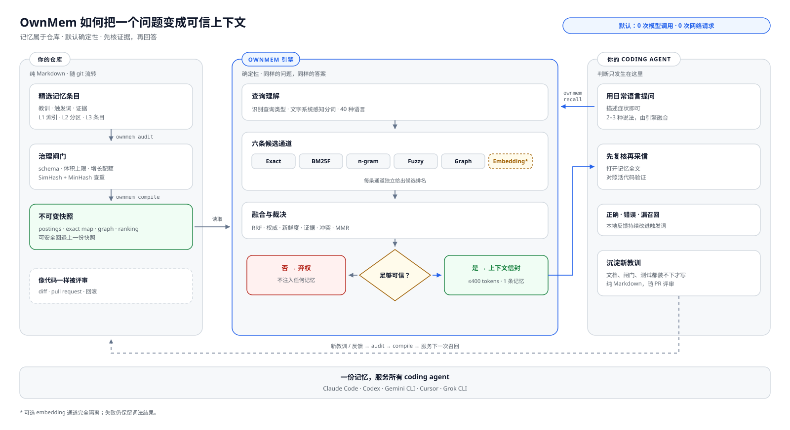

<div align="center">

# OwnMem

**你的项目，拥有自己的记忆。**

为 coding agent 打造的本地、确定性、git 原生工程记忆。<br>
一套文件，同时服务 Claude Code · Codex · Gemini CLI · Cursor · Grok CLI。

[](https://www.npmjs.com/package/ownmem)
[](https://nodejs.org)
[](./LICENSE)


[English](./README.md) · **简体中文** · [日本語](./README.ja.md) · [한국어](./README.ko.md) · [Español](./README.es.md) · [Français](./README.fr.md) · [Deutsch](./README.de.md) · [Português (BR)](./README.pt-BR.md)

</div>

OwnMem 让 Claude Code、Codex 以及其他 coding agent 拥有一份住在仓库里的记忆：
`.ownmem/` 中的纯 Markdown，由一个确定性的、Unicode 文字系统感知的 BM25F
引擎负责排序。召回不调用模型、不发网络请求、不消耗任何查询时 token——
同样的问题返回同样的答案，耗时大约两毫秒。

OwnMem 由两部分组成。**npm 包**是引擎：以可审查的 `devDependency` 形式安装在
每个仓库里，负责该仓库 `.ownmem/` 中的记忆。**agent 插件**是可选的便捷层，
每台机器安装一次：它教你的 agent 调用引擎，并会引导你完成仓库级安装。

> **提示：** 只要仓库里有了 npm 包和 `.ownmem/`，它就已就绪——从哪个入口
> 开始都可以。

<picture>
  <source media="(prefers-color-scheme: dark)" srcset="./assets/architecture-zh-CN-dark.svg">
  
</picture>

## 缘起

我在做 Oriveo——一个覆盖 iOS、Android、Web 与桌面端的 BYOK 多模型 AI 客户端。这个不小的代码库每天都靠 coding agent 开发，我在 Claude Code 和 Codex 之间来回切换。每个仓库都在不断沉淀来之不易的教训：调试根因、工具链的坑、时序竞态。可这些教训住在某一个工具的记忆里、某一台机器上——换 agent、换机器、换协作者，它们就悄悄丢了。

向量与云端记忆服务始终让我觉得不对味：关于一个仓库的知识，不该需要账号、服务器，或者按次付费。于是记忆搬进了仓库本身。OwnMem 就是我每天在 Oriveo 代码库里跑的那套系统——数百条经筛选的记忆，由配额与审计管着——抽出来重写成一个干净的公共引擎。

## 为什么选 OwnMem

OwnMem 押了四个赌注，所有设计决策都由此推导而来：

- **记忆属于仓库。** 以可审阅的 Markdown 形式随 git 流转，出现在 pull
  request 里，像任何代码一样可回滚。克隆仓库即得到记忆——不需要账号、
  不需要同步服务、不需要导出步骤。
- **召回必须免费且确定。** 同样的查询返回同样的排序，没有模型调用、没有
  延迟税、没有按次计费：在锁定的公开 benchmark 上 Recall@1 100%，P95 仅
  2.46 ms。
- **记忆必须比任何单一工具活得久。** 同一批文件同时服务 Claude Code、
  Codex、Gemini CLI、Cursor 与 Grok CLI，换 agent 永远不意味着丢掉团队
  学到的东西。
- **记忆必须保持小，才值得信任。** 零净增长配额、纯 Node 审计、近重复与
  防漂移门禁让它精瘦且常新，而不是变成一个没人修剪的第二 wiki。

### OwnMem 不是什么

- **不是向量数据库。** 想要在大记忆池上做模糊语义检索，向量或知识图谱类
  记忆服务更合适。
- **不是全自动捕获。** 写入是刻意且经过筛选的——审阅本身就是质量门。
  各工具内建记忆更省事，代价是被锁死在单一工具里且不可审阅。
- **不是跨仓库或云同步的记忆。** 记忆随仓库自己的 git 历史走——clone 下来
  就有；但它不跨仓库共享，也不经过任何云端记忆服务，这是设计使然。

## `.ownmem/` 内部：三层记忆

常驻加载的部分保持极小，其余全部按需读取：

| 层 | 文件 | 何时被读 |
| --- | --- | --- |
| **L1** | `MEMORY.md` | 总索引——每次会话开始时加载 |
| **L2** | `MEMORY-<area>.md` | 领域子索引——触及该领域时打开 |
| **L3** | 每个 topic 一个文件 | 一课一文件——`recall` 命中其 triggers 时返回 |

topic 文件是带严格 schema 校验 frontmatter 的纯 Markdown——症状与措辞写进
`triggers`，证据写进 `evidence`（此处为节选；`ownmem init` 会生成一份
完整示例）：

```markdown
---
name: pool_cap_timeout
description: staging deploys time out when workers exceed the pool cap
metadata:
  type: lesson
  triggers: ["staging deploy timeout", "pool cap exceeded"]
  evidence: [deploy-2026-08-12.log]
---

Raising the worker count without raising the connection pool cap exhausts
the pool, and every deploy waits until it times out. Raise both together.
```

召回之所以能免费，靠的正是这个结构：索引小到可以常驻，BM25F 只需要对小而
标注良好的 topic 文件排序。

## 与其他方案的对比

下表中每一列都在解决真实的问题——表格展示的是各自的取舍，包括我们自己的。

| | OwnMem | [Mem0 (OSS)](https://github.com/mem0ai/mem0) | [Zep / Graphiti](https://github.com/getzep/graphiti) | [claude-mem](https://github.com/thedotmack/claude-mem) | 工具内建自动记忆¹ |
| --- | :---: | :---: | :---: | :---: | :---: |
| 记忆住在你的仓库里，随 git 与 PR 流转 | ✅ | ❌ | ❌ | ❌ | ❌ |
| 人类可读、可审阅的 Markdown | ✅ | ❌ | ❌ | ❌ | ⚠️² |
| 召回不调用模型、不发网络请求 | ✅ | ❌³ | ❌ | ❌ | — |
| 确定性、可复现的排序 | ✅ | ❌ | ❌ | ❌ | — |
| 一份记忆通吃 Claude Code、Codex、Gemini CLI、Cursor、Grok CLI | ✅ | ⚠️⁴ | ⚠️⁴ | ⚠️⁴ | ❌ |
| 防膨胀治理（增长配额、审计、防漂移门禁） | ✅ | ❌ | ❌ | ❌ | ⚠️⁵ |
| 语义级同义改写检索 | ⚠️⁶ | ✅ | ✅ | ✅ | ❌ |
| 全自动捕获 | ❌⁷ | ✅ | ✅ | ✅ | ✅ |
| 跨仓库、用户级记忆 | ❌⁷ | ✅ | ✅ | ⚠️ | ❌ |

¹ 指 Claude Code 自动记忆与 Codex Memories：文件放在用户主目录下——
只在本机、锁定单一工具、不在仓库内。Cursor 已在 2.1 移除 Memories 改用
Rules；Windsurf 的记忆同样只留在本机且从不提交。
² 是可编辑的 Markdown，但位于仓库之外，因此永远不会出现在 pull request
里。
³ Mem0 的 Apache-2.0 库可以本地运行，但写入与查询仍需要一个 LLM 和一个
embedding 模型（默认 OpenAI key，或经 Ollama 使用本地模型）。
⁴ 经由 MCP server 或其自有 API——记忆按用户或应用划分，不是一组归你仓库
所有的文件。
⁵ Claude Code 对常驻加载的索引设了上限（200 行 / 25 KB），但背后没有配额、
审计或去重门禁。
⁶ 可选的 embedding 通道，默认关闭；只有本地 A/B 证据通过安全门后才参与
排序。
⁷ 设计使然。OwnMem 押注于经筛选、经审阅的写入与单仓库作用域；如果你需要
全自动捕获或跨应用的用户级记忆，那些工具确实更合适。

以上事实核对于 2026 年 8 月，依据各项目的公开文档——欢迎指正。

## Benchmark

<picture>
  <source media="(prefers-color-scheme: dark)" srcset="./assets/benchmark-dark.svg">
  
</picture>

每次发布都必须通过一个锁定的公开 benchmark：40 主题的 CC0 语料，覆盖 40
个 BCP 47 语言标签与 25 个文字系统分组，含 128 条正例查询与 40 条无关负例。
下列数字来自 release 级运行（每条查询计时 25 轮）：

| 指标 | 结果 | 发布门禁 |
| --- | --- | --- |
| Recall@1 / Recall@5（128 条正例查询） | **100% / 100%** | = 100% |
| MRR | **1.000** | = 1.000 |
| 40 条无关查询的正确弃答 | **40 / 40** | = 100% |
| 召回延迟 P50 / P95（4,200 次计时采样） | **1.17 ms / 2.46 ms** | P95 ≤ 5 ms |
| 同一门禁覆盖的语言 / 文字系统 | 40 标签 / 25 文字系统 | 分语言与分文字系统 P95 ≤ 5 ms |
| 召回期间的模型调用 / 网络请求 | **0 / 0** | = 0 |
| 运行时依赖 | 2 个（`ajv`、`yaml`——纯 JS） | 锁定 |
| 运行期间的额外内存（RSS 增量） | < 2 MB | — |

在同一语料上，大小写不敏感的固定字符串 grep 只拿到 3.1% 的 Recall@1。
仅靠「词法且确定」本身并不是诀窍——Unicode 文字系统感知的 BM25F 排序
才是。

亲自复现：

```bash
git clone https://github.com/grpcer/ownmem
cd ownmem && npm ci && npm run benchmark
```

> **提示：** 测量环境为 Apple M5 Pro、Node 25。语料哈希、排序与阈值全部
> 锁定，且每次运行都会以倒序主题重跑一遍以证明确定性。这些合成指标是
> 回归证据，不代表真实用户准确率。

## 快速开始

OwnMem 需要 Node.js 20 或更新版本。在需要记住自身工程上下文的仓库里安装
引擎：

```bash
npm install --save-dev ownmem
```

Claude Code 用户：

```bash
npx ownmem init --locale auto --hosts claude --layers compiler --hook --command "npx ownmem"
```

Codex 用户：

```bash
npx ownmem init --locale auto --hosts codex --layers compiler --command "npx ownmem"
```

两者同时启用，并带本地 Web 控制台：

```bash
npx ownmem init --locale auto --hosts claude,codex --layers dashboard --hook --command "npx ownmem"
```

初始化会创建 `.ownmem/`，并在宿主的项目指令文件中写入带边界标记的 OwnMem
区块；`ownmem-generated` 边界之外的所有文本都会原样保留。Claude Code 还会
获得 `/ownmem` 命令，启用 `--hook` 时另有一个 `PreToolUse` 守卫。Codex 通过
`AGENTS.md` 获得同样的纪律，外加仓库级 skill `.agents/skills/ownmem/`——
Cursor 与 Grok CLI 也从同一路径自动发现它。Gemini CLI 与 Cursor 规则同样受
支持（`--hosts gemini,cursor`），`--hosts generic` 则为任何其他 agent 生成
一份纯文本的 `MEMORY_INSTRUCTIONS.md`。

若从源码检出且尚未发布，可使用等价的本地入口：
`node memory.mjs init --locale auto`。

> **提示：** 斜杠命令来自两个地方。`init` 写入的是仓库级命令，也就是你
> 刚刚装好的这些（Claude Code 的 `/ownmem`，以及 Codex、Cursor、Grok CLI
> 共用的 `.agents/skills/ownmem/` skill）；下一节的可选插件则添加机器级的
> `/ownmem:recall` 与 `/ownmem:init`——在还没有 `.ownmem/` 的仓库里也
> 用得上。

## 安装 agent 插件（可选，每台机器一次）

**到底要不要装？不装也一切正常。** `ownmem init` 已经把纪律写进了仓库的
agent 指令文件，任何打开这个仓库的 agent 都会遵守。插件解决的是整台机器的
便利：给机器上每一个仓库加上 `/ownmem:recall` 与 `/ownmem:init`——包括
还没有 `.ownmem/` 的仓库，init skill 会引导 agent 完成引擎安装。本仓库
同时就是插件 marketplace；插件的命令只是路由到 `npx ownmem`，所以插件
更新永远不会改写你的记忆。

Claude Code：

```
/plugin marketplace add grpcer/ownmem
/plugin install ownmem@ownmem
```

这会添加 `/ownmem:recall` 与 `/ownmem:init` 两个命令及其模型自动触发的
skill。在 `/plugin` → Marketplaces 里为该 marketplace 开启自动更新，即可
自动收到新版本。

Codex CLI：

```
codex plugin marketplace add grpcer/ownmem
codex plugin add ownmem@ownmem
```

这会安装 `$ownmem` 与 `$ownmem-init` 两个 skill。之后可用
`codex plugin marketplace upgrade ownmem` 刷新。

Gemini CLI：

```
gemini extensions install https://github.com/grpcer/ownmem
```

这会添加 `/ownmem` 命令与同样的两个 skill。用
`gemini extensions update ownmem` 更新。

## 安全的自动更新

OwnMem 面向可审查的依赖更新设计，而非静默的后台改写。为 npm 依赖启用
Dependabot 或 Renovate；当它提出 OwnMem 升级 PR 时，CI 应运行：

```bash
npx ownmem init --update
npx ownmem init --check
npx ownmem audit
```

`init --update` 只刷新 OwnMem 管理的边界区块并保留项目记忆；`init --check`
在生成的适配文件漂移时报错。提交 `package-lock.json` 可让每个 agent 和 CI
任务都停留在经过审查的版本上。

手动更新：

```bash
npm install --save-dev ownmem@latest
npx ownmem init --update
npx ownmem init --check
npx ownmem audit
```

避免在生产仓库里使用漂移的 `npx ownmem@latest`：初次尝鲜方便，但会让每次
执行不可复现。

## 日常使用

**教它一课。** 你刚花了一小时才发现：staging 部署超时是因为连接池上限
是 5。告诉你的 agent：

> “记下来——超时来自连接池上限，不是 worker 数量。以后不涨池子就不许
> 涨 worker。”

agent 会在 `.ownmem/` 下写一个小小的 topic 文件——症状写进
`triggers`，证据写进 `evidence`——门禁负责让它保持诚实：

```bash
npx ownmem audit
```

**在关键时刻召回。** 下周，换了机器、换了 agent，同样的症状：

```bash
npx ownmem recall -- "staging deploy timeout"
```

教训约两毫秒就回来了，证据随附——没有模型调用、没有网络请求、不花
一个 token。

**给结果打分。** 显式反馈留在被 git 忽略的本地待复盘队列里——绝不
上传，也绝不自动进入任何 benchmark：

```bash
npx ownmem recall --feedback correct -- "staging deploy timeout"
npx ownmem recall --feedback miss --expected pool_cap_timeout -- "why do deploys hang"
```

**看全局。** OwnMem Console 展示这个仓库的采用率、召回质量、延迟与
治理状况——只在 127.0.0.1 提供（`--status` 与 `--stop` 负责管理）：

```bash
npx ownmem dashboard --open
```


## 分层

按需选择机制的多少——每一层都包含前一层：

| 分层 | 新增内容 |
| --- | --- |
| `core` | 初始化、严格 schema、Unicode 文字系统感知的 BM25F 召回、确定性多查询融合、增长配额 |
| `gates` | 纯 Node 审计与近重复门禁 |
| `compiler` | 不可变快照、stdio 常驻运行时、可选的 Claude Code hook |
| `dashboard` | OwnMem Console 与可选的 embedding 评测通道 |

所有分层仅依赖纯 JavaScript 的 `ajv` 与 `yaml` 两个运行时依赖。OwnMem
Console 内置英语、简体中文、繁体中文、日语、韩语、西班牙语、法语、德语、
巴西葡萄牙语、阿拉伯语、印地语、印尼语、俄语、泰语、土耳其语、越南语的
完整语言目录。

## 安全与证据

- 记忆文件始终是仓库内可审阅的 Markdown。
- Schema、配额、生成边界与近重复检查全部在本地运行。
- `recall.consumed` 是采用率北极星；Recall@K 只是过程指标。
- 默认安装永远不下载、不调用任何模型。
- 可选的 embedding 通道在本地 A/B 证据通过安全门之前，不参与排序。

OwnMem 以 Apache-2.0 许可发布。分享产物或发布版本前，请先阅读
`PRIVACY.md`、`SECURITY.md` 与 `RELEASE.md`。
