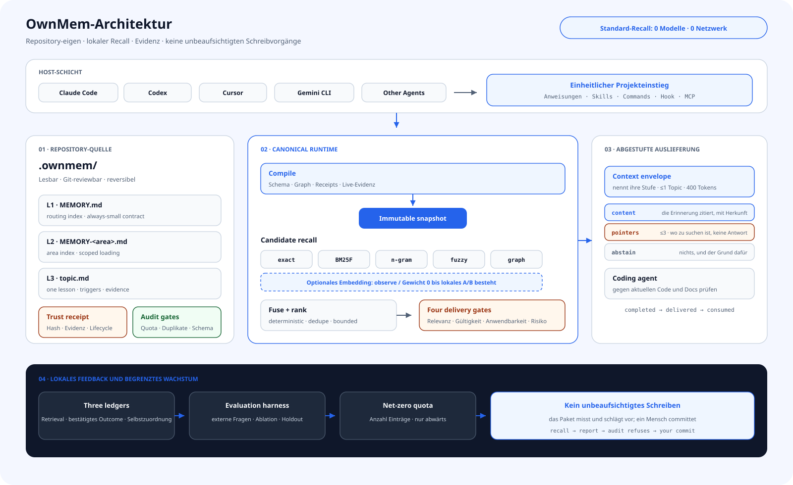

<div align="center">

# OwnMem

**Projektgedächtnis für Coding Agents im Repository: lokal, deterministisch, reviewbar und innerhalb sicherer Grenzen selbstverbessernd.**

`Git-nativ` · `lokaler Recall` · `Multi-Agent` · `evidenzgesteuert` · `Apache-2.0`

[](https://www.npmjs.com/package/ownmem)
[](https://nodejs.org)
[](../../LICENSE)

[English](../../README.md) · [简体中文](./README.zh-CN.md) · [繁體中文](./README.zh-TW.md) · [日本語](./README.ja.md) · [한국어](./README.ko.md) · [Español](./README.es.md) · [Français](./README.fr.md) · **Deutsch** · [Português (BR)](./README.pt-BR.md)

</div>

## Warum OwnMem

Die meisten Memory-Systeme optimieren „mehr erinnern“. OwnMem fragt zuerst: **Wem gehört Projektwissen, wer darf es ändern und wie stoppen wir eine falsche Erinnerung, bevor sie Agent-Aktionen beeinflusst?**

| Vorteil | Praktische Bedeutung |
| --- | --- |
| **Das Repository besitzt das Memory** | Lesbares Markdown in `.ownmem/` reist beim Clone, Review und Rollback mit dem Code. |
| **Ein Memory für viele Agents** | Claude Code, Codex, Cursor, Gemini CLI, Grok CLI und weitere Hosts teilen eine Quelle. |
| **Deterministischer lokaler Recall** | Kein Modell, kein Netzwerk; gleiche Query, Config und Snapshot ergeben dieselbe Rangfolge. |
| **Evidenz vor Autorität** | Text kann sich nicht selbst vertrauenswürdig nennen; unabhängige Receipts und Live-Prüfung entscheiden. |
| **Begrenztes Wachstum** | Schema, Quota, Duplikate, Lifecycle und Audit verhindern ein zweites verlassenes Wiki. |
| **Niedriges Risiko automatisch** | Nur per Replay bewiesene R0-Retrieval-Metadaten entwickeln sich unbeaufsichtigt. |

## Architektur

<picture>
  <source media="(prefers-color-scheme: dark)" srcset="../assets/architecture-de-dark.svg">
  
</picture>

OwnMem trennt „Erfahrung aufschreiben“ von „sie einem Agent liefern“:

- **Das Repository ist die Quelle.** L1-Routing, L2-Indizes und L3-Topics sind reviewbares Markdown; Trust Receipts stehen außerhalb des autorisierten Textes.
- **Erst kompilieren, dann erinnern.** Schema, Graph, Lifecycle und Evidenz erzeugen einen content-addressed unveränderlichen Snapshot.
- **Fünf deterministische Kanäle.** exact, BM25F, n-gram, fuzzy und graph werden lokal fusioniert. embedding ist ein optionaler sechster Kanal mit Gewicht 0 bis zum A/B-Nachweis.
- **Vier Auslieferungstore.** Relevanz, faktische Gültigkeit, Anwendbarkeit und Risiko führen zu normal, advisory, Quarantäne oder Abstention.
- **Begrenzte autonome Evolution.** Am Turn-Ende wird nur bewiesenes, quota-begrenztes und exakt reversibles R0 promoviert; R1–R5 geht ins Review.

## Was 0.3 besonders macht

Der Unterschied ist keine einzelne Ranking-Formel. OwnMem 0.3 macht Agent Memory zu einem verifizierbaren Evolutionsprotokoll:

| Mechanismus | OwnMem 0.3 |
| --- | --- |
| **Evidenztragendes Memory** | Hash, Evidenzwurzel, Lifecycle, Anwendbarkeit, Risiko und Vorgänger-Receipts entscheiden über Kontext. |
| **Kontrafaktisches Promotion-Gate** | Baseline-Miss, nur durch den Kandidaten erzeugte Recovery und null Regression müssen bewiesen werden. |
| **Risiko aus der Änderungsfläche** | Es folgt aus Änderung und Wirkung; der Agent kann seinen eigenen Vorschlag nicht herunterstufen. |
| **Content-addressed kompensierender Rollback** | Automatische Edits tragen eine geprüfte Inverse und stellen exakte Bytes wieder her, ohne Historie zu löschen. |
| **Quarantäne gegen Memory Poisoning** | Kandidat, Inhalt, Autorität und Evidenz sind getrennt; gefunden zu werden gewährt keine Befugnis. |
| **Selektive Auslieferung** | Fehlende Evidenz ergibt advisory, Quarantäne oder Abstention statt erfundener Sicherheit. |
| **Unveränderliche kompilierte Snapshots** | Markdown, Graph, Ranking-Identität und Trust State bilden reproduzierbaren Runtime-Input. |
| **Drei unverwechselbare Ledger** | Recall-Korrektheit, bestätigte Outcomes und Agent-Selbstzuordnung bleiben getrennt. |

Mehr im [technischen Design und Research Mapping](../TECHNICAL.md).

## In drei Minuten starten

Erfordert Node.js 20.6 oder neuer. Im Repository ausführen, das das Memory besitzen soll:

```bash
npm install --save-dev ownmem
npx ownmem init --locale auto --hosts claude,codex --layers dashboard --hook
```

Danach den Agent neu öffnen. OwnMem erstellt `.ownmem/` und ändert nur verwaltete Markerbereiche. Für einen Adapter `--hosts claude`, `--hosts codex`, `--hosts cursor` oder `--hosts gemini` verwenden; mit `npx ownmem init --check` vorher prüfen.

## Tägliche Nutzung

Danach in natürlicher Sprache weiterarbeiten:

> „Merke dir: Das staging timeout kommt vom pool cap, nicht von zu wenigen workers. Prüfe nächstes Mal beides.“

> „Bevor du das änderst, prüfe, ob das Projektgedächtnis denselben Fehler kennt.“

Der Host ruft vor relevanter Arbeit ab und plant am Turn-Ende eine gesperrte, entprellte Evolution. promotion, trust, audit und compile müssen normalerweise nicht manuell verkettet werden. Lokale Konsole und Coordinator-Status zeigen den Zustand:

```bash
npx ownmem dashboard --open
npx ownmem evolve status
npx ownmem evolve run --force
```

## Grenze von Vertrauen und Automatisierung

OwnMem automatisiert, was eine Maschine beweisen kann, nicht was nur plausibel klingt.

- **Automatisch:** deterministischer Recall, Scan, Tripwire, kontrafaktisches Replay, R0-Backfill, Maschinen-Receipt, Audit, Compile, Beobachtung, Quarantäne und exakter Rollback.
- **Zum Review:** neuer Text, Policy, Active Set, Konflikte, ungenügende Evidenz, R1–R5 und Veröffentlichung.
- **Harte Grenze:** candidate ist nicht memory; Selbstzuordnung ist keine Bestätigung; Recall-Text überschreibt keine Host-Anweisungen oder Tool-Rechte.
- **Bei Fehlern:** unsignierter Inhalt oder unprüfbare Evidenz wird isoliert; Drift wird advisory; Transaktionsfehler stellen den letzten validierten Zustand her.

## Wann es passt

| OwnMem passt | Anderes System wählen |
| --- | --- |
| Projektwissen soll mit Code reviewt und migriert werden. | Repository-übergreifendes persönliches Profil oder globales User Memory ist nötig. |
| Mehrere Coding Agents wechseln sich in einem Repository ab. | Alle Gespräche sollen ohne Evidenz- oder Risikogrenze automatisch gespeichert werden. |
| Lokaler, reproduzierbarer Recall ohne Query-Kosten zählt. | Große Cloud-Vektorsuche oder globaler Echtzeitgraph ist nötig. |
| Falsches Memory muss zurechenbar, ablehnbar und reversibel sein. | Menge ist wichtiger als Governance. |

## Standardmäßig lokal

- Standard-Recall liest nur Repository-Dateien und lokale Snapshots: null LLM-, Netzwerk- und Query-Token-Kosten.
- Runtime-Events bleiben in einem von Git ignorierten lokalen Ordner. Ohne Outcomes erscheint „nicht verfügbar“, nie erfundene 0 %.
- Secrets sowie persönliche oder Produktionsdaten, die nicht in Git gehören, gehören auch nicht ins Memory.
- embedding ist optional und isoliert; weighted ranking beginnt erst nach lokalem A/B-Sicherheitsnachweis.

## Forschungslinie

OwnMem beansprucht diese Grundlagen nicht als Erfindung. Der Beitrag ist ihre Kombination zu einem ausführbaren Protokoll für Repository Memory:

- **Agent Memory und Reflexion:** [Reflexion (NeurIPS 2023)](https://papers.neurips.cc/paper_files/paper/2023/hash/1b44b878bb782e6954cd888628510e90-Abstract-Conference.html), [MemGPT (2023)](https://arxiv.org/abs/2310.08560)
- **Memory- und Wissens-Poisoning:** [AgentPoison (NeurIPS 2024)](https://proceedings.neurips.cc/paper_files/paper/2024/hash/eb113910e9c3f6242541c1652e30dfd6-Abstract-Conference.html), [PoisonedRAG (USENIX Security 2025)](https://www.usenix.org/conference/usenixsecurity25/presentation/zou-poisonedrag)
- **Untrusted Data getrennt von Authority:** [CaMeL: Defeating Prompt Injections by Design (2025)](https://arxiv.org/abs/2503.18813)
- **Unabhängige Provenance:** [in-toto (USENIX Security 2019)](https://www.usenix.org/conference/usenixsecurity19/presentation/torres-arias)
- **Selektive Vorhersage und Abstention:** [Selective Classification (JMLR 2010)](https://jmlr.org/papers/v11/el-yaniv10a.html)
- **Differentielle Validierung und Kompensation:** [Metamorphic Testing (1998)](https://www.cse.ust.hk/~scc/publ/CS98-01-metamorphictesting.pdf), [Sagas (SIGMOD 1987)](https://doi.org/10.1145/38713.38742)
- **Zerlegte Retrieval-Evaluation:** [ARES (NAACL 2024)](https://aclanthology.org/2024.naacl-long.20/), [RAGChecker (2024)](https://arxiv.org/abs/2408.08067)

Die Zitate zeigen die Forschungslinie; sie bedeuten weder, dass diese Arbeiten OwnMem implementieren, noch dass OwnMem ihre Experimente reproduziert.

## Dokumentation

| Dokument | Inhalt |
| --- | --- |
| [Architecture](../ARCHITECTURE.md) | Grenzen, Snapshots, Trust und Evolution |
| [Technical design](../TECHNICAL.md) | Mechanismen, Bedrohungen und Forschung |
| [Plugins](../PLUGINS.md) | Optionale Host-Plugins |
| [Updating](../UPDATING.md) | Sicheres Update und 0.2 → 0.3 Migration |
| [Privacy](../PRIVACY.md) | Lokale Daten und optionale Kanäle |
| [Changelog](../../CHANGELOG.md) | Versionsverlauf |
| [License](../../LICENSE) | Apache-2.0 |

OwnMem ist Open Source. Reproduzierbare Issues und Pull Requests sind willkommen.
