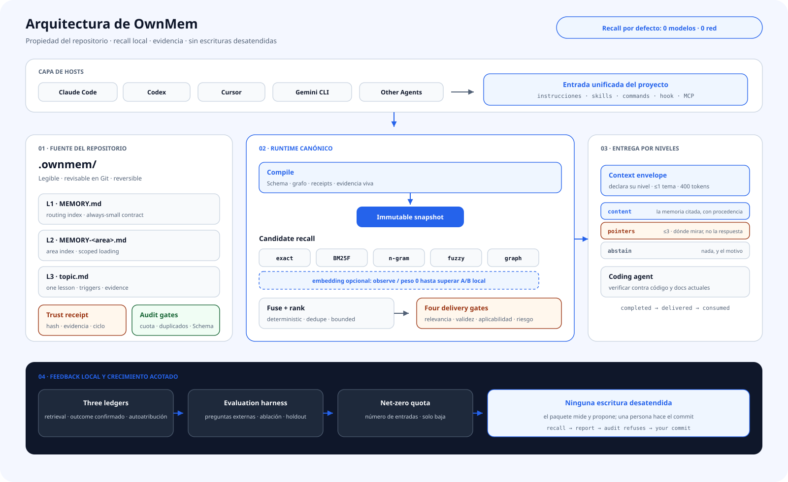

<div align="center">

# OwnMem

**Memoria de proyecto para agentes de programación: local, determinista, revisable y capaz de mejorar dentro de límites seguros.**

`Nativo de Git` · `recall local` · `multiagente` · `gobierno por evidencia` · `Apache-2.0`

[](https://www.npmjs.com/package/ownmem)
[](https://nodejs.org)
[](../../LICENSE)

[English](../../README.md) · [简体中文](./README.zh-CN.md) · [繁體中文](./README.zh-TW.md) · [日本語](./README.ja.md) · [한국어](./README.ko.md) · **Español** · [Français](./README.fr.md) · [Deutsch](./README.de.md) · [Português (BR)](./README.pt-BR.md)

</div>

## Por qué OwnMem

La mayoría de los sistemas optimiza «recordar más». OwnMem empieza por otra pregunta: **¿quién posee el conocimiento del proyecto, quién puede cambiarlo y cómo se detiene un recuerdo erróneo antes de que altere las acciones del agente?**

| Ventaja | Qué significa en la práctica |
| --- | --- |
| **La memoria pertenece al repositorio** | Markdown legible en `.ownmem/` viaja con el código al clonar, revisar y revertir. |
| **Una memoria para varios agentes** | Claude Code, Codex, Cursor, Gemini CLI, Grok CLI y otros hosts comparten una sola fuente. |
| **Recall local y determinista** | Sin modelo ni red; la misma consulta, configuración y snapshot producen el mismo orden. |
| **Evidencia antes que autoridad** | El contenido no puede declararse fiable; receipts independientes y evidencia viva deciden la entrega. |
| **Crecimiento acotado** | Schema, cuotas, duplicados, ciclo de vida y auditoría evitan otro wiki abandonado. |
| **Automático si el riesgo es bajo** | Solo metadata R0 demostrada por replay evoluciona sin supervisión; prosa, política y alto impacto no. |

## Arquitectura

<picture>
  <source media="(prefers-color-scheme: dark)" srcset="../assets/architecture-es-dark.svg">
  
</picture>

OwnMem separa «escribir la experiencia» de «entregarla a un agente»:

- **El repositorio es la fuente.** Rutas L1, índices L2 y temas L3 son Markdown revisable; los trust receipts viven fuera del texto autorizado.
- **Compilar antes de recordar.** Schema, grafo, ciclo de vida y evidencia producen un snapshot inmutable y direccionado por contenido.
- **Cinco canales deterministas.** exact, BM25F, n-gram, fuzzy y graph se fusionan localmente. embedding es un sexto canal opcional con peso 0 hasta superar A/B.
- **Cuatro puertas de entrega.** relevancia, validez factual, aplicabilidad y riesgo deciden entrega normal, advisory, cuarentena o abstención.
- **Evolución desatendida y acotada.** Al final del turno solo se promueve R0 demostrado, dentro de cuota y reversible; R1–R5 pasa a revisión.

## Qué distingue a la versión 0.3

La diferencia no es una fórmula de ranking. OwnMem 0.3 convierte la memoria del agente en un protocolo de evolución verificable:

| Mecanismo | Qué hace OwnMem 0.3 |
| --- | --- |
| **Memoria con evidencia** | Hash, raíz de evidencia, ciclo de vida, ámbito, riesgo y receipts previos deciden si el texto entra en contexto. |
| **Puerta contrafactual de promoción** | Debe probar fallo base, recuperación causada solo por el candidato y cero regresiones en el corpus aprobado. |
| **Riesgo según la superficie cambiada** | Deriva de qué cambia y qué puede afectar; el agente no puede rebajar su propia propuesta. |
| **Rollback compensatorio y direccionado** | Cada cambio automático lleva su inversa verificada y restaura bytes exactos sin borrar el historial. |
| **Cuarentena contra poisoning** | Candidato, contenido, autoridad y evidencia son dominios separados; ser recuperado no concede permiso. |
| **Entrega selectiva** | La falta de evidencia produce advisory, cuarentena o abstención, no confianza inventada. |
| **Snapshots compilados e inmutables** | Markdown, grafo, identidad de ranking y confianza forman una entrada de runtime reproducible. |
| **Tres libros sin contaminación** | Corrección del recall, resultados confirmados y autoatribución del agente nunca se sustituyen. |

Consulta el [diseño técnico y su relación con la investigación](../TECHNICAL.md).

## Inicio en tres minutos

Requiere Node.js 20.6 o posterior. Ejecútalo en el repositorio que debe poseer la memoria:

```bash
npm install --save-dev ownmem
npx ownmem init --locale auto --hosts claude,codex --layers dashboard --hook
```

Vuelve a abrir el agente tras inicializar. OwnMem crea `.ownmem/` y solo modifica regiones marcadas como administradas. Para un único adaptador usa `--hosts claude`, `--hosts codex`, `--hosts cursor` o `--hosts gemini`; previsualiza con `npx ownmem init --check`.

## Uso diario

Después, trabaja en lenguaje natural:

> «Recuerda: el timeout de staging viene del límite del pool, no de pocos workers. Comprueba ambos la próxima vez.»

> «Antes de cambiar esto, revisa si la memoria del proyecto ya vio el mismo fallo.»

El host hace recall antes del trabajo relevante y programa una evolución bloqueada y con debounce al final del turno. Normalmente no hay que encadenar promotion, trust, audit y compile. Para observarlo abre la consola local o consulta el coordinador:

```bash
npx ownmem dashboard --open
npx ownmem evolve status
npx ownmem evolve run --force
```

## Límite entre confianza y automatización

OwnMem automatiza lo que una máquina puede demostrar, no lo que solo parece plausible.

- **Automático:** recall determinista, escaneo, tripwire, replay contrafactual, backfill R0, receipt de máquina, audit, compile, observación, cuarentena y rollback exacto.
- **A revisión:** nueva prosa, política, active set, conflictos, evidencia insuficiente, cambios R1–R5 y publicación.
- **Límite duro:** candidate no es memory; autoatribución no es confirmación; el texto recuperado no reemplaza instrucciones ni autoriza herramientas.
- **Ante fallos:** contenido sin firmar o evidencia no verificable se aísla; el drift baja a advisory; una transacción fallida restaura el estado validado anterior.

## Cuándo encaja

| OwnMem encaja | Mejor otro sistema |
| --- | --- |
| El conocimiento debe revisarse y migrar con el código. | Necesitas un perfil personal o memoria global entre repositorios. |
| Varios agentes trabajan por turnos en un repositorio. | Quieres capturar toda conversación sin límites de evidencia o riesgo. |
| Importa el recall local, reproducible y sin coste por consulta. | Necesitas búsqueda vectorial cloud masiva o un grafo global en tiempo real. |
| La memoria errónea debe poder atribuirse, rechazarse y revertirse. | La cantidad importa más que el gobierno. |

## Local por defecto

- El recall predeterminado solo lee archivos y snapshots locales: cero LLM, red y tokens por consulta.
- Los eventos quedan en un directorio local ignorado por Git. Sin outcomes se muestra «no disponible», nunca un 0 % inventado.
- Secretos y datos personales o de producción que no deben ir a Git tampoco deben ir a memoria.
- embedding es opcional y aislado; solo entra en ranking weighted tras superar evidencia A/B local.

## Linaje de investigación

OwnMem no presenta estas bases como invenciones; su aportación es componerlas en un protocolo ejecutable para memoria de repositorio:

- **Memoria de agentes y reflexión:** [Reflexion (NeurIPS 2023)](https://papers.neurips.cc/paper_files/paper/2023/hash/1b44b878bb782e6954cd888628510e90-Abstract-Conference.html), [MemGPT (2023)](https://arxiv.org/abs/2310.08560)
- **Poisoning de memoria y conocimiento:** [AgentPoison (NeurIPS 2024)](https://proceedings.neurips.cc/paper_files/paper/2024/hash/eb113910e9c3f6242541c1652e30dfd6-Abstract-Conference.html), [PoisonedRAG (USENIX Security 2025)](https://www.usenix.org/conference/usenixsecurity25/presentation/zou-poisonedrag)
- **Datos no fiables separados de autoridad:** [CaMeL: Defeating Prompt Injections by Design (2025)](https://arxiv.org/abs/2503.18813)
- **Procedencia independiente:** [in-toto (USENIX Security 2019)](https://www.usenix.org/conference/usenixsecurity19/presentation/torres-arias)
- **Predicción selectiva y abstención:** [Selective Classification (JMLR 2010)](https://jmlr.org/papers/v11/el-yaniv10a.html)
- **Validación diferencial y compensación:** [Metamorphic Testing (1998)](https://www.cse.ust.hk/~scc/publ/CS98-01-metamorphictesting.pdf), [Sagas (SIGMOD 1987)](https://doi.org/10.1145/38713.38742)
- **Evaluación descompuesta de retrieval:** [ARES (NAACL 2024)](https://aclanthology.org/2024.naacl-long.20/), [RAGChecker (2024)](https://arxiv.org/abs/2408.08067)

Las citas describen el linaje; no implican que esos trabajos implementen OwnMem ni que OwnMem reproduzca sus experimentos.

## Documentación

| Documento | Contenido |
| --- | --- |
| [Architecture](../ARCHITECTURE.md) | Límites, snapshots, confianza y evolución |
| [Technical design](../TECHNICAL.md) | Mecanismos, amenazas e investigación |
| [Plugins](../PLUGINS.md) | Instalación opcional de plugins |
| [Updating](../UPDATING.md) | Actualización segura y migración 0.2 → 0.3 |
| [Privacy](../PRIVACY.md) | Datos locales y canales opcionales |
| [Changelog](../../CHANGELOG.md) | Historial de versiones |
| [License](../../LICENSE) | Apache-2.0 |

OwnMem es código abierto. Se agradecen issues y pull requests reproducibles.
