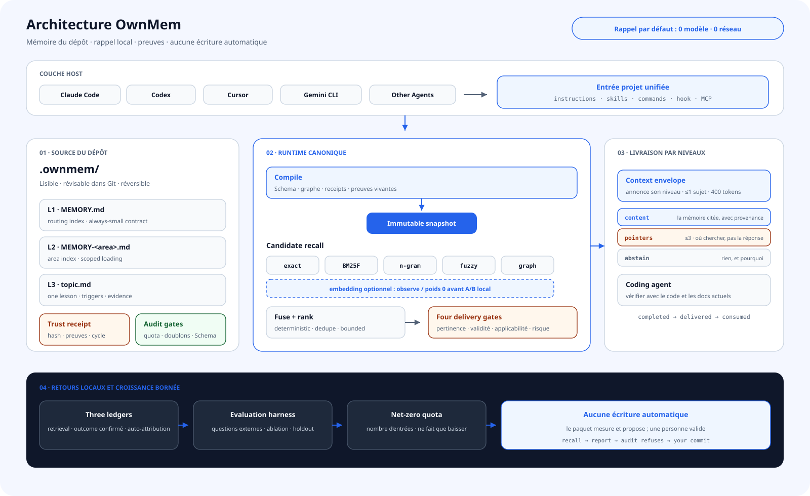

<div align="center">

# OwnMem

**La mémoire de projet des agents de code reste dans le dépôt : locale, déterministe, révisable et capable de progresser dans des limites sûres.**

`Natif Git` · `rappel local` · `multi-agent` · `gouverné par les preuves` · `Apache-2.0`

[](https://www.npmjs.com/package/ownmem)
[](https://nodejs.org)
[](../../LICENSE)

[English](../../README.md) · [简体中文](./README.zh-CN.md) · [繁體中文](./README.zh-TW.md) · [日本語](./README.ja.md) · [한국어](./README.ko.md) · [Español](./README.es.md) · **Français** · [Deutsch](./README.de.md) · [Português (BR)](./README.pt-BR.md)

</div>

## Pourquoi OwnMem

La plupart des mémoires cherchent d’abord à « retenir plus ». OwnMem pose une autre question : **qui possède le savoir du projet, qui peut le modifier et comment arrêter un mauvais souvenir avant qu’il influence l’agent ?**

| Avantage | Conséquence pratique |
| --- | --- |
| **Le dépôt possède la mémoire** | Le Markdown lisible de `.ownmem/` voyage avec le code lors du clone, de la revue et du rollback. |
| **Une mémoire, plusieurs agents** | Claude Code, Codex, Cursor, Gemini CLI, Grok CLI et d’autres hosts partagent la même source. |
| **Rappel local et déterministe** | Aucun modèle ni réseau ; mêmes requête, configuration et snapshot, même classement. |
| **Les preuves avant l’autorité** | Le texte ne peut pas s’auto-déclarer fiable ; receipts indépendants et preuves vivantes décident. |
| **Croissance bornée** | Schema, quotas, doublons, cycle de vie et audit évitent un second wiki abandonné. |
| **Faible risque automatique, fort impact relu** | Seule la metadata R0 prouvée par replay évolue sans intervention. |

## Architecture

<picture>
  <source media="(prefers-color-scheme: dark)" srcset="../assets/architecture-fr-dark.svg">
  
</picture>

OwnMem sépare « écrire l’expérience » de « la livrer à un agent » :

- **Le dépôt est la source.** Routage L1, index L2 et sujets L3 sont du Markdown révisable ; les trust receipts sont extérieurs au texte autorisé.
- **Compiler avant le rappel.** Schema, graphe, cycle de vie et preuves produisent un snapshot immuable adressé par contenu.
- **Cinq canaux déterministes.** exact, BM25F, n-gram, fuzzy et graph fusionnent localement. embedding est un sixième canal optionnel à poids 0 avant preuve A/B.
- **Quatre portes de livraison.** pertinence, validité, applicabilité et risque mènent à livraison, advisory, quarantaine ou abstention.
- **Évolution autonome bornée.** En fin de tour, seul R0 prouvé, sous quota et exactement réversible est promu ; R1–R5 est relu.

## Ce qui distingue la version 0.3

La différence n’est pas une formule de ranking. OwnMem 0.3 transforme la mémoire agent en protocole d’évolution vérifiable :

| Mécanisme | OwnMem 0.3 |
| --- | --- |
| **Mémoire porteuse de preuves** | Hash, racine de preuve, cycle de vie, applicabilité, risque et receipts précédents décident de l’injection. |
| **Porte de promotion contrefactuelle** | Il faut prouver l’échec initial, la récupération causée seulement par le candidat et zéro régression. |
| **Risque dérivé de la surface modifiée** | Il dépend de ce qui change et de son impact ; l’agent ne peut pas déclasser sa proposition. |
| **Rollback compensatoire adressé par contenu** | Chaque édition automatique porte son inverse vérifié et restaure les octets exacts sans effacer l’historique. |
| **Quarantaine contre l’empoisonnement** | Candidat, contenu, autorité et preuve sont séparés ; être retrouvé n’accorde aucun pouvoir. |
| **Livraison sélective** | Le manque de preuve produit advisory, quarantaine ou abstention, jamais une confiance inventée. |
| **Snapshots compilés immuables** | Markdown, graphe, identité de ranking et état de confiance forment une entrée reproductible. |
| **Trois registres non substituables** | Correction du rappel, outcomes confirmés et auto-attribution de l’agent restent distincts. |

Lire le [design technique et la correspondance avec la recherche](../TECHNICAL.md).

## Démarrer en trois minutes

Node.js 20.6 ou plus récent est requis. Exécutez ceci dans le dépôt qui doit posséder la mémoire :

```bash
npm install --save-dev ownmem
npx ownmem init --locale auto --hosts claude,codex --layers dashboard --hook
```

Rouvrez l’agent après l’initialisation. OwnMem crée `.ownmem/` et ne modifie que les zones marquées comme gérées. Pour un seul adaptateur, utilisez `--hosts claude`, `--hosts codex`, `--hosts cursor` ou `--hosts gemini` ; prévisualisez avec `npx ownmem init --check`.

## Usage quotidien

Ensuite, travaillez en langage naturel :

> « Mémorise ceci : le timeout de staging vient de la limite du pool, pas d’un manque de workers. Vérifie les deux la prochaine fois. »

> « Avant de modifier, regarde si la mémoire du projet a déjà rencontré la même panne. »

Le host rappelle avant le travail concerné et planifie une évolution verrouillée et debounced en fin de tour. Inutile d’enchaîner manuellement promotion, trust, audit et compile. La console locale et le statut du coordinateur rendent le tout visible :

```bash
npx ownmem dashboard --open
npx ownmem evolve status
npx ownmem evolve run --force
```

## Frontière entre confiance et automatisation

OwnMem automatise ce que la machine peut prouver, pas ce qui semble seulement plausible.

- **Automatique :** rappel déterministe, scan, tripwire, replay contrefactuel, backfill R0, receipt machine, audit, compile, observation, quarantaine et rollback exact.
- **À relire :** nouvelle prose, politique, active set, conflits, preuves insuffisantes, changements R1–R5 et publication.
- **Frontière dure :** candidate n’est pas memory ; auto-attribution n’est pas confirmation ; le texte rappelé ne remplace pas les instructions ni les autorisations.
- **En cas d’échec :** contenu non signé ou preuve invérifiable est isolé ; le drift devient advisory ; une transaction échouée restaure l’état validé précédent.

## Quand OwnMem convient

| OwnMem convient | Préférer un autre système |
| --- | --- |
| Le savoir doit être relu et migrer avec le code. | Il faut un profil personnel ou une mémoire globale entre dépôts. |
| Plusieurs agents alternent sur un même dépôt. | Toute conversation doit être capturée sans limite de preuve ni de risque. |
| Le rappel local, reproductible et sans coût compte. | Il faut une recherche vectorielle cloud massive ou un graphe mondial temps réel. |
| Une mauvaise mémoire doit être traçable, rejetable et réversible. | Le volume prime sur la gouvernance. |

## Local par défaut

- Le rappel par défaut ne lit que fichiers et snapshots locaux : zéro LLM, réseau ou token par requête.
- Les événements restent dans un dossier local ignoré par Git. Sans outcome, l’interface affiche « indisponible », pas un faux 0 %.
- Secrets et données personnelles ou de production interdits dans Git le sont aussi dans la mémoire.
- embedding est optionnel et isolé ; il rejoint le ranking weighted seulement après preuve A/B locale.

## Filiation scientifique

OwnMem ne revendique pas ces fondations. Sa contribution est leur composition en protocole exécutable pour la mémoire de dépôt :

- **Mémoire agent et réflexion :** [Reflexion (NeurIPS 2023)](https://papers.neurips.cc/paper_files/paper/2023/hash/1b44b878bb782e6954cd888628510e90-Abstract-Conference.html), [MemGPT (2023)](https://arxiv.org/abs/2310.08560)
- **Empoisonnement de mémoire et de connaissances :** [AgentPoison (NeurIPS 2024)](https://proceedings.neurips.cc/paper_files/paper/2024/hash/eb113910e9c3f6242541c1652e30dfd6-Abstract-Conference.html), [PoisonedRAG (USENIX Security 2025)](https://www.usenix.org/conference/usenixsecurity25/presentation/zou-poisonedrag)
- **Données non fiables séparées de l’autorité :** [CaMeL: Defeating Prompt Injections by Design (2025)](https://arxiv.org/abs/2503.18813)
- **Provenance indépendante :** [in-toto (USENIX Security 2019)](https://www.usenix.org/conference/usenixsecurity19/presentation/torres-arias)
- **Prédiction sélective et abstention :** [Selective Classification (JMLR 2010)](https://jmlr.org/papers/v11/el-yaniv10a.html)
- **Validation différentielle et compensation :** [Metamorphic Testing (1998)](https://www.cse.ust.hk/~scc/publ/CS98-01-metamorphictesting.pdf), [Sagas (SIGMOD 1987)](https://doi.org/10.1145/38713.38742)
- **Évaluation décomposée du retrieval :** [ARES (NAACL 2024)](https://aclanthology.org/2024.naacl-long.20/), [RAGChecker (2024)](https://arxiv.org/abs/2408.08067)

Ces citations indiquent une filiation ; elles ne signifient ni que ces travaux implémentent OwnMem ni qu’OwnMem reproduit leurs expériences.

## Documentation

| Document | Contenu |
| --- | --- |
| [Architecture](../ARCHITECTURE.md) | Frontières, snapshots, confiance et évolution |
| [Technical design](../TECHNICAL.md) | Mécanismes, menaces et recherche |
| [Plugins](../PLUGINS.md) | Installation optionnelle des plugins |
| [Updating](../UPDATING.md) | Mise à jour sûre et migration 0.2 → 0.3 |
| [Privacy](../PRIVACY.md) | Données locales et canaux optionnels |
| [Changelog](../../CHANGELOG.md) | Historique des versions |
| [License](../../LICENSE) | Apache-2.0 |

OwnMem est open source. Les issues et pull requests reproductibles sont bienvenues.
