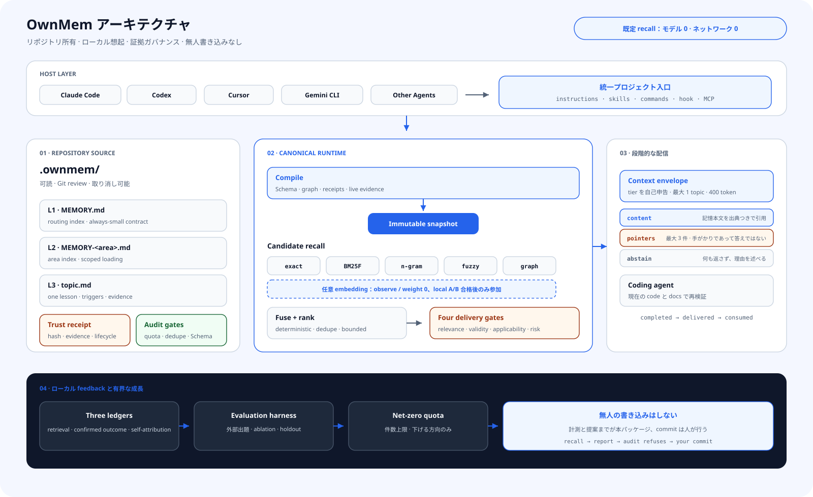

<div align="center">

# OwnMem

**AI コーディングエージェントのプロジェクト記憶をリポジトリに置く。ローカル、決定的、レビュー可能、そして安全な範囲で自己改善。**

`Git ネイティブ` · `ローカル想起` · `マルチエージェント` · `証拠ガバナンス` · `Apache-2.0`

[](https://www.npmjs.com/package/ownmem)
[](https://nodejs.org)
[](../../LICENSE)

[English](../../README.md) · [简体中文](./README.zh-CN.md) · [繁體中文](./README.zh-TW.md) · **日本語** · [한국어](./README.ko.md) · [Español](./README.es.md) · [Français](./README.fr.md) · [Deutsch](./README.de.md) · [Português (BR)](./README.pt-BR.md)

</div>

## なぜ OwnMem なのか

多くの記憶システムは「より多く覚える」ことを最適化します。OwnMem は先に、**プロジェクト知識を誰が所有し、誰が変更でき、誤った記憶を行動の前にどう止めるか**を問います。

| 強み | 実開発での意味 |
| --- | --- |
| **記憶はリポジトリ所有** | `.ownmem/` の可読 Markdown がコードと一緒に clone、review、rollback されます。 |
| **1 つの記憶を複数 Agent で共有** | Claude Code、Codex、Cursor、Gemini CLI、Grok CLI などが同じ知識源を使います。 |
| **既定で決定的なローカル想起** | モデルもネットワークも呼ばず、同じクエリ・設定・snapshot なら同じ順位です。 |
| **authority より先に証拠** | 本文は自分を信頼済みにできません。独立 receipt と生きた証拠検証が配信を決めます。 |
| **成長を制限** | Schema、quota、重複、lifecycle、audit が第二の放置 Wiki 化を防ぎます。 |
| **低リスクは自動、高影響はレビュー** | replay で証明された R0 検索メタデータだけが無人で進化できます。 |

## 全体アーキテクチャ

<picture>
  <source media="(prefers-color-scheme: dark)" srcset="../assets/architecture-ja-dark.svg">
  
</picture>

OwnMem は「経験を書くこと」と「Agent に渡すこと」を分離します。

- **リポジトリが唯一の情報源。** L1 routing、L2 area index、L3 topic は review 可能な Markdown。trust receipt は本文と分離されます。
- **compile してから recall。** Schema、graph、lifecycle、evidence gate が content-addressed な不変 snapshot を作ります。
- **5 本の決定的候補 lane。** exact、BM25F、n-gram、fuzzy、graph をローカル融合。embedding は任意の第 6 lane で、A/B 証拠が通るまで重み 0 です。
- **配信前の 4 gate。** relevance、factual validity、task applicability、action risk が通常配信、advisory、quarantine、abstention を決めます。
- **制限付き無人進化。** turn 終了時に replay 済み・quota 内・正確に戻せる R0 だけを自動昇格し、R1–R5 はレビューへ送ります。

## 0.3 の独自性

違いは単一の ranking 式ではありません。OwnMem 0.3 は Agent Memory を検証可能な進化プロトコルにします。

| 仕組み | OwnMem 0.3 の動作 |
| --- | --- |
| **証拠を伴う記憶** | content hash、evidence root、lifecycle、applicability、risk、predecessor receipt が注入可否を決めます。 |
| **反実仮想 promotion gate** | 基準で miss、候補だけで回復、既存合格 corpus は無回帰であることを証明します。 |
| **変更面からリスク算定** | 何を変え何に影響するかで決まり、Agent は自分の提案を低リスク化できません。 |
| **content-addressed 補償 rollback** | 自動変更は検証可能な逆操作を持ち、失敗や harmful outcome で以前の byte を正確に復元します。 |
| **memory poisoning の隔離** | candidate、content、authority、evidence は別の trust domain。検索されたことは権限ではありません。 |
| **選択的配信** | 証拠不足なら advisory、quarantine、abstention とし、信頼度を捏造しません。 |
| **不変 compiled snapshot** | Markdown、graph、ranking identity、trust state を再現可能な runtime input にします。 |
| **混同しない 3 台帳** | 検索の正誤、user/host outcome、Agent self-attribution を別々に記録します。 |

詳細は [technical design and research mapping](../TECHNICAL.md) を参照してください。

## 3 分で始める

Node.js 20.6 以上が必要です。記憶を所有させるリポジトリで実行します。

```bash
npm install --save-dev ownmem
npx ownmem init --locale auto --hosts claude,codex --layers dashboard --hook
```

初期化後に Agent を開き直してください。OwnMem は `.ownmem/` を作成し、host ファイルの管理 marker 内だけを変更します。adapter が 1 つなら `--hosts claude`、`--hosts codex`、`--hosts cursor`、`--hosts gemini` を使い、`npx ownmem init --check` で事前確認できます。

## 日常の使い方

セットアップ後は自然な言葉で作業します。

> 「覚えておいて。staging deploy の timeout は worker 不足ではなく pool cap が原因。次回は両方確認する。」

> 「変更前に、同じ障害をプロジェクト記憶で経験していないか確認して。」

host は関連作業前に recall し、turn 終了時に lock・debounce 付きの進化を 1 回予約します。promotion、trust、audit、compile を手作業で連結する必要は通常ありません。可視化にはローカル console と coordinator status を使います。

```bash
npx ownmem dashboard --open
npx ownmem evolve status
npx ownmem evolve run --force
```

## 信頼と自動化の境界

OwnMem が自動化するのは「機械で証明できる部分」であり、「もっともらしい部分」ではありません。

- **自動：** 決定的 recall、candidate scan、tripwire、反実仮想 replay、R0 trigger backfill、machine trust receipt、audit、compile、観測、隔離、正確な rollback。
- **レビューへ：** 新しい本文知識、policy、active set、conflict、証拠不足、R1–R5、publish。
- **固定境界：** candidate は memory ではなく、self-attribution は user confirmation ではなく、想起本文は host 指示や tool 権限を上書きできません。
- **失敗時：** unsigned content と検証不能 evidence は隔離、evidence drift は advisory、transaction failure は直前の検証済み状態へ復元します。

## 適している場面

| OwnMem が合う | 別のシステムが合う |
| --- | --- |
| プロジェクト知識をコードと一緒に review・移行したい。 | リポジトリ横断の個人 profile や global user memory が必要。 |
| 同じリポジトリで複数の coding Agent を使う。 | 証拠や risk boundary なしで全会話を自動保存したい。 |
| ローカル、再現可能、query cost 0 の recall が重要。 | 大規模 cloud vector search や realtime global knowledge graph が必要。 |
| 誤った記憶を追跡、拒否、撤回できる必要がある。 | governance より記憶量を優先する。 |

## ローカルファースト

- 既定 recall はリポジトリ file と local snapshot だけを読み、LLM・network・query token cost は 0 です。
- runtime event は Git-ignore された local directory に保存。outcome sample がなければ 0% ではなく「利用不可」と表示します。
- Git に置けない secret、個人情報、本番 data は memory にも置きません。
- embedding lane は任意かつ隔離。repository-local A/B evidence が safety gate を通って初めて weighted ranking に参加します。

## 研究上の系譜

OwnMem は基礎技術の発明を主張しません。貢献は、それらをリポジトリ記憶の実行可能 protocol に組み合わせることです。

- **Agent memory と reflection:** [Reflexion (NeurIPS 2023)](https://papers.neurips.cc/paper_files/paper/2023/hash/1b44b878bb782e6954cd888628510e90-Abstract-Conference.html), [MemGPT (2023)](https://arxiv.org/abs/2310.08560)
- **Memory / knowledge-base poisoning:** [AgentPoison (NeurIPS 2024)](https://proceedings.neurips.cc/paper_files/paper/2024/hash/eb113910e9c3f6242541c1652e30dfd6-Abstract-Conference.html), [PoisonedRAG (USENIX Security 2025)](https://www.usenix.org/conference/usenixsecurity25/presentation/zou-poisonedrag)
- **Untrusted data と authority の分離:** [CaMeL: Defeating Prompt Injections by Design (2025)](https://arxiv.org/abs/2503.18813)
- **独立 provenance:** [in-toto (USENIX Security 2019)](https://www.usenix.org/conference/usenixsecurity19/presentation/torres-arias)
- **Selective prediction と abstention:** [Selective Classification (JMLR 2010)](https://jmlr.org/papers/v11/el-yaniv10a.html)
- **Differential validation と compensation:** [Metamorphic Testing (1998)](https://www.cse.ust.hk/~scc/publ/CS98-01-metamorphictesting.pdf), [Sagas (SIGMOD 1987)](https://doi.org/10.1145/38713.38742)
- **分解された retrieval evaluation:** [ARES (NAACL 2024)](https://aclanthology.org/2024.naacl-long.20/), [RAGChecker (2024)](https://arxiv.org/abs/2408.08067)

引用は研究上の系譜を示すもので、各論文が OwnMem を実装した、または OwnMem が実験を再現したという意味ではありません。

## ドキュメント

| 文書 | 内容 |
| --- | --- |
| [Architecture](../ARCHITECTURE.md) | package 境界、snapshot、trust、evolution |
| [Technical design](../TECHNICAL.md) | mechanism、threat model、research mapping |
| [Plugins](../PLUGINS.md) | 任意 host plugin の導入 |
| [Updating](../UPDATING.md) | 安全な更新と 0.2 → 0.3 migration |
| [Privacy](../PRIVACY.md) | local data と optional channel |
| [Changelog](../../CHANGELOG.md) | version history |
| [License](../../LICENSE) | Apache-2.0 |

OwnMem はオープンソースです。再現可能な issue と pull request を歓迎します。
