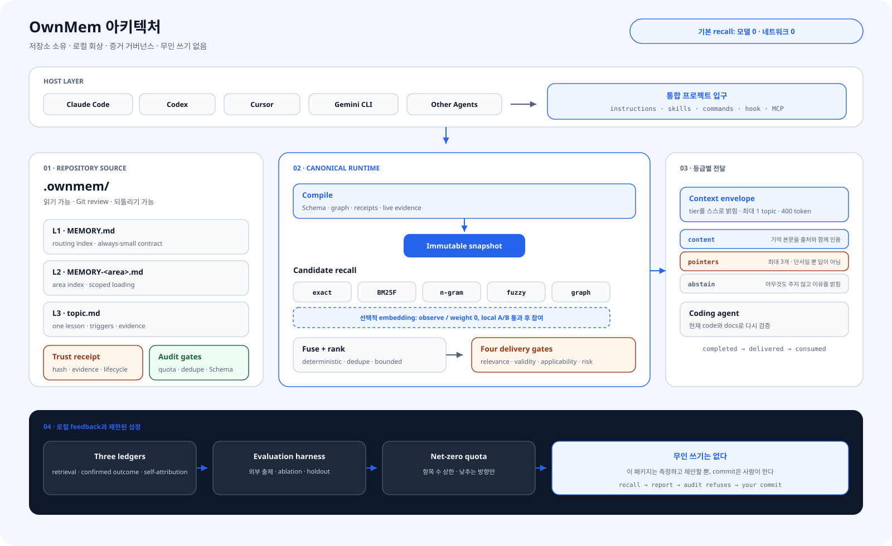

<div align="center">

# OwnMem — AI 코딩 에이전트를 위한 Git 네이티브 프로젝트 메모리

**프로젝트의 지식을 세션을 넘어 이어 가세요.**

AI 코딩 에이전트를 위한 영속적이고 로컬이며 결정적인 Git 네이티브 프로젝트 메모리.<br>
같은 파일 세트를 Claude Code · Codex · Antigravity · Cursor · Gemini CLI · Grok CLI에서 공유합니다.

[](https://www.npmjs.com/package/ownmem)
[](https://nodejs.org)
[](../../LICENSE)
[](https://github.com/grpcer/ownmem/actions/workflows/ci.yml)
[](#벤치마크)
[](#벤치마크)

[English](../../README.md) · [简体中文](./README.zh-CN.md) · [繁體中文](./README.zh-TW.md) · [日本語](./README.ja.md) · **한국어** · [Español](./README.es.md) · [Français](./README.fr.md) · [Deutsch](./README.de.md) · [Português (BR)](./README.pt-BR.md)

</div>

## OwnMem이란?

OwnMem은 Claude Code, Codex 등의 코딩 에이전트에게 세션을 넘어 사용할 수 있는
영속적 프로젝트 메모리를 제공하는 오픈 소스 AI 에이전트 메모리 시스템입니다.
메모리는 저장소의 `.ownmem/` 아래 일반 Markdown 파일에 저장되며, Unicode 문자 체계를
인식하는 BM25F 엔진이 결정적으로 순위를 매깁니다. 기본 회상은 모델 호출 0회,
네트워크 호출 0회, 쿼리 시점 토큰 소비 0입니다. 쿼리, 설정, 컴파일된 스냅샷이 같으면 같은 답을 약 2밀리초 만에 돌려줍니다.

OwnMem은 두 부분으로 구성됩니다. **npm 패키지**는 엔진입니다. 각 저장소에
리뷰 가능한 `devDependency`로 설치되어 해당 저장소의 `.ownmem/` 메모리를
관리합니다. **에이전트 플러그인**은 머신마다 한 번 설치하는 선택적 편의
레이어로, 에이전트에게 엔진 사용법을 알려 주고 저장소별 설정 과정도 안내합니다.

> **참고:** 어떤 경로로 도달했든, 저장소에 패키지와 `.ownmem/`이 갖춰지면
> 준비 완료입니다. 어느 쪽에서 시작해도 좋습니다.

## 한눈에 보는 OwnMem

| 항목 | 내용 |
| --- | --- |
| 범주 | AI 코딩 에이전트를 위한 저장소 소유 프로젝트 메모리 |
| 범위 | 하나의 저장소 |
| 저장 위치 | `.ownmem/` 안의 리뷰 가능한 Markdown, Git으로 버전 관리 |
| 기본 회상 | 결정적 BM25F, 모델 호출 0회, 네트워크 호출 0회 |
| 공개 벤치마크 | v0.2.0의 고정된 합성 벤치마크에서 Recall@1 100%, P95 2.46 ms. 실제 사용자 환경의 정확도를 의미하지는 않습니다 |
| 라이선스 | Apache-2.0 |

<picture>
  <source media="(prefers-color-scheme: dark)" srcset="../assets/architecture-ko-dark.svg">
  
</picture>

## 빠른 시작

OwnMem은 Node.js 20 이상이 필요합니다. 세 단계 모두 기억을 추가하고 싶은
저장소 안에서 실행합니다.

**1단계 — 엔진 설치.** 다른 의존성과 마찬가지로 리뷰하고 버전을 고정하는
평범한 `devDependency`가 됩니다:

```bash
npm install --save-dev ownmem
```

**2단계 — 이 저장소 초기화.** `.ownmem/`과 에이전트별 어댑터 파일을 만듭니다:

```bash
npx ownmem init --locale auto --hosts claude,codex --layers dashboard --hook
```

**3단계 — 에이전트 다시 열기.** 에이전트는 세션 시작 시점에 명령을 탐지하므로,
아래 내용은 초기화를 실행한 세션이 아니라 다음 세션부터 나타납니다.

이것이 권장 설정입니다 — Claude Code와 Codex를 바로 사용할 수 있고 로컬
콘솔도 함께 설치됩니다. 다시 열고 나면 다음이 준비됩니다:

- **Claude Code**에는 프로젝트 명령이 생깁니다:
  `/ownmem <메모리가 해 주길 바라는 무엇이든>`.
- **Codex와 Grok CLI**는 저장소의 `ownmem` 스킬을 자동으로 탐지합니다.
- **Antigravity**는 같은 프로젝트 지침(`AGENTS.md`, `GEMINI.md`)을 로드하여
  메모리 규율을 그대로 따릅니다 — 이 지침을 읽는 다른 모든 에이전트도
  마찬가지입니다.
- **콘솔**은 slash 명령이 아니라 터미널 명령입니다:
  `npx ownmem dashboard --open`. (아래의 선택적 플러그인이
  `/ownmem:dashboard`를 추가합니다.)

매일 실행할 설정 명령은 없습니다 — 그냥 평소처럼 작업하세요. 자체 메모리를
가져야 할 저장소마다 위 세 단계를 한 번씩 반복하세요.

에이전트 하나만 사용하나요? `--hosts claude,codex`를 `--hosts claude` 또는
`--hosts codex`로 바꾸세요. Antigravity와 Grok CLI는 Codex와 같은
`AGENTS.md` (그리고 Grok의 경우 `.agents/skills/`) 파일을 읽으므로
`--hosts codex`로 함께 지원됩니다. Cursor는 `--hosts cursor`, 클래식
Gemini CLI 설정은 `--hosts gemini`,
그 밖의 에이전트는 `--hosts generic`을 사용할 수 있습니다.

초기화는 `.ownmem/`을 만들고 에이전트의 프로젝트 지침에 작은 OwnMem 섹션을
추가합니다. 표시된 경계 밖의 기존 내용은 변경하지 않습니다.

## 일상 사용

설정이 끝나면 두 가지만 기억하면 됩니다.

**1. 에이전트에게 평소처럼 말하세요.** 나중에도 도움이 될 내용을 알게 되면
자연스러운 말로 알려 주세요:

> "기억해 둬 — 타임아웃의 원인은 풀 상한이지 워커 수가 아니야. 풀을
> 늘리지 않고 워커를 늘리면 안 돼."

나중에 비슷한 문제가 생기면 평소처럼 질문하세요:

> "스테이징 배포가 또 멈췄어. 뭔가 바꾸기 전에 프로젝트 메모리부터 확인해 줘."

메모리 작성, 검증, 회상은 에이전트가 알아서 처리합니다. `.ownmem/`을 열거나
직접 `audit` 또는 `recall`을 실행할 필요가 없습니다. 명시적인 명령을
선호하나요? `/ownmem <요청>` (Claude Code)과 `ownmem` 스킬 (Codex)이 같은
요청을 메모리로 라우팅합니다.

**2. 전체 상황이 궁금할 때만 콘솔을 여세요.** 이 저장소의 사용 현황,
회상 품질, 지연 시간, 메모리 상태를 보여 주며 자신의 컴퓨터에 있는
127.0.0.1에서만 열립니다:

```bash
npx ownmem dashboard --open
```


일상적인 사용법은 이것이 전부입니다. `audit`(감사), 수동 `recall`(회상), 피드백 명령은
CI와 문제 해결용이므로 일반 사용자가 기억할 필요는 없습니다.

## 만들게 된 이유

저는 Oriveo라는 BYOK 멀티모델 AI 클라이언트를 만들고 있습니다. iOS, Android, Web, 데스크톱에 걸친 큰 코드베이스를 매일 Claude Code와 Codex를 오가며 코딩 에이전트와 함께 개발합니다. 저장소마다 어렵게 얻은 교훈이 쌓여 갔습니다. 디버깅 근본 원인, 툴체인의 함정, 타이밍 경합 같은 것들입니다. 하지만 그 교훈은 한 도구의 메모리, 한 기계 안에만 있었고, 에이전트나 기계, 동료가 바뀔 때마다 조용히 사라졌습니다.

벡터나 클라우드 메모리 서비스는 이 용도에 맞지 않다고 느꼈습니다. 저장소에 관한 지식에 계정도, 서버도, 쿼리당 과금도 필요해서는 안 됩니다. 그래서 메모리를 저장소 자체로 옮겼습니다. OwnMem은 제가 Oriveo 코드베이스에서 매일 쓰는 그 시스템입니다. 쿼터와 감사로 관리되는 수백 개의 선별된 기억을, 깨끗한 공개 엔진으로 다시 만들었습니다.

## 왜 OwnMem인가

OwnMem은 네 가지에 베팅하며, 모든 설계 결정이 여기에서 따라 나옵니다:

- **메모리는 저장소에 속합니다.** Git과 함께 이동하고, 풀 리퀘스트에
  나타나며, 다른 코드처럼 롤백되는 리뷰 가능한 Markdown입니다. 저장소를
  복제하면 메모리도 함께 옵니다 — 계정도, 동기화 서비스도, 내보내기 단계도
  필요 없습니다.
- **회상은 무료이고 결정적이어야 합니다.** 같은 쿼리는 같은 순위를
  돌려주며, 모델 호출도, 지연 비용도, 질문당 과금도 없습니다: 잠금된 공개
  벤치마크에서 100% Recall@1, P95 2.46 ms.
- **메모리는 어떤 단일 도구보다 오래 살아야 합니다.** 같은 파일들이
  Claude Code, Codex, Antigravity, Cursor, Gemini CLI, Grok CLI를 동시에 지원하므로,
  에이전트를 바꿔도 팀이 배운 것을 잃지 않습니다.
- **메모리는 작아야 신뢰를 유지합니다.** 순 성장 제로 쿼터, 순수 Node 감사,
  근접 중복·드리프트 게이트가 메모리를, 아무도 가지치기하지 않는 제2의
  위키가 아니라 작고 최신인 상태로 유지합니다.

### OwnMem이 아닌 것

- **벡터 데이터베이스가 아닙니다.** 큰 메모리 풀에서의 퍼지 시맨틱 검색을
  원한다면 벡터·지식 그래프형 메모리 서비스가 더 맞습니다.
- **자동 캡처가 아닙니다.** 기록은 의도적으로, 선별해서 이루어집니다 —
  리뷰가 곧 품질 게이트입니다. 각 도구의 내장 에이전트 메모리가 더 편하지만,
  도구에 종속되고 리뷰가 불가능해지는 대가를 치릅니다.
- **저장소 간 공유도, 클라우드 동기화도 아닙니다.** 메모리는 저장소 자신의
  Git 기록과 함께 이동합니다 — 복제하면 그대로 따라옵니다. 다만 저장소를
  넘어 공유되지 않고, 어떤 클라우드 메모리 서비스도 거치지 않습니다. 설계가
  그렇습니다.

## `.ownmem/` 내부: 3계층 메모리

항상 로드되는 부분은 아주 작게 유지되고, 나머지는 전부 필요할 때 읽습니다:

| 계층 | 파일 | 읽히는 시점 |
| --- | --- | --- |
| **L1** | `MEMORY.md` | 총 색인 — 매 세션 시작 시 로드 |
| **L2** | `MEMORY-<area>.md` | 영역별 하위 색인 — 해당 영역을 건드릴 때 열림 |
| **L3** | 주제당 파일 하나 | 파일 하나에 교훈 하나 — `triggers`가 일치하면 `recall`이 반환 |

주제 파일은 스키마 검증을 거치는 엄격한 프런트매터를 가진 일반 Markdown
입니다 — 증상과 표현은 `triggers`에, 증거는 `evidence`에 기록합니다(여기서는
발췌본이며, 완전한 예시는 `ownmem init`가 생성합니다):

```markdown
---
name: pool_cap_timeout
description: staging deploys time out when workers exceed the pool cap
metadata:
  type: lesson
  triggers: ["staging deploy timeout", "pool cap exceeded"]
  evidence: [deploy-2026-08-12.log]
---

Raising the worker count without raising the connection pool cap exhausts
the pool, and every deploy waits until it times out. Raise both together.
```

회상이 무료일 수 있는 이유가 바로 이 구조입니다. 색인은 상주할 만큼
작고, BM25F는 작고 라벨이 잘 붙은 주제 파일만 순위를 매기면 됩니다.

## 다른 도구와의 비교

아래의 모든 열은 저마다 실제 문제를 풉니다 — 이 표는 우리 것을 포함해 각
도구가 어떤 트레이드오프를 택했는지 보여 줍니다.

| | OwnMem | [Mem0 (OSS)](https://github.com/mem0ai/mem0) | [Zep / Graphiti](https://github.com/getzep/graphiti) | [claude-mem](https://github.com/thedotmack/claude-mem) | 내장 자동 메모리¹ |
| --- | :---: | :---: | :---: | :---: | :---: |
| 메모리가 저장소 안에 살며 Git·PR과 함께 이동 | ✅ | ❌ | ❌ | ❌ | ❌ |
| 사람이 읽고 리뷰할 수 있는 Markdown | ✅ | ❌ | ❌ | ❌ | ⚠️² |
| 모델·네트워크 호출 없는 회상 | ✅ | ❌³ | ❌ | ❌ | — |
| 결정적이고 재현 가능한 랭킹 | ✅ | ❌ | ❌ | ❌ | — |
| Claude Code, Codex, Antigravity, Cursor, Gemini CLI, Grok CLI를 관통하는 하나의 메모리 | ✅ | ⚠️⁴ | ⚠️⁴ | ⚠️⁴ | ❌ |
| 비대화 방지 거버넌스 (성장 쿼터, 감사, 드리프트 게이트) | ✅ | ❌ | ❌ | ❌ | ⚠️⁵ |
| 시맨틱 패러프레이즈 검색 | ⚠️⁶ | ✅ | ✅ | ✅ | ❌ |
| 완전 자동 캡처 | ❌⁷ | ✅ | ✅ | ✅ | ✅ |
| 저장소 간·사용자 수준 메모리 | ❌⁷ | ✅ | ✅ | ⚠️ | ❌ |

¹ Claude Code 자동 메모리와 Codex Memories: 홈 디렉터리 아래의 파일 — 머신
로컬이고, 도구에 종속되며, 저장소 밖에 있습니다. Cursor는 2.1에서 Memories를
은퇴시키고 Rules로 대체했으며, Windsurf 메모리는 한 머신에만 남고 절대
커밋되지 않습니다.
² 편집 가능한 Markdown이지만 저장소 밖에 살기 때문에 풀 리퀘스트에는 절대
나타나지 않습니다.
³ Mem0의 Apache-2.0 라이브러리는 로컬에서 동작하지만, 메모리를 쓰고
조회하려면 여전히 LLM과 임베딩 모델 (기본은 OpenAI 키, 또는 Ollama를 통한
로컬 모델)이 필요합니다.
⁴ MCP 서버나 자체 API를 경유합니다 — 메모리는 사용자·앱 범위이지, 저장소가
소유하는 파일 세트가 아닙니다.
⁵ Claude Code는 항상 로드되는 인덱스에 상한(200 lines / 25 KB)을 두지만, 그
뒤를 받치는 쿼터·감사·중복 게이트는 없습니다.
⁶ 선택적 임베딩 경로로, 기본은 꺼져 있습니다. 로컬 A/B 증거가 안전
게이트를 통과한 뒤에만 랭킹에 합류합니다.
⁷ 의도된 설계입니다. OwnMem은 선별·리뷰된 기록과 단일 저장소 범위에
베팅합니다. 자동 캡처나 앱을 가로지르는 사용자 수준 메모리가 필요하다면,
그런 도구들이 정말로 더 맞습니다.

사실 관계는 2026년 8월, 각 프로젝트의 공개 문서([Mem0](https://docs.mem0.ai),
[Zep / Graphiti](https://help.getzep.com/graphiti/getting-started/overview),
[claude-mem](https://github.com/thedotmack/claude-mem),
[Claude Code auto memory](https://code.claude.com/docs/en/memory),
[Codex memories](https://developers.openai.com/codex/memories),
[Cursor rules](https://cursor.com/docs/context/rules),
[Windsurf memories](https://docs.devin.ai/desktop/cascade/memories))를 기준으로 확인했습니다 — 정정 제안을 환영합니다.

## 벤치마크

<picture>
  <source media="(prefers-color-scheme: dark)" srcset="../assets/benchmark-dark.svg">
  
</picture>

모든 릴리스는 잠금된 공개 벤치마크를 통과해야 합니다: 40개의 BCP 47 언어
태그와 25개의 문자 체계 그룹에 걸친 40개 주제의 CC0 코퍼스로, 128개의 정답
쿼리와 40개의 무관한 부정 예를 담고 있습니다. 아래 수치는 릴리스 등급
실행(쿼리당 25회 시간 측정 반복)에서 얻은 것입니다:

| 지표 | 결과 | 릴리스 게이트 |
| --- | --- | --- |
| Recall@1 / Recall@5 (정답 쿼리 128개) | **100% / 100%** | = 100% |
| MRR | **1.000** | = 1.000 |
| 무관한 쿼리 40개에 대한 기권 | **40 / 40** | = 100% |
| 회상 지연 P50 / P95 (시간 측정 샘플 4,200개) | **1.17 ms / 2.46 ms** | P95 ≤ 5 ms |
| 같은 게이트를 적용한 언어 / 문자 체계 | 40개 태그 / 25개 문자 체계 | 언어별·문자 체계별 P95 ≤ 5 ms |
| 회상 중 모델 호출 / 네트워크 호출 | **0 / 0** | = 0 |
| 런타임 의존성 | 2 (`ajv`, `yaml` — 순수 JS) | 잠금 |
| 실행 중 추가 메모리(RSS 증가분) | < 2 MB | — |

같은 코퍼스에서 대소문자 무시 고정 문자열 grep은 Recall@1 3.1%에 그칩니다.
렉시컬하고 결정적으로 유지하는 것 자체가 비결이 아니라, Unicode 문자 체계를
인식하는 BM25F 랭킹이 비결입니다.

직접 재현해 보세요:

```bash
git clone https://github.com/grpcer/ownmem
cd ownmem && npm ci && npm run benchmark
```

> **참고:** Apple M5 Pro와 Node 25에서 측정했습니다. 코퍼스 해시, 랭킹,
> 임계값은 잠겨 있으며, 주제 순서를 뒤집어 다시 실행해 결정성을 증명합니다.
> 이 합성 지표는 회귀 증거일 뿐, 실사용자 정확도를 주장하지 않습니다.

## 참고 문헌

랭킹 수식에 자체 고안은 없습니다 — 엔진의 모든 기법은 공개되고 검증된
방법입니다. OwnMem의 기여는 이를 결정적이고 의존성이 적은 엔진으로 조합한
데 있습니다:

| OwnMem에서의 위치 | 기법 | 문헌 |
| --- | --- | --- |
| `bm25f` 검색 경로 | 필드 가중 BM25 랭킹 | Robertson & Zaragoza (2009), *[The Probabilistic Relevance Framework: BM25 and Beyond](https://doi.org/10.1561/1500000019)*; Robertson, Zaragoza & Taylor (2004), *[Simple BM25 extension to multiple weighted fields](https://doi.org/10.1145/1031171.1031181)* |
| 검색 경로·다중 표현 융합 | Reciprocal Rank Fusion | Cormack, Clarke & Büttcher (2009), *[Reciprocal rank fusion outperforms Condorcet and individual rank learning methods](https://doi.org/10.1145/1571941.1572114)* |
| 결과 다양화 | Maximal Marginal Relevance | Carbonell & Goldstein (1998), *[The use of MMR, diversity-based reranking for reordering documents and producing summaries](https://doi.org/10.1145/290941.291025)* |
| `ngram` 검색 경로 | 문자 n-gram 유사도 (Dice) | Dice (1945), *[Measures of the amount of ecologic association between species](https://doi.org/10.2307/1932409)* |
| `fuzzy` 검색 경로 | 상한 편집 거리 | Levenshtein (1966), *Binary codes capable of correcting deletions, insertions, and reversals*, Soviet Physics Doklady 10(8) |
| 중복 게이트 | SimHash | Charikar (2002), *[Similarity estimation techniques from rounding algorithms](https://doi.org/10.1145/509907.509965)*; Manku, Jain & Das Sarma (2007), *[Detecting near-duplicates for web crawling](https://doi.org/10.1145/1242572.1242592)* |
| 중복 게이트 | MinHash | Broder (1997), *[On the resemblance and containment of documents](https://doi.org/10.1109/SEQUEN.1997.666900)* |
| 토크나이저 | 문자 체계 인식 분할 | *[UAX #24: Unicode Script Property](https://unicode.org/reports/tr24/)*; *[UAX #29: Unicode Text Segmentation](https://unicode.org/reports/tr29/)* |

## 에이전트 플러그인 설치 (선택, 머신마다 한 번)

**꼭 설치해야 하나요? 아니요 — 설치하지 않아도 모든 것이 동작합니다.**
`ownmem init`가 이미 저장소의 에이전트 지침 파일에 규율을 써 두었기 때문에,
이 저장소를 여는 어떤 에이전트든 그것을 따릅니다. 플러그인이 해결하는 것은
머신 전체의 편의입니다. 머신의 모든 저장소에 같은 세 가지 스킬을
추가하며 — 아직 `.ownmem/`가 없는 저장소에서도 초기화
스킬이 에이전트를 엔진 설치로 안내합니다. 이 저장소는 플러그인 마켓플레이스를
겸하고, 플러그인의 명령은 `npx ownmem`으로 라우팅될 뿐이라 플러그인
업데이트가 메모리를 다시 쓰는 일은 없습니다.

플러그인 하나, 스킬 세 가지, 이름 한 벌:

| Skill | Claude Code | Codex CLI | 하는 일 |
| --- | --- | --- | --- |
| `recall` | `/ownmem:recall` | `ownmem:recall` | 코드를 바꾸기 전에 메모리 회상 |
| `init` | `/ownmem:init` | `ownmem:init` | 저장소에 OwnMem을 설치하거나 업데이트 |
| `dashboard` | `/ownmem:dashboard` | `ownmem:dashboard` | 로컬 콘솔 열기 |

**Claude Code** — 두 명령을 순서대로 실행하세요. 첫 번째는 이 저장소를
플러그인 마켓플레이스로 등록하고 (한 번만 필요), 두 번째는 거기서 플러그인을
설치합니다:

```
/plugin marketplace add grpcer/ownmem
/plugin install ownmem@ownmem
```

그다음 Claude Code를 재시작하세요. 플러그인 명령은 세션 시작 시점에
로드되므로, 설치한 세션이 아니라 다음 세션부터 나타납니다. `/plugin` →
Marketplaces에서 이 마켓플레이스의 자동 업데이트를 켜면 새 버전을 자동으로
받습니다.

**Codex CLI** — 같은 두 단계를 순서대로: 마켓플레이스를 등록한 다음
플러그인을 추가하세요:

```
codex plugin marketplace add grpcer/ownmem
codex plugin add ownmem@ownmem
```

여기서도 스킬은 세션 시작 시점에 로드됩니다. `$` 스킬 선택기에서 찾을 수
있습니다. 이후 `codex plugin marketplace upgrade ownmem`을 실행한 다음
`codex plugin add ownmem@ownmem`으로 갱신하세요.

**Grok CLI** — 역시 두 명령을 순서대로: 마켓플레이스를 등록한 다음
설치하세요 (Grok은 명시적인 `--trust`가 필요합니다). Grok이 이미 Claude Code
마켓플레이스를 가져온 상태라면 첫 번째 명령은 건너뛰세요:

```
grok plugin marketplace add grpcer/ownmem
grok plugin install ownmem@ownmem --trust
```

같은 세 가지 스킬이 설치됩니다. 스킬 이름이 이미 사용 중이면 Grok이
네임스페이스를 붙입니다 — 내장 대시보드 때문에 우리 것은
`/ownmem:dashboard`가 됩니다. 업데이트는 `grok plugin update ownmem`입니다.

**Antigravity** — 명령 하나면 됩니다. 마켓플레이스 단계는 없습니다:

```
agy plugin install https://github.com/grpcer/ownmem
```

이로써 `ownmem`, `ownmem-init`, `ownmem-dashboard` 스킬을 가져옵니다.
업데이트는 같은 명령을 다시 실행하면 됩니다. (API 키, Vertex AI 또는
엔터프라이즈 라이선스를 쓰는 클래식 Gemini CLI 설정은 지금도
`gemini extensions install https://github.com/grpcer/ownmem`으로 같은
저장소를 설치할 수 있습니다.)

## 안전한 자동 업데이트

OwnMem은 조용한 백그라운드 재작성이 아니라 리뷰 가능한 의존성 업데이트를
위해 설계되었습니다. npm 의존성에 Dependabot 또는 Renovate를 활성화하세요.
OwnMem 업그레이드 PR이 열리면 CI에서 다음 세 명령을 순서대로 실행해야
합니다:

```bash
npx ownmem init --update
npx ownmem init --check
npx ownmem audit
```

`init --update`는 OwnMem이 관리하는 경계 블록만 갱신하고 프로젝트 메모리는
보존합니다. `init --check`는 생성된 어댑터가 드리프트하면 실패합니다.
`package-lock.json`을 커밋해 두면 모든 에이전트와 CI 작업이 리뷰된 버전에
머뭅니다.

수동 업데이트는 네 개 명령을 모두 순서대로 실행하세요:

```bash
npm install --save-dev ownmem@latest
npx ownmem init --update
npx ownmem init --check
npx ownmem audit
```

프로덕션 저장소에서 버전이 떠다니는 `npx ownmem@latest`는 피하세요. 처음
살펴볼 때는 편리하지만 실행 재현성이 사라집니다.

## 레이어

필요한 만큼만 골라 쓰세요 — 각 레이어는 이전 레이어를 포함합니다:

| 레이어 | 추가 요소 |
| --- | --- |
| `core` | 초기화, 엄격한 스키마, Unicode 문자 체계 인식 BM25F 회상, 결정적 다중 쿼리 융합, 성장 쿼터 |
| `gates` | 순수 Node 감사와 근접 중복 게이트 |
| `compiler` | 불변 스냅샷, stdio 상주 런타임, 선택적 Claude Code 훅 |
| `dashboard` | OwnMem Console과 선택적 임베딩 평가 경로 |

모든 레이어는 순수 JavaScript인 `ajv`와 `yaml` 두 런타임 의존성만 사용합니다.
OwnMem Console은 영어, 중국어 간체·번체, 일본어, 한국어, 스페인어, 프랑스어,
독일어, 브라질 포르투갈어, 아랍어, 힌디어, 인도네시아어, 러시아어, 태국어,
터키어, 베트남어의 완전한 카탈로그를 포함합니다.

## AI 에이전트 메모리 FAQ

### AI 에이전트 메모리 시스템이란 무엇인가요?

AI 에이전트 메모리 시스템은 에이전트가 작업이나 세션을 넘어 다시 사용할 지식을 저장합니다.
OwnMem은 대화 기록이나 사용자 프로필이 아니라, 리뷰를 마친 엔지니어링 교훈을 소프트웨어 저장소에 보관합니다.

### Claude Code와 Codex가 세션을 넘어 같은 메모리를 쓸 수 있나요?

네. 저장소마다 [빠른 시작](#빠른-시작)을 한 번 실행한 뒤 에이전트를 다시 여세요.
Claude Code, Codex, Antigravity, Cursor, Gemini CLI, Grok CLI가 별도의 메모리 저장소 대신 같은 `.ownmem/` 파일을 읽을 수 있습니다.

### 메모리는 어디에 저장되고 팀원과 어떻게 공유하나요?

메모리는 `.ownmem/` 아래의 일반 Markdown입니다. 적절한 메모리를 Git에 커밋하면 저장소의 복제, 풀 리퀘스트, 접근 제어, 롤백 절차를 따라 공유됩니다. 저장소에 포함하면 안 되는 비밀은 기록하지 마세요.

### LLM, 임베딩, 벡터 데이터베이스, 네트워크가 필요한가요?

기본 회상에는 모두 필요하지 않습니다. 두 개의 작은 순수 JavaScript 런타임 의존성만 쓰는 로컬 어휘 검색입니다. 패키지 설치에는 네트워크가 필요할 수 있고, 선택적 임베딩 경로는 로컬 A/B 증거가 안전 게이트를 통과할 때까지 꺼져 있습니다.

### Mem0, Graphiti, claude-mem, 내장 메모리와 무엇이 다른가요?

OwnMem은 단일 저장소 범위에서 선별된 지식을 결정적으로 검색하며 Git에서 리뷰할 수 있습니다. 자동 캡처, 대규모 저장소의 의미 검색, 사용자 수준 메모리, 지식 그래프, 클라우드 동기화가 필요하다면 다른 도구가 더 적합합니다. 자세한 근거는 [다른 도구와의 비교](#다른-도구와의-비교)를 참고하세요.

## 기여하기

issue와 pull request를 환영합니다. 기본 규칙은 [CONTRIBUTING.md](../../.github/CONTRIBUTING.md)를
참고하세요: 기본 회상은 결정적·로컬·모델 미사용으로 유지하고, 검색 관련 변경마다
회귀 케이스를 추가하며, 리뷰 요청 전에 `npm test`와 `npm run benchmark:release`를
실행합니다. 보안 제보는 [SECURITY.md](../../.github/SECURITY.md)를 통해 주세요.

## 안전과 증거

- 메모리 파일은 언제나 저장소 안의 검토 가능한 Markdown으로 남습니다.
- 스키마, 쿼터, 생성 경계, 근접 중복 검사가 모두 로컬에서 실행됩니다.
- `recall.consumed`가 핵심 채택 지표이며, Recall@K는 과정 지표일 뿐입니다.
- 기본 설치는 어떤 모델도 다운로드하거나 호출하지 않습니다.
- 선택적 임베딩 경로는 로컬 A/B 증거가 안전 게이트를 통과하기 전까지 순위에 관여하지 않습니다.

OwnMem은 Apache-2.0으로 라이선스됩니다. 산출물을 공유하거나 릴리스를
게시하기 전에 `docs/PRIVACY.md`, `.github/SECURITY.md`, `docs/RELEASE.md`를 읽어 주세요.

## 감사의 말

- [LINUX DO](https://linux.do/)
