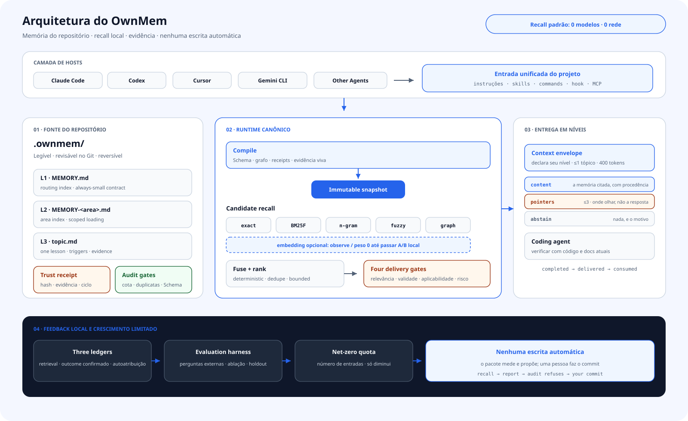
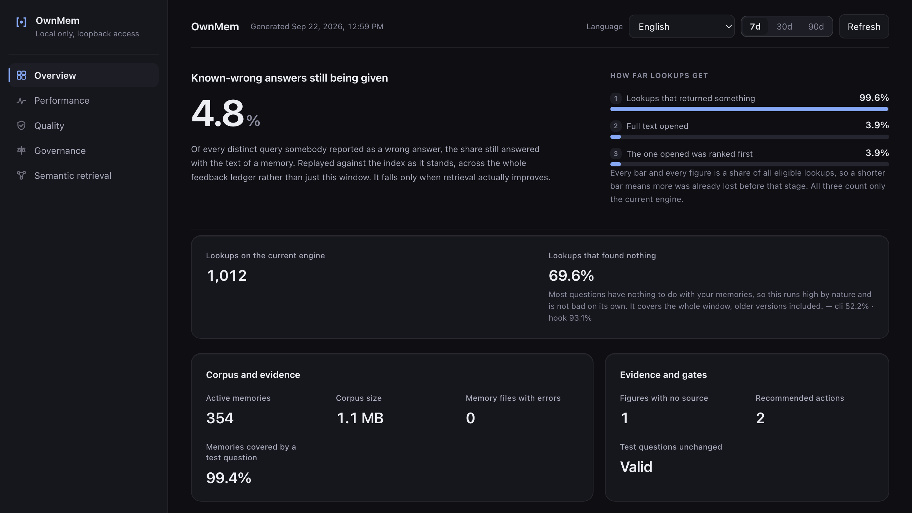
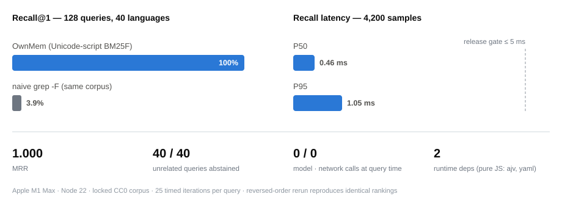

<div align="center">

# OwnMem — Memória de projeto nativa do Git para agentes de programação com IA

**Do repositório. Determinística. Revisável.**

Um sistema de memória de código aberto para agentes de IA em repositórios de software.<br>
Uma memória de projeto persistente para Claude Code · Codex · Antigravity · Cursor · Gemini CLI · Grok CLI.

[](https://www.npmjs.com/package/ownmem)
[](https://nodejs.org)
[](../../LICENSE)
[](https://github.com/grpcer/ownmem/actions/workflows/ci.yml)
[](#benchmarks)
[](#benchmarks)

[English](../../README.md) · [简体中文](./README.zh-CN.md) · [繁體中文](./README.zh-TW.md) · [日本語](./README.ja.md) · [한국어](./README.ko.md) · [Español](./README.es.md) · [Français](./README.fr.md) · [Deutsch](./README.de.md) · **Português (BR)**

</div>

## O que é o OwnMem?

O OwnMem é um sistema de memória de código aberto, local e nativo do Git para
agentes de programação com IA. Ele mantém decisões, restrições e aprendizados de
depuração do projeto como Markdown revisável dentro do repositório. Essa
memória de projeto persistente funciona entre agentes e sessões, acompanha o
Git e pode ser revertida junto com o código que descreve.

Seu motor BM25F determinístico, adaptado aos sistemas de escrita Unicode,
classifica as memórias em `.ownmem/`. Com a mesma consulta, configuração e
instantâneo compilado, a recuperação padrão devolve a mesma classificação sem
chamadas de modelo, solicitações de rede ou custo de tokens no momento da
consulta — cerca de dois milissegundos no benchmark público.

O OwnMem tem duas partes. O **pacote npm** é o motor: vive em cada repositório
como uma `devDependency` revisada e cuida da memória daquele repositório em
`.ownmem/`. O **plugin de agente** é uma camada de conveniência opcional,
instalada uma vez por máquina: ensina seu agente a usar o motor, inclusive
guiando você pela configuração por repositório.

> **Nota:** Um repositório está pronto assim que tiver o pacote e `.ownmem/`,
> independentemente de como ambos foram instalados. Você pode começar por
> qualquer uma das duas partes.

## OwnMem em resumo

| Atributo | Fato |
| --- | --- |
| Categoria | Memória de projeto pertencente ao repositório para agentes de programação com IA |
| Escopo | Um repositório |
| Armazenamento | Markdown revisável em `.ownmem/`, versionado com o Git |
| Recuperação padrão | BM25F determinístico, **0 chamadas de modelo / 0 chamadas de rede** |
| Benchmark público | Benchmark sintético fixado da v0.2.0: **100% de Recall@1**, **P95 de 2,46 ms**; não mede a precisão com usuários reais |
| Licença | Apache-2.0 |

<picture>
  <source media="(prefers-color-scheme: dark)" srcset="../assets/architecture-pt-BR-dark.svg">
  
</picture>

## Início rápido

O OwnMem exige Node.js 20.6 ou mais recente. Três passos, todos dentro do
repositório que você quer que tenha memória.

**Passo 1 — instale o motor.** Ele vira uma `devDependency` normal, revisada
e fixada como qualquer outra:

```bash
npm install --save-dev ownmem
```

**Passo 2 — inicialize este repositório.** Isso cria `.ownmem/` e os
arquivos adaptadores por agente:

```bash
npx ownmem init --locale auto --hosts claude,codex --layers dashboard --hook
```

**Passo 3 — reabra seu agente.** Os agentes descobrem comandos no início da
sessão, então tudo abaixo aparece na próxima sessão, não naquela que executou
a inicialização.

Essa é a configuração recomendada — Claude Code e Codex ficam prontos para
uso, e o console local também é incluído. O que você tem depois de reabrir:

- **Claude Code** ganha um comando de projeto: `/ownmem <qualquer coisa que
  você queira que a memória faça>`.
- **Codex e Grok CLI** descobrem automaticamente a habilidade `ownmem` do
  repositório.
- **Antigravity** carrega as mesmas instruções de projeto (`AGENTS.md`,
  `GEMINI.md`), então também segue a disciplina de memória — assim como
  qualquer outro agente que as leia.
- **O console** é um comando de terminal, não um comando com barra:
  `npx ownmem dashboard --open`. (O plugin opcional abaixo adiciona
  `/ownmem:dashboard`.)

Não existe comando de configuração para executar todos os dias — apenas
trabalhe normalmente. Repita os três passos uma vez para cada repositório que
deva ter sua própria memória.

Usa apenas um agente? Troque `--hosts claude,codex` por `--hosts claude` ou
`--hosts codex`. O Antigravity e o Grok CLI leem os mesmos arquivos
`AGENTS.md` (e, no caso do Grok, `.agents/skills/`) que o Codex, então
`--hosts codex` cobre os dois. O Cursor usa `--hosts cursor`, configurações
clássicas do Gemini CLI usam `--hosts gemini`, e `--hosts generic` funciona
com outros agentes.

A inicialização cria `.ownmem/` e adiciona uma pequena seção do OwnMem às
instruções do projeto. O texto fora dos limites marcados nunca é alterado.

## Uso diário

Depois da configuração, você só precisa lembrar de duas coisas.

**1. Fale com seu agente.** Quando aprender algo que vale a pena guardar,
diga com suas próprias palavras:

> "Lembre disso — o tempo limite vem da capacidade do pool de conexões, não
> do número de processos. Nunca aumente os processos sem aumentar o pool."

Mais tarde, pergunte com a mesma naturalidade de sempre:

> "A implantação em homologação travou de novo. Consulte a memória do projeto antes de
> mudar qualquer coisa."

O agente cuida da escrita, da validação e do recall. Você não precisa abrir
`.ownmem/` nem executar `audit` ou `recall` por conta própria. Prefere um
comando explícito? `/ownmem <pedido>` (Claude Code) e a habilidade `ownmem`
(Codex) encaminham o mesmo pedido pela memória.

**2. Abra o console quando quiser uma visão geral.** Ele mostra o uso, a
qualidade do recall, a latência e o estado da memória deste repositório, e fica
disponível apenas no seu computador por meio do 127.0.0.1:

```bash
npx ownmem dashboard --open
```



Esse é todo o fluxo diário. `audit`, o `recall` manual e os comandos de
avaliação são voltados a CI e diagnóstico; usuários comuns não precisam memorizá-los.

## Por que isso existe

Eu construo o Oriveo, um cliente de IA multimodelo BYOK para iOS, Android, web e desktop — uma base de código grande que desenvolvo todos os dias com agentes de programação, alternando entre Claude Code e Codex. Cada repositório acumulava lições conquistadas a duras penas: causas raiz de erros, armadilhas da cadeia de ferramentas e condições de corrida. Toda vez que o agente, a máquina ou um colega mudava, essas lições sumiam em silêncio, porque viviam na memória de uma única ferramenta, em uma única máquina.

Serviços de memória vetorial ou em nuvem nunca pareceram certos para isso: o conhecimento sobre um repositório não deveria exigir conta, servidor nem cobrança por consulta. Então a memória se mudou para o próprio repositório. O OwnMem é o sistema que uso diariamente na base de código do Oriveo — centenas de memórias curadas, mantidas honestas por cotas e auditorias — extraído e reconstruído como um motor público e limpo.

## Por que OwnMem

O OwnMem faz quatro apostas, e toda decisão de design decorre delas:

- **A memória pertence ao repositório.** Markdown revisável que viaja com o
  git, aparece nos pull requests e é revertido como qualquer outro código.
  Clone o repo e leve a memória junto — sem conta, sem serviço de
  sincronização, sem etapa de exportação.
- **O recall precisa ser gratuito e determinístico.** A mesma consulta devolve
  a mesma classificação, sem chamada de modelo, sem imposto de latência e sem conta
  por pergunta: 100% de Recall@1 com P95 de 2,46 ms no benchmark público
  fixado.
- **A memória precisa sobreviver a qualquer ferramenta isolada.** Os mesmos
  arquivos atendem ao Claude Code, ao Codex, ao Antigravity, ao Cursor, ao
  Gemini CLI e ao Grok CLI, então
  trocar de agente nunca significa perder o que o time aprendeu.
- **A memória precisa continuar pequena para continuar confiável.** Uma cota
  de crescimento líquido zero, uma auditoria em Node puro e portões de
  quase-duplicatas e de desvio a mantêm enxuta e atual, em vez de deixá-la
  virar uma segunda wiki que ninguém poda.

### O que o OwnMem não é

- **Não é um banco de dados vetorial.** Se você quer busca semântica difusa
  sobre grandes conjuntos de memórias, um serviço de memória vetorial ou de
  grafo de conhecimento é mais indicado.
- **Não é captura automática.** As escritas são deliberadas e curadas — a
  revisão é o controle de qualidade. As memórias embutidas dos agentes são mais
  cômodas, ao custo de ficarem presas a uma ferramenta e não serem revisáveis.
- **Não é multi-repositório nem sincronizado na nuvem.** A memória viaja com
  o histórico git do próprio repositório — clone o repositório e ela está lá.
  Mas nunca é compartilhada entre repositórios nem passa por um serviço de
  memória, por decisão de projeto.

## Dentro de `.ownmem/`: a memória em três camadas

A parte sempre carregada continua minúscula; todo o resto é lido sob demanda:

| Camada | Arquivo | Quando é lida |
| --- | --- | --- |
| **L1** | `MEMORY.md` | O índice — carregado no início de cada sessão |
| **L2** | `MEMORY-<area>.md` | Subíndices por área — abertos quando aquela área é tocada |
| **L3** | um arquivo por tópico | Uma lição por arquivo — devolvida pelo `recall` quando seus gatilhos correspondem |

Um arquivo de tópico é Markdown puro com metadados iniciais estritos validados
por um esquema — sintomas e formulações em `triggers`, provas em `evidence`
(resumido aqui; o `ownmem init` gera um exemplo completo):

```markdown
---
name: pool_cap_timeout
description: staging deploys time out when workers exceed the pool cap
metadata:
  type: lesson
  triggers: ["staging deploy timeout", "pool cap exceeded"]
  evidence: [deploy-2026-08-12.log]
---

Raising the worker count without raising the connection pool cap exhausts
the pool, and every deploy waits until it times out. Raise both together.
```

É essa estrutura que torna o recall gratuito: o índice é pequeno o bastante
para ficar sempre carregado, e o BM25F só precisa classificar arquivos de tópico
pequenos e bem rotulados.

## Como o OwnMem se compara

Cada coluna abaixo resolve um problema real — a tabela mostra quais trade-offs
cada uma faz, inclusive os nossos.

| | OwnMem | [Mem0 (OSS)](https://github.com/mem0ai/mem0) | [Zep / Graphiti](https://github.com/getzep/graphiti) | [claude-mem](https://github.com/thedotmack/claude-mem) | Memória automática embutida¹ |
| --- | :---: | :---: | :---: | :---: | :---: |
| A memória vive no seu repositório, viaja com o Git e os pull requests | ✅ | ❌ | ❌ | ❌ | ❌ |
| Markdown legível e revisável por humanos | ✅ | ❌ | ❌ | ❌ | ⚠️² |
| Recall sem chamadas de modelo nem de rede | ✅ | ❌³ | ❌ | ❌ | — |
| Ranking determinístico e reproduzível | ✅ | ❌ | ❌ | ❌ | — |
| Uma memória só para Claude Code, Codex, Antigravity, Cursor, Gemini CLI e Grok CLI | ✅ | ⚠️⁴ | ⚠️⁴ | ⚠️⁴ | ❌ |
| Controle de crescimento (cota, auditoria, verificações de desvio) | ✅ | ❌ | ❌ | ❌ | ⚠️⁵ |
| Busca semântica por paráfrase | ⚠️⁶ | ✅ | ✅ | ✅ | ❌ |
| Captura totalmente automática | ❌⁷ | ✅ | ✅ | ✅ | ✅ |
| Memória multi-repositório, no nível do usuário | ❌⁷ | ✅ | ✅ | ⚠️ | ❌ |

¹ Auto memory do Claude Code e Memories do Codex: arquivos no seu diretório
de usuário — locais à máquina, presos à ferramenta, fora do repositório. O Cursor
aposentou as Memories na 2.1 em favor das Rules; as memórias do Windsurf ficam
restritas a uma máquina e nunca são incluídas em commits.
² Markdown editável, mas que vive fora do repo, então nunca aparece num pull
request.
³ A biblioteca Apache-2.0 do Mem0 roda localmente, mas ainda exige um LLM e um
modelo de embedding (uma chave da OpenAI por padrão, ou modelos locais via
Ollama) para escrever e consultar a memória.
⁴ Via um servidor MCP ou sua própria API — a memória tem escopo de usuário ou
de app, não é um conjunto de arquivos que pertence ao seu repositório.
⁵ O Claude Code limita seu índice sempre carregado (200 linhas / 25 KB); não
há cota, auditoria nem verificação de duplicatas por trás disso.
⁶ Via opcional de embeddings, desligada por padrão; ela só entra na classificação
depois que a sua evidência A/B local passa pela verificação de segurança.
⁷ Por decisão de projeto. O OwnMem aposta em escritas curadas e revisadas e no
escopo de um repositório; se você quer captura automática ou memória no nível
do usuário entre aplicativos, essas ferramentas realmente se adaptam melhor.

Fatos verificados em agosto de 2026 contra a documentação pública de cada
projeto: [Mem0](https://docs.mem0.ai), [Zep / Graphiti](https://help.getzep.com/graphiti/getting-started/overview),
[claude-mem](https://github.com/thedotmack/claude-mem),
[memória automática do Claude Code](https://code.claude.com/docs/en/memory),
[Codex memories](https://developers.openai.com/codex/memories),
[Cursor rules](https://cursor.com/docs/context/rules),
[Windsurf memories](https://docs.devin.ai/desktop/cascade/memories) — correções são bem-vindas.

## Benchmarks

<picture>
  <source media="(prefers-color-scheme: dark)" srcset="../assets/benchmark-dark.svg">
  
</picture>

Toda versão precisa passar por um benchmark público fixado: um corpus CC0 de
40 tópicos cobrindo 40 tags de idioma BCP 47 e 25 grupos de escrita, com 128
consultas positivas e 40 negativas sem relação. Os números abaixo vêm de uma
execução em nível de publicação (25 iterações cronometradas por consulta):

| Métrica | Resultado | Critério de publicação |
| --- | --- | --- |
| Recall@1 / Recall@5 (128 consultas positivas) | **100% / 100%** | = 100% |
| MRR | **1,000** | = 1,000 |
| Abstenção em 40 consultas sem relação | **40 / 40** | = 100% |
| Latência de recuperação P50 / P95 (4.200 amostras cronometradas) | **1,17 ms / 2,46 ms** | P95 ≤ 5 ms |
| Idiomas / escritas sob os mesmos portões | 40 tags / 25 escritas | P95 ≤ 5 ms por idioma e por escrita |
| Chamadas de modelo / de rede durante a recuperação | **0 / 0** | = 0 |
| Dependências de execução | 2 (`ajv`, `yaml` — JS puro) | fixadas |
| Memória extra durante a execução (delta de RSS) | < 2 MB | — |

No mesmo corpus, um `grep` de texto fixo sem distinção de maiúsculas marca 3,1%
de Recall@1. Ser lexical e determinístico não é o truque por si só — a classificação
BM25F ciente dos sistemas de escrita Unicode é.

Reproduza você mesmo:

```bash
git clone https://github.com/grpcer/ownmem
cd ownmem && npm ci && npm run benchmark
```

> **Nota:** Medido num Apple M5 Pro com Node 25. O hash do corpus, as classificações
> e os limiares estão fixados, e a execução se repete com a ordem dos tópicos
> invertida para provar o determinismo. Essas métricas sintéticas são
> evidência de regressão, não uma alegação de precisão com usuários reais.

## Referências

Nada da matemática de classificação é invenção caseira — cada técnica do motor é um
método publicado e comprovado. A contribuição do OwnMem é compô-las em um
motor determinístico com duas pequenas dependências de execução em JavaScript puro:

| No OwnMem | Técnica | Bibliografia |
| --- | --- | --- |
| Canal `bm25f` | BM25 ponderado por campos | Robertson & Zaragoza (2009), *[The Probabilistic Relevance Framework: BM25 and Beyond](https://doi.org/10.1561/1500000019)*; Robertson, Zaragoza & Taylor (2004), *[Simple BM25 extension to multiple weighted fields](https://doi.org/10.1145/1031171.1031181)* |
| Fusão de canais e consultas | Reciprocal Rank Fusion | Cormack, Clarke & Büttcher (2009), *[Reciprocal rank fusion outperforms Condorcet and individual rank learning methods](https://doi.org/10.1145/1571941.1572114)* |
| Diversidade de resultados | Maximal Marginal Relevance | Carbonell & Goldstein (1998), *[The use of MMR, diversity-based reranking for reordering documents and producing summaries](https://doi.org/10.1145/290941.291025)* |
| Canal `ngram` | Similaridade de n-gramas (Dice) | Dice (1945), *[Measures of the amount of ecologic association between species](https://doi.org/10.2307/1932409)* |
| Canal `fuzzy` | Distância de edição limitada | Levenshtein (1966), *Binary codes capable of correcting deletions, insertions, and reversals*, Soviet Physics Doklady 10(8) |
| Verificação de duplicatas | SimHash | Charikar (2002), *[Similarity estimation techniques from rounding algorithms](https://doi.org/10.1145/509907.509965)*; Manku, Jain & Das Sarma (2007), *[Detecting near-duplicates for web crawling](https://doi.org/10.1145/1242572.1242592)* |
| Verificação de duplicatas | MinHash | Broder (1997), *[On the resemblance and containment of documents](https://doi.org/10.1109/SEQUEN.1997.666900)* |
| Tokenizador | Segmentação por escrita | *[UAX #24: Unicode Script Property](https://unicode.org/reports/tr24/)*; *[UAX #29: Unicode Text Segmentation](https://unicode.org/reports/tr29/)* |

## Instalar o plugin de agente (opcional, uma vez por máquina)

**Precisa instalar? Não — sem ele, tudo continua funcionando.**
O `ownmem init` já escreveu a disciplina nas instruções de agente do
repositório, então qualquer agente que abrir o repositório a segue. O plugin
resolve a conveniência no nível da máquina: adiciona as mesmas três habilidades a
todos os repositórios da máquina — inclusive os que ainda
não têm `.ownmem/`, onde a habilidade de inicialização guia o agente pela instalação do
motor. Este repositório também funciona como marketplace do plugin; seus
comandos apenas roteiam para `npx ownmem`, então uma atualização do plugin
nunca reescreve sua memória.

Um plugin, três habilidades, um único conjunto de nomes:

| Habilidade | Claude Code | Codex CLI | O que faz |
| --- | --- | --- | --- |
| `recall` | `/ownmem:recall` | `ownmem:recall` | Consultar a memória antes de mudar o código |
| `init` | `/ownmem:init` | `ownmem:init` | Instalar ou atualizar o OwnMem em um repositório |
| `dashboard` | `/ownmem:dashboard` | `ownmem:dashboard` | Abrir o console local |

**Claude Code** — execute os dois comandos, nesta ordem: o primeiro registra
este repositório como um marketplace de plugins (necessário uma única vez), o
segundo instala o plugin a partir dele:

```
/plugin marketplace add grpcer/ownmem
/plugin install ownmem@ownmem
```

Depois, reinicie o Claude Code: os comandos do plugin carregam no início da
sessão, então aparecem na próxima sessão, não naquela que fez a instalação.
Ative a atualização automática do marketplace em `/plugin` → Marketplaces
para receber novas versões automaticamente.

**Codex CLI** — os mesmos dois passos, em ordem: registre o marketplace e
depois adicione o plugin:

```
codex plugin marketplace add grpcer/ownmem
codex plugin add ownmem@ownmem
```

Aqui as habilidades também carregam no início da sessão; encontre-as no seletor
`$`. Atualize depois com `codex plugin marketplace upgrade ownmem`
seguido de `codex plugin add ownmem@ownmem`.

**Grok CLI** — de novo os dois comandos em ordem: registre o marketplace e
depois instale (o Grok exige o `--trust` explícito). Pule o primeiro comando
se o Grok já importou seus marketplaces do Claude Code:

```
grok plugin marketplace add grpcer/ownmem
grok plugin install ownmem@ownmem --trust
```

Isso instala as mesmas três habilidades. Quando um nome simples já está
em uso, o Grok o coloca em um espaço de nomes — o painel embutido dele faz o
nosso virar `/ownmem:dashboard`. Atualize com `grok plugin update ownmem`.

**Antigravity** — um único comando, sem etapa de marketplace:

```
agy plugin install https://github.com/grpcer/ownmem
```

Isso importa as habilidades `ownmem`, `ownmem-init` e `ownmem-dashboard`; atualize
executando o mesmo comando de novo. (Configurações clássicas do Gemini CLI —
chave de API, Vertex AI ou uma licença empresarial — ainda podem instalar o
mesmo repositório com
`gemini extensions install https://github.com/grpcer/ownmem`.)

## Atualizações automáticas seguras

O OwnMem foi projetado para atualizações de dependência revisáveis, não para
reescritas silenciosas em segundo plano. Ative o Dependabot ou o Renovate para
as dependências npm. Quando um deles abrir um pull request de atualização do
OwnMem, o CI deve executar estes três comandos em ordem:

```bash
npx ownmem init --update
npx ownmem init --check
npx ownmem audit
```

`init --update` atualiza apenas os limites gerenciados pelo OwnMem e preserva
a memória do projeto. `init --check` falha quando os adaptadores gerados
divergem. Commitar o `package-lock.json` mantém cada agente e job de CI na
versão revisada.

Para uma atualização manual, execute os quatro em ordem:

```bash
npm install --save-dev ownmem@latest
npx ownmem init --update
npx ownmem init --check
npx ownmem audit
```

Evite um `npx ownmem@latest` flutuante em repositórios de produção: é cômodo
para uma primeira olhada, mas torna as execuções não reproduzíveis.

## Camadas

Escolha quanta maquinaria você quer — cada camada contém a anterior:

| Camada | Adiciona |
| --- | --- |
| `core` | Inicialização, esquema estrito, recuperação BM25F adaptada aos sistemas de escrita Unicode, fusão determinística de múltiplas consultas, cota de crescimento |
| `gates` | Auditoria em Node puro e verificação de quase-duplicatas |
| `compiler` | Instantâneos imutáveis, ambiente de execução residente via stdio, integração opcional do Claude Code |
| `dashboard` | OwnMem Console e a via opcional de avaliação de embeddings |

Todas as camadas usam apenas as dependências de execução em JavaScript puro
`ajv` e `yaml`. O OwnMem Console traz catálogos completos para inglês, chinês
simplificado e tradicional, japonês, coreano, espanhol, francês, alemão,
português do Brasil, árabe, híndi, indonésio, russo, tailandês, turco e
vietnamita.

## Perguntas frequentes sobre memória para agentes de IA

### O que é um sistema de memória para agentes de IA?

É um sistema que armazena conhecimento que um agente pode reutilizar entre
tarefas ou sessões. O OwnMem aplica essa ideia a repositórios de software e
mantém aprendizados técnicos revisados, não históricos de conversas nem perfis.

### Como dar memória de projeto persistente ao Claude Code ou ao Codex?

Siga o [início rápido](#início-rápido) uma vez em cada repositório e reabra o
agente. Claude Code, Codex, Antigravity, Cursor, Gemini CLI e Grok CLI poderão
ler os mesmos arquivos em `.ownmem/`.

### Onde a memória fica e como uma equipe pode compartilhá-la?

A memória é Markdown puro dentro de `.ownmem/`. Inclua no Git apenas memórias
adequadas para que acompanhem o fluxo normal de clone, pull request, controle
de acesso e reversão; não armazene segredos do repositório.

### O OwnMem exige LLM, API de embeddings, banco vetorial ou rede?

A recuperação padrão não exige nada disso: é uma busca lexical local com duas
pequenas dependências de execução em JavaScript puro. A instalação de pacotes
pode exigir rede; a via opcional de embeddings continua desativada até que as
evidências A/B locais passem pela verificação de segurança.

### Qual é a diferença para Mem0, Graphiti, claude-mem ou a memória integrada?

O OwnMem tem escopo de repositório, é curado, determinístico e revisável no
Git. Essas alternativas são mais indicadas para captura automática, busca
semântica em grandes volumes, memória de usuário, grafos de conhecimento ou
sincronização em nuvem; veja a [comparação](#como-o-ownmem-se-compara).

## Contribuindo

Issues e pull requests são bem-vindos — veja
[CONTRIBUTING.md](../../.github/CONTRIBUTING.md) para as regras básicas: manter o recall
padrão determinístico, local e sem modelos, adicionar um caso de regressão
para cada mudança de recuperação, e rodar `npm test` e
`npm run benchmark:release` antes de pedir revisão. Relatos de segurança vão
por [SECURITY.md](../../.github/SECURITY.md).

## Segurança e evidência

- Os arquivos de memória continuam sendo Markdown inspecionável dentro do repositório.
- As checagens de esquema, cota, limites gerados e quase-duplicatas rodam localmente.
- `recall.consumed` é a estrela-guia de adoção; Recall@K é uma métrica de processo.
- A instalação padrão nunca baixa nem invoca um modelo.
- A via opcional de embeddings fica fora da classificação até a evidência A/B local passar pela verificação de segurança.

O OwnMem é licenciado sob Apache-2.0. Leia `docs/PRIVACY.md`, `.github/SECURITY.md` e
`docs/RELEASE.md` antes de compartilhar artefatos ou publicar uma versão.

## Agradecimentos

- [LINUX DO](https://linux.do/)
