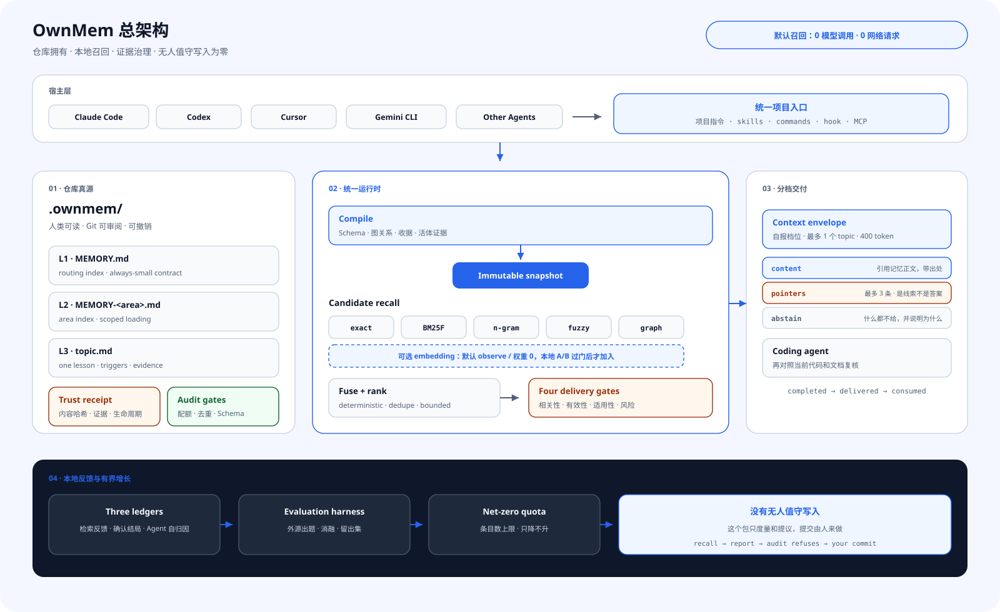

<div align="center">

# OwnMem

**把 AI 编程 Agent 的项目记忆留在仓库里：本地、确定、可审阅，并能在安全边界内自我改进。**

`Git 原生` · `本地召回` · `多 Agent 共用` · `证据治理` · `Apache-2.0`

[](https://www.npmjs.com/package/ownmem)
[](https://nodejs.org)
[](../../LICENSE)

[English](../../README.md) · **简体中文** · [繁體中文](./README.zh-TW.md) · [日本語](./README.ja.md) · [한국어](./README.ko.md) · [Español](./README.es.md) · [Français](./README.fr.md) · [Deutsch](./README.de.md) · [Português (BR)](./README.pt-BR.md)

</div>

## 为什么是 OwnMem

大多数记忆方案先解决“记得更多”。OwnMem 先问另一件事：**项目知识由谁拥有，谁有权改变它，错误记忆怎样在影响 Agent 行动前被拦住？**

| 优势 | 对实际开发意味着什么 |
| --- | --- |
| **记忆归仓库所有** | 记忆是 `.ownmem/` 中可读的 Markdown，随 Git 克隆、评审和回滚。 |
| **一份记忆，多 Agent 共用** | Claude Code、Codex、Cursor、Gemini CLI、Grok CLI 等宿主共享同一知识源。 |
| **默认召回确定且本地** | 不调用模型、不请求网络；相同查询、配置和快照得到相同排序。 |
| **先验证证据，再授予 authority** | 正文不能自证可信；独立收据和活体证据核验决定是否交付。 |
| **有界增长** | Schema、配额、去重、生命周期和审计避免记忆变成第二个没人维护的 Wiki。 |
| **低风险自动，高影响复审** | 回放证明有效的 R0 检索元数据可以无人值守；正文、策略和高风险变化不能。 |

## 总架构

<picture>
  <source media="(prefers-color-scheme: dark)" srcset="../assets/architecture-zh-CN-dark.svg">
  
</picture>

OwnMem 把“写下经验”和“把经验交给 Agent”分成两个受控流程：

- **仓库是真源。** L1 路由、L2 领域索引和 L3 topic 是可审阅 Markdown；信任收据独立于它所授权的正文。
- **编译后再召回。** Schema、图关系、生命周期和证据门生成内容寻址的不可变快照，查询期不重读正在变化的正文。
- **默认五路确定性候选。** exact、BM25F、n-gram、fuzzy、graph 在本地融合；embedding 是可选第六路，没有 A/B 证据前权重为 0。
- **交付前四道门。** 相关性、事实有效性、任务适用性和动作风险共同决定正常交付、advisory、隔离或弃答。
- **有界无人值守演化。** 轮末协调器只自动晋升经过回放、受配额约束且可精确撤销的 R0 元数据；R1–R5 进入复审。

## 0.3 到底独特在哪里

差异不在某一个排序公式，而在于 OwnMem 0.3 把 Agent Memory 做成一条可验证的演化协议：

| 机制 | OwnMem 0.3 做了什么 |
| --- | --- |
| **证据携带记忆** | 内容哈希、证据根、生命周期、适用范围、风险和前驱收据共同决定正文能否进入上下文。 |
| **反事实晋升门** | 自动化必须证明“改前失败、只因候选改动而恢复、原有通过语料零回归”。 |
| **按变更面定风险** | 风险来自改了什么、能影响什么；Agent 不能给自己的提案降级。 |
| **内容寻址补偿回滚** | 自动编辑携带可验证逆操作；事务失败或 harmful 结局会恢复原字节，同时保留历史。 |
| **记忆投毒隔离** | 候选、正文、authority 与证据处于不同信任域；被检索到从不等于获得行动权限。 |
| **选择性交付** | 证据不足时 advisory、隔离或弃答，不伪造置信度。 |
| **不可变编译快照** | Markdown、图关系、排序身份和信任状态共同成为可复现的运行时输入。 |
| **三条反指标污染账** | 检索对错、用户/宿主确认结局和 Agent 自归因互不冒充。 |

深入阅读[技术设计与研究对应](./TECHNICAL.zh-CN.md)。

## 三分钟开始

需要 Node.js 20.6 或更新版本。在希望拥有项目记忆的仓库里执行：

```bash
npm install --save-dev ownmem
npx ownmem init --locale auto --hosts claude,codex --layers dashboard --hook
```

初始化后重新打开 Agent。OwnMem 会创建 `.ownmem/`，并只修改宿主文件中受管理的标记区。只需一个适配器时使用 `--hosts claude`、`--hosts codex`、`--hosts cursor` 或 `--hosts gemini`；用 `npx ownmem init --check` 可以先预览。

## 日常怎么用

安装后继续用人话工作：

> “记住：staging 部署超时来自连接池上限，不是 worker 太少。下次两者一起检查。”

> “改之前先看看项目记忆里有没有遇到同一种故障。”

宿主会在相关工作前召回，并在每轮结束后调度一次带锁、防抖的演化。通常不需要手工串联 promotion、trust、audit 和 compile。想查看时打开本地控制台或检查协调器：

```bash
npx ownmem dashboard --open
npx ownmem evolve status
npx ownmem evolve run --force
```

## 信任与自动化边界

OwnMem 自动化的是“机器能证明”的部分，不是“听起来像对”的部分。

- **自动完成：** 确定性召回、候选扫描、tripwire、反事实回放、R0 trigger 回填、机器信任收据、审计、编译、观察、隔离和精确回滚。
- **升级复审：** 新正文知识、策略、active set、冲突、证据不足、R1–R5 变化和发布动作。
- **硬边界：** candidate 不是 memory；Agent 自归因不是用户确认；被召回的文本不能覆盖宿主指令或授权工具。
- **失败行为：** 未签正文或不可核验证据进入隔离；证据漂移降为 advisory；事务失败恢复上一份已验证状态。

## 适合什么

| 适合 OwnMem | 这些情况更适合其他系统 |
| --- | --- |
| 团队希望项目知识和代码一起评审、迁移。 | 需要跨仓库个人画像或全局用户记忆。 |
| 同一仓库轮换使用多个编程 Agent。 | 希望无差别自动保存全部对话，不接受证据门与风险边界。 |
| 在意本地、可复现、零查询成本的召回。 | 需要大规模云向量搜索或实时全局知识图谱。 |
| 错误记忆必须可归因、可拒绝、可撤销。 | 记忆数量比治理更重要。 |

## 默认本地优先

- 默认召回只读仓库文件和本地快照：零 LLM 调用、零网络请求、零查询 token 成本。
- 运行事件保存在 Git 忽略的本机目录；没有 outcome 样本就显示“暂无”，不会伪装成 0%。
- 不该进入 Git 的密钥、个人信息和生产秘密，也不该进入记忆。
- embedding 通道是隔离的可选增强；只有仓库本地 A/B 证据过安全门后才参与 weighted 排序。

## 研究脉络

OwnMem 不把这些基础概念冒充原创；它的贡献是把它们组合成仓库记忆的可执行协议：

- **Agent Memory 与反思学习：** [Reflexion (NeurIPS 2023)](https://papers.neurips.cc/paper_files/paper/2023/hash/1b44b878bb782e6954cd888628510e90-Abstract-Conference.html)、[MemGPT (2023)](https://arxiv.org/abs/2310.08560)
- **记忆与知识库投毒：** [AgentPoison (NeurIPS 2024)](https://proceedings.neurips.cc/paper_files/paper/2024/hash/eb113910e9c3f6242541c1652e30dfd6-Abstract-Conference.html)、[PoisonedRAG (USENIX Security 2025)](https://www.usenix.org/conference/usenixsecurity25/presentation/zou-poisonedrag)
- **不可信数据与授权分离：** [CaMeL: Defeating Prompt Injections by Design (2025)](https://arxiv.org/abs/2503.18813)
- **独立来源证明：** [in-toto (USENIX Security 2019)](https://www.usenix.org/conference/usenixsecurity19/presentation/torres-arias)
- **选择性预测与弃答：** [Selective Classification (JMLR 2010)](https://jmlr.org/papers/v11/el-yaniv10a.html)
- **差分验证与补偿事务：** [Metamorphic Testing (1998)](https://www.cse.ust.hk/~scc/publ/CS98-01-metamorphictesting.pdf)、[Sagas (SIGMOD 1987)](https://doi.org/10.1145/38713.38742)
- **分维度检索评测：** [ARES (NAACL 2024)](https://aclanthology.org/2024.naacl-long.20/)、[RAGChecker (2024)](https://arxiv.org/abs/2408.08067)

这些引用只说明研究脉络，不表示相关论文实现了 OwnMem，也不表示 OwnMem 复现了论文实验。

## 文档

| 文档 | 内容 |
| --- | --- |
| [Architecture](../ARCHITECTURE.md) | 包边界、快照、信任与演化 |
| [Technical design](./TECHNICAL.zh-CN.md) | 机制、威胁模型与研究对应 |
| [Plugins](../PLUGINS.md) | 可选宿主插件安装 |
| [Updating](../UPDATING.md) | 安全更新与 0.2 → 0.3 迁移 |
| [Privacy](../PRIVACY.md) | 本地数据和可选通道边界 |
| [Changelog](../../CHANGELOG.md) | 版本变化 |
| [License](../../LICENSE) | Apache-2.0 |

OwnMem 是开源项目，欢迎提交带可复现证据的 issue 和 pull request。
