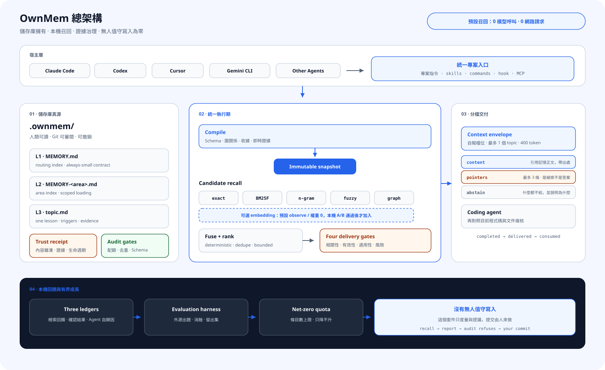

<div align="center">

# OwnMem

**把 AI 程式 Agent 的專案記憶留在儲存庫：本機、確定、可審閱，並能在安全邊界內自我改進。**

`Git 原生` · `本機召回` · `多 Agent 共用` · `證據治理` · `Apache-2.0`

[](https://www.npmjs.com/package/ownmem)
[](https://nodejs.org)
[](../../LICENSE)

[English](../../README.md) · [简体中文](./README.zh-CN.md) · **繁體中文** · [日本語](./README.ja.md) · [한국어](./README.ko.md) · [Español](./README.es.md) · [Français](./README.fr.md) · [Deutsch](./README.de.md) · [Português (BR)](./README.pt-BR.md)

</div>

## 為什麼是 OwnMem

多數記憶方案先解決「記得更多」。OwnMem 先問另一件事：**專案知識由誰擁有，誰有權改變它，錯誤記憶如何在影響 Agent 行動前被攔下？**

| 優勢 | 對實際開發的意義 |
| --- | --- |
| **記憶歸儲存庫所有** | 記憶是 `.ownmem/` 中可讀的 Markdown，隨 Git 複製、審閱與回復。 |
| **一份記憶，多 Agent 共用** | Claude Code、Codex、Cursor、Gemini CLI、Grok CLI 等宿主共用同一知識源。 |
| **預設召回確定且本機** | 不呼叫模型、不請求網路；相同查詢、設定與快照得到相同排序。 |
| **先驗證證據，再授予 authority** | 正文不能自證可信；獨立收據與即時證據核驗決定是否交付。 |
| **有界成長** | Schema、配額、去重、生命週期與稽核避免記憶變成第二個無人維護的 Wiki。 |
| **低風險自動，高影響複審** | 回放證明有效的 R0 檢索中繼資料可以無人值守；正文、策略與高風險變更不能。 |

## 總架構

<picture>
  <source media="(prefers-color-scheme: dark)" srcset="../assets/architecture-zh-TW-dark.svg">
  
</picture>

OwnMem 把「寫下經驗」與「把經驗交給 Agent」拆成兩個受控流程：

- **儲存庫是真源。** L1 路由、L2 領域索引與 L3 topic 是可審閱 Markdown；信任收據獨立於它授權的正文。
- **編譯後再召回。** Schema、圖關係、生命週期與證據門產生內容定址的不可變快照，查詢時不重讀正在變動的正文。
- **預設五路確定性候選。** exact、BM25F、n-gram、fuzzy、graph 在本機融合；embedding 是可選第六路，沒有 A/B 證據前權重為 0。
- **交付前四道門。** 相關性、事實有效性、任務適用性與動作風險共同決定正常交付、advisory、隔離或棄答。
- **有界無人值守演化。** 輪末協調器只自動晉升通過回放、受配額約束且可精確撤銷的 R0 中繼資料；R1–R5 進入複審。

## 0.3 到底獨特在哪裡

差異不在某個排序公式，而在 OwnMem 0.3 把 Agent Memory 做成可驗證的演化協定：

| 機制 | OwnMem 0.3 做了什麼 |
| --- | --- |
| **證據攜帶記憶** | 內容雜湊、證據根、生命週期、適用範圍、風險與前驅收據共同決定正文能否進入上下文。 |
| **反事實晉升門** | 自動化必須證明「改前失敗、只因候選變更而恢復、既有通過語料零退步」。 |
| **按變更面定風險** | 風險來自改了什麼、能影響什麼；Agent 不能替自己的提案降級。 |
| **內容定址補償回復** | 自動編輯攜帶可驗證逆操作；交易失敗或 harmful 結果會恢復原位元組並保留歷史。 |
| **記憶投毒隔離** | 候選、正文、authority 與證據位於不同信任域；被檢索到不等於取得行動權限。 |
| **選擇性交付** | 證據不足時 advisory、隔離或棄答，不虛構信心。 |
| **不可變編譯快照** | Markdown、圖關係、排序身分與信任狀態共同成為可重現的執行期輸入。 |
| **三條反指標污染帳** | 檢索對錯、使用者/宿主確認結果與 Agent 自歸因互不冒充。 |

深入閱讀[技術設計與研究對應](../TECHNICAL.md)。

## 三分鐘開始

需要 Node.js 20.6 或更新版本。在希望擁有專案記憶的儲存庫中執行：

```bash
npm install --save-dev ownmem
npx ownmem init --locale auto --hosts claude,codex --layers dashboard --hook
```

初始化後重新開啟 Agent。OwnMem 會建立 `.ownmem/`，且只修改宿主檔案中受管理的標記區。只需要一個適配器時使用 `--hosts claude`、`--hosts codex`、`--hosts cursor` 或 `--hosts gemini`；`npx ownmem init --check` 可先預覽。

## 日常怎麼用

安裝後繼續用自然語言工作：

> 「記住：staging 部署逾時來自連線池上限，不是 worker 太少。下次兩者一起檢查。」

> 「修改前先看看專案記憶是否遇過同一種故障。」

宿主會在相關工作前召回，並在每輪結束後排程一次帶鎖、防抖的演化。通常不必手動串接 promotion、trust、audit 與 compile。想查看時開啟本機主控台或檢查協調器：

```bash
npx ownmem dashboard --open
npx ownmem evolve status
npx ownmem evolve run --force
```

## 信任與自動化邊界

OwnMem 自動化的是「機器能證明」的部分，不是「聽起來像對」的部分。

- **自動完成：** 確定性召回、候選掃描、tripwire、反事實回放、R0 trigger 回填、機器信任收據、稽核、編譯、觀察、隔離與精確回復。
- **升級複審：** 新正文知識、策略、active set、衝突、證據不足、R1–R5 變更與發布動作。
- **硬邊界：** candidate 不是 memory；Agent 自歸因不是使用者確認；召回文字不能覆寫宿主指令或授權工具。
- **失敗行為：** 未簽正文或不可核驗證據進入隔離；證據漂移降為 advisory；交易失敗恢復上一份已驗證狀態。

## 適合什麼

| 適合 OwnMem | 這些情況更適合其他系統 |
| --- | --- |
| 團隊希望專案知識與程式碼一起審閱、遷移。 | 需要跨儲存庫個人輪廓或全域使用者記憶。 |
| 同一儲存庫輪流使用多個程式 Agent。 | 希望無差別自動保存所有對話，不接受證據門與風險邊界。 |
| 重視本機、可重現、零查詢成本的召回。 | 需要大規模雲端向量搜尋或即時全域知識圖譜。 |
| 錯誤記憶必須可歸因、可拒絕、可撤銷。 | 記憶數量比治理更重要。 |

## 預設本機優先

- 預設召回只讀儲存庫檔案與本機快照：零 LLM 呼叫、零網路請求、零查詢 token 成本。
- 執行事件保存在 Git 忽略的本機目錄；沒有 outcome 樣本就顯示「暫無」，不偽裝成 0%。
- 不該進入 Git 的金鑰、個人資料與生產祕密，也不該進入記憶。
- embedding 通道是隔離的可選增強；只有儲存庫本機 A/B 證據通過安全門後才參與 weighted 排序。

## 研究脈絡

OwnMem 不把這些基礎概念冒充原創；它的貢獻是把它們組成儲存庫記憶的可執行協定：

- **Agent Memory 與反思學習：** [Reflexion (NeurIPS 2023)](https://papers.neurips.cc/paper_files/paper/2023/hash/1b44b878bb782e6954cd888628510e90-Abstract-Conference.html)、[MemGPT (2023)](https://arxiv.org/abs/2310.08560)
- **記憶與知識庫投毒：** [AgentPoison (NeurIPS 2024)](https://proceedings.neurips.cc/paper_files/paper/2024/hash/eb113910e9c3f6242541c1652e30dfd6-Abstract-Conference.html)、[PoisonedRAG (USENIX Security 2025)](https://www.usenix.org/conference/usenixsecurity25/presentation/zou-poisonedrag)
- **不可信資料與授權分離：** [CaMeL: Defeating Prompt Injections by Design (2025)](https://arxiv.org/abs/2503.18813)
- **獨立來源證明：** [in-toto (USENIX Security 2019)](https://www.usenix.org/conference/usenixsecurity19/presentation/torres-arias)
- **選擇性預測與棄答：** [Selective Classification (JMLR 2010)](https://jmlr.org/papers/v11/el-yaniv10a.html)
- **差分驗證與補償交易：** [Metamorphic Testing (1998)](https://www.cse.ust.hk/~scc/publ/CS98-01-metamorphictesting.pdf)、[Sagas (SIGMOD 1987)](https://doi.org/10.1145/38713.38742)
- **分維度檢索評測：** [ARES (NAACL 2024)](https://aclanthology.org/2024.naacl-long.20/)、[RAGChecker (2024)](https://arxiv.org/abs/2408.08067)

這些引用只說明研究脈絡，不表示相關論文實作了 OwnMem，也不表示 OwnMem 重現了論文實驗。

## 文件

| 文件 | 內容 |
| --- | --- |
| [Architecture](../ARCHITECTURE.md) | 套件邊界、快照、信任與演化 |
| [Technical design](../TECHNICAL.md) | 機制、威脅模型與研究對應 |
| [Plugins](../PLUGINS.md) | 可選宿主外掛安裝 |
| [Updating](../UPDATING.md) | 安全更新與 0.2 → 0.3 遷移 |
| [Privacy](../PRIVACY.md) | 本機資料與可選通道邊界 |
| [Changelog](../../CHANGELOG.md) | 版本變更 |
| [License](../../LICENSE) | Apache-2.0 |

OwnMem 是開源專案，歡迎提交附可重現證據的 issue 與 pull request。
